<div class="knitr-options" data-fig-width="576" data-fig-height="460"></div>


<div class="knitr-options" data-fig-width="576" data-fig-height="460"></div>


**Vigilancia Epidemiológica**
=====================================  

Column {.tabset}
------------------------------------


### **<span style="color:#7d9029"> Casos por Estado </span>**
<html>
<head>
<style>
</style>
</head>
<body>
<div >
  <h2></h2>
  <p></p>


<div style = "display: grid; width: 1px; grid-template-columns: 700px 700px; align-items: start; justify-content: space-between;">
#### **<span style="color:blue"> Treemap de casos confirmados </span>**
<div class="knitr-options" data-fig-width="576" data-fig-height="460"></div>


<div>
#### **<span style="color:blue"> Casos confirmados y serotipos </span>**
<div class="knitr-options" data-fig-width="576" data-fig-height="460"></div>
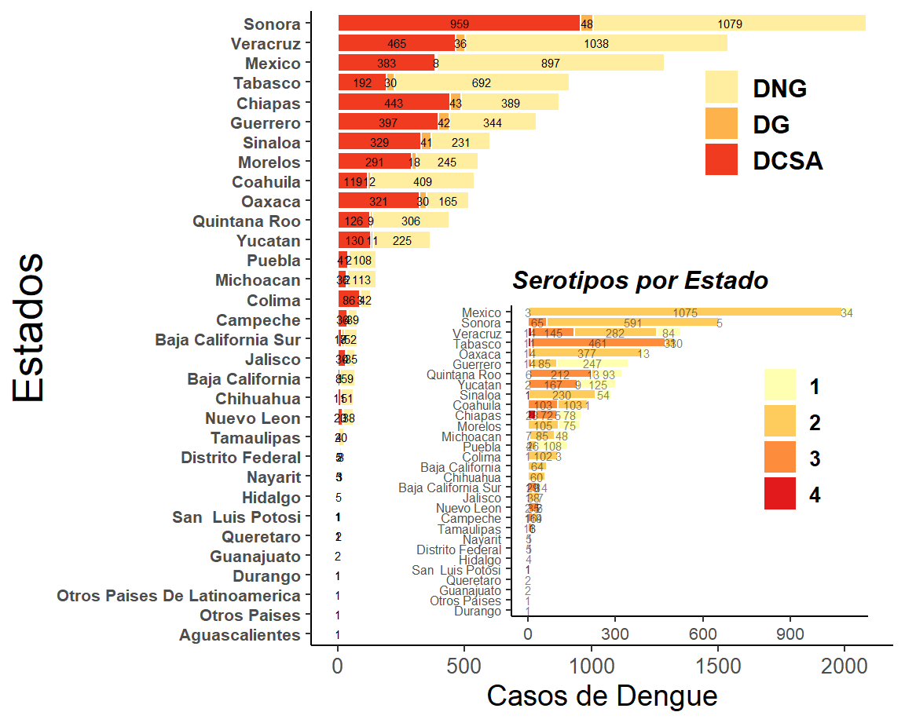
</div>
</div>


#### **<span style="color:blue"> Casos confirmados por semana </span>**
<div class="knitr-options" data-fig-width="576" data-fig-height="460"></div>

```{=html}
<div id="htmlwidget-cd45d020ea70037e135f" style="width:576px;height:460.8px;" class="plotly html-widget"></div>
<script type="application/json" data-for="htmlwidget-cd45d020ea70037e135f">{"x":{"data":[{"x":[1,2,3,4,5,6,7,8,9,10,11,12,13,14,15,16,17,18,19,20,21,22,23,24,25,26,27,28,29,30,31,32,33],"y":[1,2,3,4,5,6,7,8,9,10,11,12,13,14,15,16,17,18,19,20,21,22,23,24,25,26],"z":[[0,0,0,0,0,0,0,0,0,0,0,0,0,0,0,0,0,0,0,0,0,0,0,0,0,0,0,0,0,0,0,0.00819672131147541,0],[0,0,0,0,0,0,0,0,0,0,0,0,0,0,0,0,0.00819672131147541,0,0,0,0,0,0,0,0,0,0,0,0,0,0,0,0],[0,0.00819672131147541,0,0,0,0,0,0,0,0,0,0,0,0,0,0,0,0,0,0,0,0,0,0,0,0,0,0,0,0,0,0,0],[0,0,0,0,0,0,0,0,0,0,0,0,0,0,0,0,0,0,0,0,0,0,0,0,0,0,0,0,0,0,0,0.00819672131147541,0],[0.00819672131147541,0,0,0,0,0,0,0,0,0,0,0,0,0,0,0,0,0,0,0,0,0,0,0,0,0,0,0,0,0,0,0.00819672131147541,0],[0,0.00819672131147541,0,0,0,0,0,0,0,0,0,0,0,0,0,0,0,0,0,0,0,0,0,0,0,0.00819672131147541,0,0,0,0.00819672131147541,0,0,0],[0,0,0,0,0,0,0,0,0.00819672131147541,0,0,0,0,0,0,0,0,0,0,0,0,0,0,0,0,0.00819672131147541,0,0,0.00819672131147541,0,0,0,0],[0,0,0.00819672131147541,0,0,0,0,0,0,0.00819672131147541,0,0,0.00819672131147541,0,0,0,0,0,0,0,0,0,0,0,0.00819672131147541,0,0,0,0,0,0,0.00819672131147541,0],[0.00819672131147541,0,0,0,0,0,0.00819672131147541,0,0,0,0,0,0,0,0,0,0.00819672131147541,0,0,0,0.00819672131147541,0,0,0,0,0,0.00819672131147541,0,0,0.00819672131147541,0.00819672131147541,0,0],[0,0,0,0,0,0,0,0,0,0,0,0,0,0,0,0,0,0,0,0,0,0,0,0,0,0,0,0,0.00819672131147541,0.0163934426229508,0,0.0245901639344262,0.0245901639344262],[0,0,0.00819672131147541,0,0,0,0,0,0,0,0,0,0,0,0,0,0,0,0.00819672131147541,0,0,0,0,0,0,0.00819672131147541,0,0,0,0.0327868852459016,0.0491803278688525,0.0491803278688525,0.0245901639344262],[0.00819672131147541,0,0.0163934426229508,0,0,0,0,0,0,0,0,0.00819672131147541,0,0.0163934426229508,0,0,0,0,0,0.00819672131147541,0.00819672131147541,0,0,0,0,0,0.0245901639344262,0,0.00819672131147541,0.040983606557377,0.0245901639344262,0.0245901639344262,0],[0.00819672131147541,0,0,0,0,0,0,0,0,0,0,0.00819672131147541,0,0,0,0,0.00819672131147541,0.00819672131147541,0,0,0.0245901639344262,0.0245901639344262,0.00819672131147541,0.0163934426229508,0,0,0.00819672131147541,0,0.00819672131147541,0.0163934426229508,0.00819672131147541,0.0163934426229508,0.0245901639344262],[0,0.0163934426229508,0,0,0,0.0245901639344262,0.0245901639344262,0.00819672131147541,0.0245901639344262,0.00819672131147541,0.00819672131147541,0.0163934426229508,0.0245901639344262,0.00819672131147541,0.00819672131147541,0,0.0163934426229508,0,0,0,0,0.0245901639344262,0.00819672131147541,0,0,0,0,0,0.0163934426229508,0.00819672131147541,0.0327868852459016,0.00819672131147541,0],[0,0,0,0,0,0,0,0,0,0.00819672131147541,0,0,0,0,0,0,0.0163934426229508,0,0.00819672131147541,0.0163934426229508,0,0.00819672131147541,0.00819672131147541,0.0163934426229508,0,0,0.122950819672131,0.040983606557377,0,0.0573770491803279,0.0163934426229508,0.0245901639344262,0.00819672131147541],[0.0491803278688525,0.0245901639344262,0.0163934426229508,0.0163934426229508,0.0163934426229508,0,0.0327868852459016,0.0163934426229508,0.0163934426229508,0.0163934426229508,0.0163934426229508,0,0.0163934426229508,0.00819672131147541,0.00819672131147541,0.0327868852459016,0.0163934426229508,0.00819672131147541,0.0163934426229508,0.00819672131147541,0.0245901639344262,0.0245901639344262,0.00819672131147541,0.00819672131147541,0,0.0163934426229508,0.00819672131147541,0.040983606557377,0.0245901639344262,0.0163934426229508,0.0491803278688525,0.0491803278688525,0.040983606557377],[0,0,0.00819672131147541,0,0.00819672131147541,0,0.00819672131147541,0,0.0163934426229508,0.0163934426229508,0,0.00819672131147541,0.00819672131147541,0.0163934426229508,0.040983606557377,0.0163934426229508,0,0.00819672131147541,0.0245901639344262,0.0163934426229508,0.0163934426229508,0.0245901639344262,0.0163934426229508,0.00819672131147541,0,0,0.0245901639344262,0.040983606557377,0.0737704918032787,0.0655737704918033,0.0573770491803279,0.0983606557377049,0.0327868852459016],[0,0.00819672131147541,0,0.00819672131147541,0.00819672131147541,0,0.00819672131147541,0,0,0,0,0,0,0,0,0,0.00819672131147541,0,0,0.0163934426229508,0.0163934426229508,0.155737704918033,0.114754098360656,0.0819672131147541,0.040983606557377,0.0573770491803279,0,0.0491803278688525,0.040983606557377,0.0245901639344262,0.0901639344262295,0.147540983606557,0.0327868852459016],[0.188524590163934,0.0983606557377049,0.131147540983607,0.0655737704918033,0.00819672131147541,0.0245901639344262,0.0491803278688525,0.0655737704918033,0.0245901639344262,0.0327868852459016,0.040983606557377,0.0163934426229508,0.00819672131147541,0.0327868852459016,0,0.00819672131147541,0.0163934426229508,0.0327868852459016,0.0245901639344262,0.0245901639344262,0.0163934426229508,0.00819672131147541,0.0163934426229508,0,0.0245901639344262,0.0245901639344262,0,0.0163934426229508,0.00819672131147541,0.00819672131147541,0.0573770491803279,0.0327868852459016,0],[0,0.00819672131147541,0.00819672131147541,0.00819672131147541,0.0245901639344262,0.00819672131147541,0,0.0163934426229508,0.00819672131147541,0.00819672131147541,0,0.0245901639344262,0.0163934426229508,0.00819672131147541,0,0.0163934426229508,0.0163934426229508,0.0163934426229508,0.0245901639344262,0.0655737704918033,0.0655737704918033,0.0737704918032787,0.0819672131147541,0.0901639344262295,0.0983606557377049,0.0819672131147541,0.0983606557377049,0.122950819672131,0.114754098360656,0.0737704918032787,0.0819672131147541,0.180327868852459,0.0573770491803279],[0,0.0327868852459016,0,0.0245901639344262,0.0491803278688525,0.0573770491803279,0.0163934426229508,0.00819672131147541,0,0.0245901639344262,0.0163934426229508,0.0163934426229508,0.0245901639344262,0.00819672131147541,0.0327868852459016,0.0491803278688525,0,0.00819672131147541,0.00819672131147541,0.0327868852459016,0.040983606557377,0.0491803278688525,0.114754098360656,0.0983606557377049,0.122950819672131,0.139344262295082,0.188524590163934,0.19672131147541,0.0901639344262295,0.0901639344262295,0.19672131147541,0.0327868852459016,0],[0.0245901639344262,0.0327868852459016,0.0327868852459016,0.00819672131147541,0.0327868852459016,0.0163934426229508,0,0,0.0245901639344262,0.00819672131147541,0.0163934426229508,0.0163934426229508,0,0.0163934426229508,0.0163934426229508,0.0327868852459016,0.0327868852459016,0.0245901639344262,0.040983606557377,0.10655737704918,0.0737704918032787,0.0819672131147541,0.114754098360656,0.0901639344262295,0.0245901639344262,0.114754098360656,0.10655737704918,0.0901639344262295,0.147540983606557,0.0573770491803279,0.139344262295082,0.221311475409836,0.0901639344262295],[0.0573770491803279,0.040983606557377,0.0573770491803279,0.0573770491803279,0.0245901639344262,0.0245901639344262,0.0655737704918033,0.0245901639344262,0.0655737704918033,0.0573770491803279,0.040983606557377,0.0573770491803279,0.0245901639344262,0.0327868852459016,0.040983606557377,0.0163934426229508,0.0327868852459016,0.0327868852459016,0.0491803278688525,0.0737704918032787,0.0655737704918033,0.0737704918032787,0.040983606557377,0.0737704918032787,0.0983606557377049,0.122950819672131,0.147540983606557,0.213114754098361,0.278688524590164,0.311475409836066,0.418032786885246,0.475409836065574,0.114754098360656],[0.0655737704918033,0.0573770491803279,0.0163934426229508,0.00819672131147541,0.0245901639344262,0.0245901639344262,0.0327868852459016,0.0327868852459016,0.040983606557377,0,0.0163934426229508,0.0737704918032787,0.0655737704918033,0.0573770491803279,0.0655737704918033,0.0901639344262295,0.040983606557377,0.10655737704918,0.0819672131147541,0.131147540983607,0.163934426229508,0.0901639344262295,0.180327868852459,0.155737704918033,0.172131147540984,0.188524590163934,0.245901639344262,0.180327868852459,0.30327868852459,0.221311475409836,0.172131147540984,0.155737704918033,0.0573770491803279],[0.00819672131147541,0.0163934426229508,0.0163934426229508,0.0245901639344262,0.0163934426229508,0.0163934426229508,0.040983606557377,0.0655737704918033,0.040983606557377,0.0573770491803279,0.0737704918032787,0.155737704918033,0.155737704918033,0.19672131147541,0.147540983606557,0.237704918032787,0.204918032786885,0.245901639344262,0.0983606557377049,0.139344262295082,0.0819672131147541,0.0901639344262295,0.163934426229508,0.0655737704918033,0.0983606557377049,0.0737704918032787,0.0737704918032787,0.139344262295082,0.163934426229508,0.213114754098361,0.172131147540984,0.19672131147541,0.122950819672131],[0,0,0,0,0,0,0,0,0,0,0.0491803278688525,0.0327868852459016,0.0163934426229508,0.0245901639344262,0.0655737704918033,0.114754098360656,0.0573770491803279,0.0819672131147541,0.221311475409836,0.336065573770492,0.278688524590164,0.663934426229508,0.852459016393443,1,0.647540983606557,0.663934426229508,0.491803278688525,0.30327868852459,0.327868852459016,0.0245901639344262,0.00819672131147541,0,0]],"text":[["week:  1<br />edo: Aguascalientes<br />n:   0<br />n:   0","week:  2<br />edo: Aguascalientes<br />n:   0<br />n:   0","week:  3<br />edo: Aguascalientes<br />n:   0<br />n:   0","week:  4<br />edo: Aguascalientes<br />n:   0<br />n:   0","week:  5<br />edo: Aguascalientes<br />n:   0<br />n:   0","week:  6<br />edo: Aguascalientes<br />n:   0<br />n:   0","week:  7<br />edo: Aguascalientes<br />n:   0<br />n:   0","week:  8<br />edo: Aguascalientes<br />n:   0<br />n:   0","week:  9<br />edo: Aguascalientes<br />n:   0<br />n:   0","week: 10<br />edo: Aguascalientes<br />n:   0<br />n:   0","week: 11<br />edo: Aguascalientes<br />n:   0<br />n:   0","week: 12<br />edo: Aguascalientes<br />n:   0<br />n:   0","week: 13<br />edo: Aguascalientes<br />n:   0<br />n:   0","week: 14<br />edo: Aguascalientes<br />n:   0<br />n:   0","week: 15<br />edo: Aguascalientes<br />n:   0<br />n:   0","week: 16<br />edo: Aguascalientes<br />n:   0<br />n:   0","week: 17<br />edo: Aguascalientes<br />n:   0<br />n:   0","week: 18<br />edo: Aguascalientes<br />n:   0<br />n:   0","week: 19<br />edo: Aguascalientes<br />n:   0<br />n:   0","week: 20<br />edo: Aguascalientes<br />n:   0<br />n:   0","week: 21<br />edo: Aguascalientes<br />n:   0<br />n:   0","week: 22<br />edo: Aguascalientes<br />n:   0<br />n:   0","week: 23<br />edo: Aguascalientes<br />n:   0<br />n:   0","week: 24<br />edo: Aguascalientes<br />n:   0<br />n:   0","week: 25<br />edo: Aguascalientes<br />n:   0<br />n:   0","week: 26<br />edo: Aguascalientes<br />n:   0<br />n:   0","week: 27<br />edo: Aguascalientes<br />n:   0<br />n:   0","week: 28<br />edo: Aguascalientes<br />n:   0<br />n:   0","week: 29<br />edo: Aguascalientes<br />n:   0<br />n:   0","week: 30<br />edo: Aguascalientes<br />n:   0<br />n:   0","week: 31<br />edo: Aguascalientes<br />n:   0<br />n:   0","week: 32<br />edo: Aguascalientes<br />n:   1<br />n:   1","week: 33<br />edo: Aguascalientes<br />n:   0<br />n:   0"],["week:  1<br />edo: Chihuahua<br />n:   0<br />n:   0","week:  2<br />edo: Chihuahua<br />n:   0<br />n:   0","week:  3<br />edo: Chihuahua<br />n:   0<br />n:   0","week:  4<br />edo: Chihuahua<br />n:   0<br />n:   0","week:  5<br />edo: Chihuahua<br />n:   0<br />n:   0","week:  6<br />edo: Chihuahua<br />n:   0<br />n:   0","week:  7<br />edo: Chihuahua<br />n:   0<br />n:   0","week:  8<br />edo: Chihuahua<br />n:   0<br />n:   0","week:  9<br />edo: Chihuahua<br />n:   0<br />n:   0","week: 10<br />edo: Chihuahua<br />n:   0<br />n:   0","week: 11<br />edo: Chihuahua<br />n:   0<br />n:   0","week: 12<br />edo: Chihuahua<br />n:   0<br />n:   0","week: 13<br />edo: Chihuahua<br />n:   0<br />n:   0","week: 14<br />edo: Chihuahua<br />n:   0<br />n:   0","week: 15<br />edo: Chihuahua<br />n:   0<br />n:   0","week: 16<br />edo: Chihuahua<br />n:   0<br />n:   0","week: 17<br />edo: Chihuahua<br />n:   1<br />n:   1","week: 18<br />edo: Chihuahua<br />n:   0<br />n:   0","week: 19<br />edo: Chihuahua<br />n:   0<br />n:   0","week: 20<br />edo: Chihuahua<br />n:   0<br />n:   0","week: 21<br />edo: Chihuahua<br />n:   0<br />n:   0","week: 22<br />edo: Chihuahua<br />n:   0<br />n:   0","week: 23<br />edo: Chihuahua<br />n:   0<br />n:   0","week: 24<br />edo: Chihuahua<br />n:   0<br />n:   0","week: 25<br />edo: Chihuahua<br />n:   0<br />n:   0","week: 26<br />edo: Chihuahua<br />n:   0<br />n:   0","week: 27<br />edo: Chihuahua<br />n:   0<br />n:   0","week: 28<br />edo: Chihuahua<br />n:   0<br />n:   0","week: 29<br />edo: Chihuahua<br />n:   0<br />n:   0","week: 30<br />edo: Chihuahua<br />n:   0<br />n:   0","week: 31<br />edo: Chihuahua<br />n:   0<br />n:   0","week: 32<br />edo: Chihuahua<br />n:   0<br />n:   0","week: 33<br />edo: Chihuahua<br />n:   0<br />n:   0"],["week:  1<br />edo: Queretaro<br />n:   0<br />n:   0","week:  2<br />edo: Queretaro<br />n:   1<br />n:   1","week:  3<br />edo: Queretaro<br />n:   0<br />n:   0","week:  4<br />edo: Queretaro<br />n:   0<br />n:   0","week:  5<br />edo: Queretaro<br />n:   0<br />n:   0","week:  6<br />edo: Queretaro<br />n:   0<br />n:   0","week:  7<br />edo: Queretaro<br />n:   0<br />n:   0","week:  8<br />edo: Queretaro<br />n:   0<br />n:   0","week:  9<br />edo: Queretaro<br />n:   0<br />n:   0","week: 10<br />edo: Queretaro<br />n:   0<br />n:   0","week: 11<br />edo: Queretaro<br />n:   0<br />n:   0","week: 12<br />edo: Queretaro<br />n:   0<br />n:   0","week: 13<br />edo: Queretaro<br />n:   0<br />n:   0","week: 14<br />edo: Queretaro<br />n:   0<br />n:   0","week: 15<br />edo: Queretaro<br />n:   0<br />n:   0","week: 16<br />edo: Queretaro<br />n:   0<br />n:   0","week: 17<br />edo: Queretaro<br />n:   0<br />n:   0","week: 18<br />edo: Queretaro<br />n:   0<br />n:   0","week: 19<br />edo: Queretaro<br />n:   0<br />n:   0","week: 20<br />edo: Queretaro<br />n:   0<br />n:   0","week: 21<br />edo: Queretaro<br />n:   0<br />n:   0","week: 22<br />edo: Queretaro<br />n:   0<br />n:   0","week: 23<br />edo: Queretaro<br />n:   0<br />n:   0","week: 24<br />edo: Queretaro<br />n:   0<br />n:   0","week: 25<br />edo: Queretaro<br />n:   0<br />n:   0","week: 26<br />edo: Queretaro<br />n:   0<br />n:   0","week: 27<br />edo: Queretaro<br />n:   0<br />n:   0","week: 28<br />edo: Queretaro<br />n:   0<br />n:   0","week: 29<br />edo: Queretaro<br />n:   0<br />n:   0","week: 30<br />edo: Queretaro<br />n:   0<br />n:   0","week: 31<br />edo: Queretaro<br />n:   0<br />n:   0","week: 32<br />edo: Queretaro<br />n:   0<br />n:   0","week: 33<br />edo: Queretaro<br />n:   0<br />n:   0"],["week:  1<br />edo: Tamaulipas<br />n:   0<br />n:   0","week:  2<br />edo: Tamaulipas<br />n:   0<br />n:   0","week:  3<br />edo: Tamaulipas<br />n:   0<br />n:   0","week:  4<br />edo: Tamaulipas<br />n:   0<br />n:   0","week:  5<br />edo: Tamaulipas<br />n:   0<br />n:   0","week:  6<br />edo: Tamaulipas<br />n:   0<br />n:   0","week:  7<br />edo: Tamaulipas<br />n:   0<br />n:   0","week:  8<br />edo: Tamaulipas<br />n:   0<br />n:   0","week:  9<br />edo: Tamaulipas<br />n:   0<br />n:   0","week: 10<br />edo: Tamaulipas<br />n:   0<br />n:   0","week: 11<br />edo: Tamaulipas<br />n:   0<br />n:   0","week: 12<br />edo: Tamaulipas<br />n:   0<br />n:   0","week: 13<br />edo: Tamaulipas<br />n:   0<br />n:   0","week: 14<br />edo: Tamaulipas<br />n:   0<br />n:   0","week: 15<br />edo: Tamaulipas<br />n:   0<br />n:   0","week: 16<br />edo: Tamaulipas<br />n:   0<br />n:   0","week: 17<br />edo: Tamaulipas<br />n:   0<br />n:   0","week: 18<br />edo: Tamaulipas<br />n:   0<br />n:   0","week: 19<br />edo: Tamaulipas<br />n:   0<br />n:   0","week: 20<br />edo: Tamaulipas<br />n:   0<br />n:   0","week: 21<br />edo: Tamaulipas<br />n:   0<br />n:   0","week: 22<br />edo: Tamaulipas<br />n:   0<br />n:   0","week: 23<br />edo: Tamaulipas<br />n:   0<br />n:   0","week: 24<br />edo: Tamaulipas<br />n:   0<br />n:   0","week: 25<br />edo: Tamaulipas<br />n:   0<br />n:   0","week: 26<br />edo: Tamaulipas<br />n:   0<br />n:   0","week: 27<br />edo: Tamaulipas<br />n:   0<br />n:   0","week: 28<br />edo: Tamaulipas<br />n:   0<br />n:   0","week: 29<br />edo: Tamaulipas<br />n:   0<br />n:   0","week: 30<br />edo: Tamaulipas<br />n:   0<br />n:   0","week: 31<br />edo: Tamaulipas<br />n:   0<br />n:   0","week: 32<br />edo: Tamaulipas<br />n:   1<br />n:   1","week: 33<br />edo: Tamaulipas<br />n:   0<br />n:   0"],["week:  1<br />edo: Baja California<br />n:   1<br />n:   1","week:  2<br />edo: Baja California<br />n:   0<br />n:   0","week:  3<br />edo: Baja California<br />n:   0<br />n:   0","week:  4<br />edo: Baja California<br />n:   0<br />n:   0","week:  5<br />edo: Baja California<br />n:   0<br />n:   0","week:  6<br />edo: Baja California<br />n:   0<br />n:   0","week:  7<br />edo: Baja California<br />n:   0<br />n:   0","week:  8<br />edo: Baja California<br />n:   0<br />n:   0","week:  9<br />edo: Baja California<br />n:   0<br />n:   0","week: 10<br />edo: Baja California<br />n:   0<br />n:   0","week: 11<br />edo: Baja California<br />n:   0<br />n:   0","week: 12<br />edo: Baja California<br />n:   0<br />n:   0","week: 13<br />edo: Baja California<br />n:   0<br />n:   0","week: 14<br />edo: Baja California<br />n:   0<br />n:   0","week: 15<br />edo: Baja California<br />n:   0<br />n:   0","week: 16<br />edo: Baja California<br />n:   0<br />n:   0","week: 17<br />edo: Baja California<br />n:   0<br />n:   0","week: 18<br />edo: Baja California<br />n:   0<br />n:   0","week: 19<br />edo: Baja California<br />n:   0<br />n:   0","week: 20<br />edo: Baja California<br />n:   0<br />n:   0","week: 21<br />edo: Baja California<br />n:   0<br />n:   0","week: 22<br />edo: Baja California<br />n:   0<br />n:   0","week: 23<br />edo: Baja California<br />n:   0<br />n:   0","week: 24<br />edo: Baja California<br />n:   0<br />n:   0","week: 25<br />edo: Baja California<br />n:   0<br />n:   0","week: 26<br />edo: Baja California<br />n:   0<br />n:   0","week: 27<br />edo: Baja California<br />n:   0<br />n:   0","week: 28<br />edo: Baja California<br />n:   0<br />n:   0","week: 29<br />edo: Baja California<br />n:   0<br />n:   0","week: 30<br />edo: Baja California<br />n:   0<br />n:   0","week: 31<br />edo: Baja California<br />n:   0<br />n:   0","week: 32<br />edo: Baja California<br />n:   1<br />n:   1","week: 33<br />edo: Baja California<br />n:   0<br />n:   0"],["week:  1<br />edo: Nayarit<br />n:   0<br />n:   0","week:  2<br />edo: Nayarit<br />n:   1<br />n:   1","week:  3<br />edo: Nayarit<br />n:   0<br />n:   0","week:  4<br />edo: Nayarit<br />n:   0<br />n:   0","week:  5<br />edo: Nayarit<br />n:   0<br />n:   0","week:  6<br />edo: Nayarit<br />n:   0<br />n:   0","week:  7<br />edo: Nayarit<br />n:   0<br />n:   0","week:  8<br />edo: Nayarit<br />n:   0<br />n:   0","week:  9<br />edo: Nayarit<br />n:   0<br />n:   0","week: 10<br />edo: Nayarit<br />n:   0<br />n:   0","week: 11<br />edo: Nayarit<br />n:   0<br />n:   0","week: 12<br />edo: Nayarit<br />n:   0<br />n:   0","week: 13<br />edo: Nayarit<br />n:   0<br />n:   0","week: 14<br />edo: Nayarit<br />n:   0<br />n:   0","week: 15<br />edo: Nayarit<br />n:   0<br />n:   0","week: 16<br />edo: Nayarit<br />n:   0<br />n:   0","week: 17<br />edo: Nayarit<br />n:   0<br />n:   0","week: 18<br />edo: Nayarit<br />n:   0<br />n:   0","week: 19<br />edo: Nayarit<br />n:   0<br />n:   0","week: 20<br />edo: Nayarit<br />n:   0<br />n:   0","week: 21<br />edo: Nayarit<br />n:   0<br />n:   0","week: 22<br />edo: Nayarit<br />n:   0<br />n:   0","week: 23<br />edo: Nayarit<br />n:   0<br />n:   0","week: 24<br />edo: Nayarit<br />n:   0<br />n:   0","week: 25<br />edo: Nayarit<br />n:   0<br />n:   0","week: 26<br />edo: Nayarit<br />n:   1<br />n:   1","week: 27<br />edo: Nayarit<br />n:   0<br />n:   0","week: 28<br />edo: Nayarit<br />n:   0<br />n:   0","week: 29<br />edo: Nayarit<br />n:   0<br />n:   0","week: 30<br />edo: Nayarit<br />n:   1<br />n:   1","week: 31<br />edo: Nayarit<br />n:   0<br />n:   0","week: 32<br />edo: Nayarit<br />n:   0<br />n:   0","week: 33<br />edo: Nayarit<br />n:   0<br />n:   0"],["week:  1<br />edo: Nuevo Leon<br />n:   0<br />n:   0","week:  2<br />edo: Nuevo Leon<br />n:   0<br />n:   0","week:  3<br />edo: Nuevo Leon<br />n:   0<br />n:   0","week:  4<br />edo: Nuevo Leon<br />n:   0<br />n:   0","week:  5<br />edo: Nuevo Leon<br />n:   0<br />n:   0","week:  6<br />edo: Nuevo Leon<br />n:   0<br />n:   0","week:  7<br />edo: Nuevo Leon<br />n:   0<br />n:   0","week:  8<br />edo: Nuevo Leon<br />n:   0<br />n:   0","week:  9<br />edo: Nuevo Leon<br />n:   1<br />n:   1","week: 10<br />edo: Nuevo Leon<br />n:   0<br />n:   0","week: 11<br />edo: Nuevo Leon<br />n:   0<br />n:   0","week: 12<br />edo: Nuevo Leon<br />n:   0<br />n:   0","week: 13<br />edo: Nuevo Leon<br />n:   0<br />n:   0","week: 14<br />edo: Nuevo Leon<br />n:   0<br />n:   0","week: 15<br />edo: Nuevo Leon<br />n:   0<br />n:   0","week: 16<br />edo: Nuevo Leon<br />n:   0<br />n:   0","week: 17<br />edo: Nuevo Leon<br />n:   0<br />n:   0","week: 18<br />edo: Nuevo Leon<br />n:   0<br />n:   0","week: 19<br />edo: Nuevo Leon<br />n:   0<br />n:   0","week: 20<br />edo: Nuevo Leon<br />n:   0<br />n:   0","week: 21<br />edo: Nuevo Leon<br />n:   0<br />n:   0","week: 22<br />edo: Nuevo Leon<br />n:   0<br />n:   0","week: 23<br />edo: Nuevo Leon<br />n:   0<br />n:   0","week: 24<br />edo: Nuevo Leon<br />n:   0<br />n:   0","week: 25<br />edo: Nuevo Leon<br />n:   0<br />n:   0","week: 26<br />edo: Nuevo Leon<br />n:   1<br />n:   1","week: 27<br />edo: Nuevo Leon<br />n:   0<br />n:   0","week: 28<br />edo: Nuevo Leon<br />n:   0<br />n:   0","week: 29<br />edo: Nuevo Leon<br />n:   1<br />n:   1","week: 30<br />edo: Nuevo Leon<br />n:   0<br />n:   0","week: 31<br />edo: Nuevo Leon<br />n:   0<br />n:   0","week: 32<br />edo: Nuevo Leon<br />n:   0<br />n:   0","week: 33<br />edo: Nuevo Leon<br />n:   0<br />n:   0"],["week:  1<br />edo: Baja California Sur<br />n:   0<br />n:   0","week:  2<br />edo: Baja California Sur<br />n:   0<br />n:   0","week:  3<br />edo: Baja California Sur<br />n:   1<br />n:   1","week:  4<br />edo: Baja California Sur<br />n:   0<br />n:   0","week:  5<br />edo: Baja California Sur<br />n:   0<br />n:   0","week:  6<br />edo: Baja California Sur<br />n:   0<br />n:   0","week:  7<br />edo: Baja California Sur<br />n:   0<br />n:   0","week:  8<br />edo: Baja California Sur<br />n:   0<br />n:   0","week:  9<br />edo: Baja California Sur<br />n:   0<br />n:   0","week: 10<br />edo: Baja California Sur<br />n:   1<br />n:   1","week: 11<br />edo: Baja California Sur<br />n:   0<br />n:   0","week: 12<br />edo: Baja California Sur<br />n:   0<br />n:   0","week: 13<br />edo: Baja California Sur<br />n:   1<br />n:   1","week: 14<br />edo: Baja California Sur<br />n:   0<br />n:   0","week: 15<br />edo: Baja California Sur<br />n:   0<br />n:   0","week: 16<br />edo: Baja California Sur<br />n:   0<br />n:   0","week: 17<br />edo: Baja California Sur<br />n:   0<br />n:   0","week: 18<br />edo: Baja California Sur<br />n:   0<br />n:   0","week: 19<br />edo: Baja California Sur<br />n:   0<br />n:   0","week: 20<br />edo: Baja California Sur<br />n:   0<br />n:   0","week: 21<br />edo: Baja California Sur<br />n:   0<br />n:   0","week: 22<br />edo: Baja California Sur<br />n:   0<br />n:   0","week: 23<br />edo: Baja California Sur<br />n:   0<br />n:   0","week: 24<br />edo: Baja California Sur<br />n:   0<br />n:   0","week: 25<br />edo: Baja California Sur<br />n:   1<br />n:   1","week: 26<br />edo: Baja California Sur<br />n:   0<br />n:   0","week: 27<br />edo: Baja California Sur<br />n:   0<br />n:   0","week: 28<br />edo: Baja California Sur<br />n:   0<br />n:   0","week: 29<br />edo: Baja California Sur<br />n:   0<br />n:   0","week: 30<br />edo: Baja California Sur<br />n:   0<br />n:   0","week: 31<br />edo: Baja California Sur<br />n:   0<br />n:   0","week: 32<br />edo: Baja California Sur<br />n:   1<br />n:   1","week: 33<br />edo: Baja California Sur<br />n:   0<br />n:   0"],["week:  1<br />edo: Distrito Federal<br />n:   1<br />n:   1","week:  2<br />edo: Distrito Federal<br />n:   0<br />n:   0","week:  3<br />edo: Distrito Federal<br />n:   0<br />n:   0","week:  4<br />edo: Distrito Federal<br />n:   0<br />n:   0","week:  5<br />edo: Distrito Federal<br />n:   0<br />n:   0","week:  6<br />edo: Distrito Federal<br />n:   0<br />n:   0","week:  7<br />edo: Distrito Federal<br />n:   1<br />n:   1","week:  8<br />edo: Distrito Federal<br />n:   0<br />n:   0","week:  9<br />edo: Distrito Federal<br />n:   0<br />n:   0","week: 10<br />edo: Distrito Federal<br />n:   0<br />n:   0","week: 11<br />edo: Distrito Federal<br />n:   0<br />n:   0","week: 12<br />edo: Distrito Federal<br />n:   0<br />n:   0","week: 13<br />edo: Distrito Federal<br />n:   0<br />n:   0","week: 14<br />edo: Distrito Federal<br />n:   0<br />n:   0","week: 15<br />edo: Distrito Federal<br />n:   0<br />n:   0","week: 16<br />edo: Distrito Federal<br />n:   0<br />n:   0","week: 17<br />edo: Distrito Federal<br />n:   1<br />n:   1","week: 18<br />edo: Distrito Federal<br />n:   0<br />n:   0","week: 19<br />edo: Distrito Federal<br />n:   0<br />n:   0","week: 20<br />edo: Distrito Federal<br />n:   0<br />n:   0","week: 21<br />edo: Distrito Federal<br />n:   1<br />n:   1","week: 22<br />edo: Distrito Federal<br />n:   0<br />n:   0","week: 23<br />edo: Distrito Federal<br />n:   0<br />n:   0","week: 24<br />edo: Distrito Federal<br />n:   0<br />n:   0","week: 25<br />edo: Distrito Federal<br />n:   0<br />n:   0","week: 26<br />edo: Distrito Federal<br />n:   0<br />n:   0","week: 27<br />edo: Distrito Federal<br />n:   1<br />n:   1","week: 28<br />edo: Distrito Federal<br />n:   0<br />n:   0","week: 29<br />edo: Distrito Federal<br />n:   0<br />n:   0","week: 30<br />edo: Distrito Federal<br />n:   1<br />n:   1","week: 31<br />edo: Distrito Federal<br />n:   1<br />n:   1","week: 32<br />edo: Distrito Federal<br />n:   0<br />n:   0","week: 33<br />edo: Distrito Federal<br />n:   0<br />n:   0"],["week:  1<br />edo: Coahuila<br />n:   0<br />n:   0","week:  2<br />edo: Coahuila<br />n:   0<br />n:   0","week:  3<br />edo: Coahuila<br />n:   0<br />n:   0","week:  4<br />edo: Coahuila<br />n:   0<br />n:   0","week:  5<br />edo: Coahuila<br />n:   0<br />n:   0","week:  6<br />edo: Coahuila<br />n:   0<br />n:   0","week:  7<br />edo: Coahuila<br />n:   0<br />n:   0","week:  8<br />edo: Coahuila<br />n:   0<br />n:   0","week:  9<br />edo: Coahuila<br />n:   0<br />n:   0","week: 10<br />edo: Coahuila<br />n:   0<br />n:   0","week: 11<br />edo: Coahuila<br />n:   0<br />n:   0","week: 12<br />edo: Coahuila<br />n:   0<br />n:   0","week: 13<br />edo: Coahuila<br />n:   0<br />n:   0","week: 14<br />edo: Coahuila<br />n:   0<br />n:   0","week: 15<br />edo: Coahuila<br />n:   0<br />n:   0","week: 16<br />edo: Coahuila<br />n:   0<br />n:   0","week: 17<br />edo: Coahuila<br />n:   0<br />n:   0","week: 18<br />edo: Coahuila<br />n:   0<br />n:   0","week: 19<br />edo: Coahuila<br />n:   0<br />n:   0","week: 20<br />edo: Coahuila<br />n:   0<br />n:   0","week: 21<br />edo: Coahuila<br />n:   0<br />n:   0","week: 22<br />edo: Coahuila<br />n:   0<br />n:   0","week: 23<br />edo: Coahuila<br />n:   0<br />n:   0","week: 24<br />edo: Coahuila<br />n:   0<br />n:   0","week: 25<br />edo: Coahuila<br />n:   0<br />n:   0","week: 26<br />edo: Coahuila<br />n:   0<br />n:   0","week: 27<br />edo: Coahuila<br />n:   0<br />n:   0","week: 28<br />edo: Coahuila<br />n:   0<br />n:   0","week: 29<br />edo: Coahuila<br />n:   1<br />n:   1","week: 30<br />edo: Coahuila<br />n:   2<br />n:   2","week: 31<br />edo: Coahuila<br />n:   0<br />n:   0","week: 32<br />edo: Coahuila<br />n:   3<br />n:   3","week: 33<br />edo: Coahuila<br />n:   3<br />n:   3"],["week:  1<br />edo: Yucatan<br />n:   0<br />n:   0","week:  2<br />edo: Yucatan<br />n:   0<br />n:   0","week:  3<br />edo: Yucatan<br />n:   1<br />n:   1","week:  4<br />edo: Yucatan<br />n:   0<br />n:   0","week:  5<br />edo: Yucatan<br />n:   0<br />n:   0","week:  6<br />edo: Yucatan<br />n:   0<br />n:   0","week:  7<br />edo: Yucatan<br />n:   0<br />n:   0","week:  8<br />edo: Yucatan<br />n:   0<br />n:   0","week:  9<br />edo: Yucatan<br />n:   0<br />n:   0","week: 10<br />edo: Yucatan<br />n:   0<br />n:   0","week: 11<br />edo: Yucatan<br />n:   0<br />n:   0","week: 12<br />edo: Yucatan<br />n:   0<br />n:   0","week: 13<br />edo: Yucatan<br />n:   0<br />n:   0","week: 14<br />edo: Yucatan<br />n:   0<br />n:   0","week: 15<br />edo: Yucatan<br />n:   0<br />n:   0","week: 16<br />edo: Yucatan<br />n:   0<br />n:   0","week: 17<br />edo: Yucatan<br />n:   0<br />n:   0","week: 18<br />edo: Yucatan<br />n:   0<br />n:   0","week: 19<br />edo: Yucatan<br />n:   1<br />n:   1","week: 20<br />edo: Yucatan<br />n:   0<br />n:   0","week: 21<br />edo: Yucatan<br />n:   0<br />n:   0","week: 22<br />edo: Yucatan<br />n:   0<br />n:   0","week: 23<br />edo: Yucatan<br />n:   0<br />n:   0","week: 24<br />edo: Yucatan<br />n:   0<br />n:   0","week: 25<br />edo: Yucatan<br />n:   0<br />n:   0","week: 26<br />edo: Yucatan<br />n:   1<br />n:   1","week: 27<br />edo: Yucatan<br />n:   0<br />n:   0","week: 28<br />edo: Yucatan<br />n:   0<br />n:   0","week: 29<br />edo: Yucatan<br />n:   0<br />n:   0","week: 30<br />edo: Yucatan<br />n:   4<br />n:   4","week: 31<br />edo: Yucatan<br />n:   6<br />n:   6","week: 32<br />edo: Yucatan<br />n:   6<br />n:   6","week: 33<br />edo: Yucatan<br />n:   3<br />n:   3"],["week:  1<br />edo: Campeche<br />n:   1<br />n:   1","week:  2<br />edo: Campeche<br />n:   0<br />n:   0","week:  3<br />edo: Campeche<br />n:   2<br />n:   2","week:  4<br />edo: Campeche<br />n:   0<br />n:   0","week:  5<br />edo: Campeche<br />n:   0<br />n:   0","week:  6<br />edo: Campeche<br />n:   0<br />n:   0","week:  7<br />edo: Campeche<br />n:   0<br />n:   0","week:  8<br />edo: Campeche<br />n:   0<br />n:   0","week:  9<br />edo: Campeche<br />n:   0<br />n:   0","week: 10<br />edo: Campeche<br />n:   0<br />n:   0","week: 11<br />edo: Campeche<br />n:   0<br />n:   0","week: 12<br />edo: Campeche<br />n:   1<br />n:   1","week: 13<br />edo: Campeche<br />n:   0<br />n:   0","week: 14<br />edo: Campeche<br />n:   2<br />n:   2","week: 15<br />edo: Campeche<br />n:   0<br />n:   0","week: 16<br />edo: Campeche<br />n:   0<br />n:   0","week: 17<br />edo: Campeche<br />n:   0<br />n:   0","week: 18<br />edo: Campeche<br />n:   0<br />n:   0","week: 19<br />edo: Campeche<br />n:   0<br />n:   0","week: 20<br />edo: Campeche<br />n:   1<br />n:   1","week: 21<br />edo: Campeche<br />n:   1<br />n:   1","week: 22<br />edo: Campeche<br />n:   0<br />n:   0","week: 23<br />edo: Campeche<br />n:   0<br />n:   0","week: 24<br />edo: Campeche<br />n:   0<br />n:   0","week: 25<br />edo: Campeche<br />n:   0<br />n:   0","week: 26<br />edo: Campeche<br />n:   0<br />n:   0","week: 27<br />edo: Campeche<br />n:   3<br />n:   3","week: 28<br />edo: Campeche<br />n:   0<br />n:   0","week: 29<br />edo: Campeche<br />n:   1<br />n:   1","week: 30<br />edo: Campeche<br />n:   5<br />n:   5","week: 31<br />edo: Campeche<br />n:   3<br />n:   3","week: 32<br />edo: Campeche<br />n:   3<br />n:   3","week: 33<br />edo: Campeche<br />n:   0<br />n:   0"],["week:  1<br />edo: Jalisco<br />n:   1<br />n:   1","week:  2<br />edo: Jalisco<br />n:   0<br />n:   0","week:  3<br />edo: Jalisco<br />n:   0<br />n:   0","week:  4<br />edo: Jalisco<br />n:   0<br />n:   0","week:  5<br />edo: Jalisco<br />n:   0<br />n:   0","week:  6<br />edo: Jalisco<br />n:   0<br />n:   0","week:  7<br />edo: Jalisco<br />n:   0<br />n:   0","week:  8<br />edo: Jalisco<br />n:   0<br />n:   0","week:  9<br />edo: Jalisco<br />n:   0<br />n:   0","week: 10<br />edo: Jalisco<br />n:   0<br />n:   0","week: 11<br />edo: Jalisco<br />n:   0<br />n:   0","week: 12<br />edo: Jalisco<br />n:   1<br />n:   1","week: 13<br />edo: Jalisco<br />n:   0<br />n:   0","week: 14<br />edo: Jalisco<br />n:   0<br />n:   0","week: 15<br />edo: Jalisco<br />n:   0<br />n:   0","week: 16<br />edo: Jalisco<br />n:   0<br />n:   0","week: 17<br />edo: Jalisco<br />n:   1<br />n:   1","week: 18<br />edo: Jalisco<br />n:   1<br />n:   1","week: 19<br />edo: Jalisco<br />n:   0<br />n:   0","week: 20<br />edo: Jalisco<br />n:   0<br />n:   0","week: 21<br />edo: Jalisco<br />n:   3<br />n:   3","week: 22<br />edo: Jalisco<br />n:   3<br />n:   3","week: 23<br />edo: Jalisco<br />n:   1<br />n:   1","week: 24<br />edo: Jalisco<br />n:   2<br />n:   2","week: 25<br />edo: Jalisco<br />n:   0<br />n:   0","week: 26<br />edo: Jalisco<br />n:   0<br />n:   0","week: 27<br />edo: Jalisco<br />n:   1<br />n:   1","week: 28<br />edo: Jalisco<br />n:   0<br />n:   0","week: 29<br />edo: Jalisco<br />n:   1<br />n:   1","week: 30<br />edo: Jalisco<br />n:   2<br />n:   2","week: 31<br />edo: Jalisco<br />n:   1<br />n:   1","week: 32<br />edo: Jalisco<br />n:   2<br />n:   2","week: 33<br />edo: Jalisco<br />n:   3<br />n:   3"],["week:  1<br />edo: Colima<br />n:   0<br />n:   0","week:  2<br />edo: Colima<br />n:   2<br />n:   2","week:  3<br />edo: Colima<br />n:   0<br />n:   0","week:  4<br />edo: Colima<br />n:   0<br />n:   0","week:  5<br />edo: Colima<br />n:   0<br />n:   0","week:  6<br />edo: Colima<br />n:   3<br />n:   3","week:  7<br />edo: Colima<br />n:   3<br />n:   3","week:  8<br />edo: Colima<br />n:   1<br />n:   1","week:  9<br />edo: Colima<br />n:   3<br />n:   3","week: 10<br />edo: Colima<br />n:   1<br />n:   1","week: 11<br />edo: Colima<br />n:   1<br />n:   1","week: 12<br />edo: Colima<br />n:   2<br />n:   2","week: 13<br />edo: Colima<br />n:   3<br />n:   3","week: 14<br />edo: Colima<br />n:   1<br />n:   1","week: 15<br />edo: Colima<br />n:   1<br />n:   1","week: 16<br />edo: Colima<br />n:   0<br />n:   0","week: 17<br />edo: Colima<br />n:   2<br />n:   2","week: 18<br />edo: Colima<br />n:   0<br />n:   0","week: 19<br />edo: Colima<br />n:   0<br />n:   0","week: 20<br />edo: Colima<br />n:   0<br />n:   0","week: 21<br />edo: Colima<br />n:   0<br />n:   0","week: 22<br />edo: Colima<br />n:   3<br />n:   3","week: 23<br />edo: Colima<br />n:   1<br />n:   1","week: 24<br />edo: Colima<br />n:   0<br />n:   0","week: 25<br />edo: Colima<br />n:   0<br />n:   0","week: 26<br />edo: Colima<br />n:   0<br />n:   0","week: 27<br />edo: Colima<br />n:   0<br />n:   0","week: 28<br />edo: Colima<br />n:   0<br />n:   0","week: 29<br />edo: Colima<br />n:   2<br />n:   2","week: 30<br />edo: Colima<br />n:   1<br />n:   1","week: 31<br />edo: Colima<br />n:   4<br />n:   4","week: 32<br />edo: Colima<br />n:   1<br />n:   1","week: 33<br />edo: Colima<br />n:   0<br />n:   0"],["week:  1<br />edo: Puebla<br />n:   0<br />n:   0","week:  2<br />edo: Puebla<br />n:   0<br />n:   0","week:  3<br />edo: Puebla<br />n:   0<br />n:   0","week:  4<br />edo: Puebla<br />n:   0<br />n:   0","week:  5<br />edo: Puebla<br />n:   0<br />n:   0","week:  6<br />edo: Puebla<br />n:   0<br />n:   0","week:  7<br />edo: Puebla<br />n:   0<br />n:   0","week:  8<br />edo: Puebla<br />n:   0<br />n:   0","week:  9<br />edo: Puebla<br />n:   0<br />n:   0","week: 10<br />edo: Puebla<br />n:   1<br />n:   1","week: 11<br />edo: Puebla<br />n:   0<br />n:   0","week: 12<br />edo: Puebla<br />n:   0<br />n:   0","week: 13<br />edo: Puebla<br />n:   0<br />n:   0","week: 14<br />edo: Puebla<br />n:   0<br />n:   0","week: 15<br />edo: Puebla<br />n:   0<br />n:   0","week: 16<br />edo: Puebla<br />n:   0<br />n:   0","week: 17<br />edo: Puebla<br />n:   2<br />n:   2","week: 18<br />edo: Puebla<br />n:   0<br />n:   0","week: 19<br />edo: Puebla<br />n:   1<br />n:   1","week: 20<br />edo: Puebla<br />n:   2<br />n:   2","week: 21<br />edo: Puebla<br />n:   0<br />n:   0","week: 22<br />edo: Puebla<br />n:   1<br />n:   1","week: 23<br />edo: Puebla<br />n:   1<br />n:   1","week: 24<br />edo: Puebla<br />n:   2<br />n:   2","week: 25<br />edo: Puebla<br />n:   0<br />n:   0","week: 26<br />edo: Puebla<br />n:   0<br />n:   0","week: 27<br />edo: Puebla<br />n:  15<br />n:  15","week: 28<br />edo: Puebla<br />n:   5<br />n:   5","week: 29<br />edo: Puebla<br />n:   0<br />n:   0","week: 30<br />edo: Puebla<br />n:   7<br />n:   7","week: 31<br />edo: Puebla<br />n:   2<br />n:   2","week: 32<br />edo: Puebla<br />n:   3<br />n:   3","week: 33<br />edo: Puebla<br />n:   1<br />n:   1"],["week:  1<br />edo: Michoacan<br />n:   6<br />n:   6","week:  2<br />edo: Michoacan<br />n:   3<br />n:   3","week:  3<br />edo: Michoacan<br />n:   2<br />n:   2","week:  4<br />edo: Michoacan<br />n:   2<br />n:   2","week:  5<br />edo: Michoacan<br />n:   2<br />n:   2","week:  6<br />edo: Michoacan<br />n:   0<br />n:   0","week:  7<br />edo: Michoacan<br />n:   4<br />n:   4","week:  8<br />edo: Michoacan<br />n:   2<br />n:   2","week:  9<br />edo: Michoacan<br />n:   2<br />n:   2","week: 10<br />edo: Michoacan<br />n:   2<br />n:   2","week: 11<br />edo: Michoacan<br />n:   2<br />n:   2","week: 12<br />edo: Michoacan<br />n:   0<br />n:   0","week: 13<br />edo: Michoacan<br />n:   2<br />n:   2","week: 14<br />edo: Michoacan<br />n:   1<br />n:   1","week: 15<br />edo: Michoacan<br />n:   1<br />n:   1","week: 16<br />edo: Michoacan<br />n:   4<br />n:   4","week: 17<br />edo: Michoacan<br />n:   2<br />n:   2","week: 18<br />edo: Michoacan<br />n:   1<br />n:   1","week: 19<br />edo: Michoacan<br />n:   2<br />n:   2","week: 20<br />edo: Michoacan<br />n:   1<br />n:   1","week: 21<br />edo: Michoacan<br />n:   3<br />n:   3","week: 22<br />edo: Michoacan<br />n:   3<br />n:   3","week: 23<br />edo: Michoacan<br />n:   1<br />n:   1","week: 24<br />edo: Michoacan<br />n:   1<br />n:   1","week: 25<br />edo: Michoacan<br />n:   0<br />n:   0","week: 26<br />edo: Michoacan<br />n:   2<br />n:   2","week: 27<br />edo: Michoacan<br />n:   1<br />n:   1","week: 28<br />edo: Michoacan<br />n:   5<br />n:   5","week: 29<br />edo: Michoacan<br />n:   3<br />n:   3","week: 30<br />edo: Michoacan<br />n:   2<br />n:   2","week: 31<br />edo: Michoacan<br />n:   6<br />n:   6","week: 32<br />edo: Michoacan<br />n:   6<br />n:   6","week: 33<br />edo: Michoacan<br />n:   5<br />n:   5"],["week:  1<br />edo: Quintana Roo<br />n:   0<br />n:   0","week:  2<br />edo: Quintana Roo<br />n:   0<br />n:   0","week:  3<br />edo: Quintana Roo<br />n:   1<br />n:   1","week:  4<br />edo: Quintana Roo<br />n:   0<br />n:   0","week:  5<br />edo: Quintana Roo<br />n:   1<br />n:   1","week:  6<br />edo: Quintana Roo<br />n:   0<br />n:   0","week:  7<br />edo: Quintana Roo<br />n:   1<br />n:   1","week:  8<br />edo: Quintana Roo<br />n:   0<br />n:   0","week:  9<br />edo: Quintana Roo<br />n:   2<br />n:   2","week: 10<br />edo: Quintana Roo<br />n:   2<br />n:   2","week: 11<br />edo: Quintana Roo<br />n:   0<br />n:   0","week: 12<br />edo: Quintana Roo<br />n:   1<br />n:   1","week: 13<br />edo: Quintana Roo<br />n:   1<br />n:   1","week: 14<br />edo: Quintana Roo<br />n:   2<br />n:   2","week: 15<br />edo: Quintana Roo<br />n:   5<br />n:   5","week: 16<br />edo: Quintana Roo<br />n:   2<br />n:   2","week: 17<br />edo: Quintana Roo<br />n:   0<br />n:   0","week: 18<br />edo: Quintana Roo<br />n:   1<br />n:   1","week: 19<br />edo: Quintana Roo<br />n:   3<br />n:   3","week: 20<br />edo: Quintana Roo<br />n:   2<br />n:   2","week: 21<br />edo: Quintana Roo<br />n:   2<br />n:   2","week: 22<br />edo: Quintana Roo<br />n:   3<br />n:   3","week: 23<br />edo: Quintana Roo<br />n:   2<br />n:   2","week: 24<br />edo: Quintana Roo<br />n:   1<br />n:   1","week: 25<br />edo: Quintana Roo<br />n:   0<br />n:   0","week: 26<br />edo: Quintana Roo<br />n:   0<br />n:   0","week: 27<br />edo: Quintana Roo<br />n:   3<br />n:   3","week: 28<br />edo: Quintana Roo<br />n:   5<br />n:   5","week: 29<br />edo: Quintana Roo<br />n:   9<br />n:   9","week: 30<br />edo: Quintana Roo<br />n:   8<br />n:   8","week: 31<br />edo: Quintana Roo<br />n:   7<br />n:   7","week: 32<br />edo: Quintana Roo<br />n:  12<br />n:  12","week: 33<br />edo: Quintana Roo<br />n:   4<br />n:   4"],["week:  1<br />edo: Sonora<br />n:   0<br />n:   0","week:  2<br />edo: Sonora<br />n:   1<br />n:   1","week:  3<br />edo: Sonora<br />n:   0<br />n:   0","week:  4<br />edo: Sonora<br />n:   1<br />n:   1","week:  5<br />edo: Sonora<br />n:   1<br />n:   1","week:  6<br />edo: Sonora<br />n:   0<br />n:   0","week:  7<br />edo: Sonora<br />n:   1<br />n:   1","week:  8<br />edo: Sonora<br />n:   0<br />n:   0","week:  9<br />edo: Sonora<br />n:   0<br />n:   0","week: 10<br />edo: Sonora<br />n:   0<br />n:   0","week: 11<br />edo: Sonora<br />n:   0<br />n:   0","week: 12<br />edo: Sonora<br />n:   0<br />n:   0","week: 13<br />edo: Sonora<br />n:   0<br />n:   0","week: 14<br />edo: Sonora<br />n:   0<br />n:   0","week: 15<br />edo: Sonora<br />n:   0<br />n:   0","week: 16<br />edo: Sonora<br />n:   0<br />n:   0","week: 17<br />edo: Sonora<br />n:   1<br />n:   1","week: 18<br />edo: Sonora<br />n:   0<br />n:   0","week: 19<br />edo: Sonora<br />n:   0<br />n:   0","week: 20<br />edo: Sonora<br />n:   2<br />n:   2","week: 21<br />edo: Sonora<br />n:   2<br />n:   2","week: 22<br />edo: Sonora<br />n:  19<br />n:  19","week: 23<br />edo: Sonora<br />n:  14<br />n:  14","week: 24<br />edo: Sonora<br />n:  10<br />n:  10","week: 25<br />edo: Sonora<br />n:   5<br />n:   5","week: 26<br />edo: Sonora<br />n:   7<br />n:   7","week: 27<br />edo: Sonora<br />n:   0<br />n:   0","week: 28<br />edo: Sonora<br />n:   6<br />n:   6","week: 29<br />edo: Sonora<br />n:   5<br />n:   5","week: 30<br />edo: Sonora<br />n:   3<br />n:   3","week: 31<br />edo: Sonora<br />n:  11<br />n:  11","week: 32<br />edo: Sonora<br />n:  18<br />n:  18","week: 33<br />edo: Sonora<br />n:   4<br />n:   4"],["week:  1<br />edo: Sinaloa<br />n:  23<br />n:  23","week:  2<br />edo: Sinaloa<br />n:  12<br />n:  12","week:  3<br />edo: Sinaloa<br />n:  16<br />n:  16","week:  4<br />edo: Sinaloa<br />n:   8<br />n:   8","week:  5<br />edo: Sinaloa<br />n:   1<br />n:   1","week:  6<br />edo: Sinaloa<br />n:   3<br />n:   3","week:  7<br />edo: Sinaloa<br />n:   6<br />n:   6","week:  8<br />edo: Sinaloa<br />n:   8<br />n:   8","week:  9<br />edo: Sinaloa<br />n:   3<br />n:   3","week: 10<br />edo: Sinaloa<br />n:   4<br />n:   4","week: 11<br />edo: Sinaloa<br />n:   5<br />n:   5","week: 12<br />edo: Sinaloa<br />n:   2<br />n:   2","week: 13<br />edo: Sinaloa<br />n:   1<br />n:   1","week: 14<br />edo: Sinaloa<br />n:   4<br />n:   4","week: 15<br />edo: Sinaloa<br />n:   0<br />n:   0","week: 16<br />edo: Sinaloa<br />n:   1<br />n:   1","week: 17<br />edo: Sinaloa<br />n:   2<br />n:   2","week: 18<br />edo: Sinaloa<br />n:   4<br />n:   4","week: 19<br />edo: Sinaloa<br />n:   3<br />n:   3","week: 20<br />edo: Sinaloa<br />n:   3<br />n:   3","week: 21<br />edo: Sinaloa<br />n:   2<br />n:   2","week: 22<br />edo: Sinaloa<br />n:   1<br />n:   1","week: 23<br />edo: Sinaloa<br />n:   2<br />n:   2","week: 24<br />edo: Sinaloa<br />n:   0<br />n:   0","week: 25<br />edo: Sinaloa<br />n:   3<br />n:   3","week: 26<br />edo: Sinaloa<br />n:   3<br />n:   3","week: 27<br />edo: Sinaloa<br />n:   0<br />n:   0","week: 28<br />edo: Sinaloa<br />n:   2<br />n:   2","week: 29<br />edo: Sinaloa<br />n:   1<br />n:   1","week: 30<br />edo: Sinaloa<br />n:   1<br />n:   1","week: 31<br />edo: Sinaloa<br />n:   7<br />n:   7","week: 32<br />edo: Sinaloa<br />n:   4<br />n:   4","week: 33<br />edo: Sinaloa<br />n:   0<br />n:   0"],["week:  1<br />edo: Morelos<br />n:   0<br />n:   0","week:  2<br />edo: Morelos<br />n:   1<br />n:   1","week:  3<br />edo: Morelos<br />n:   1<br />n:   1","week:  4<br />edo: Morelos<br />n:   1<br />n:   1","week:  5<br />edo: Morelos<br />n:   3<br />n:   3","week:  6<br />edo: Morelos<br />n:   1<br />n:   1","week:  7<br />edo: Morelos<br />n:   0<br />n:   0","week:  8<br />edo: Morelos<br />n:   2<br />n:   2","week:  9<br />edo: Morelos<br />n:   1<br />n:   1","week: 10<br />edo: Morelos<br />n:   1<br />n:   1","week: 11<br />edo: Morelos<br />n:   0<br />n:   0","week: 12<br />edo: Morelos<br />n:   3<br />n:   3","week: 13<br />edo: Morelos<br />n:   2<br />n:   2","week: 14<br />edo: Morelos<br />n:   1<br />n:   1","week: 15<br />edo: Morelos<br />n:   0<br />n:   0","week: 16<br />edo: Morelos<br />n:   2<br />n:   2","week: 17<br />edo: Morelos<br />n:   2<br />n:   2","week: 18<br />edo: Morelos<br />n:   2<br />n:   2","week: 19<br />edo: Morelos<br />n:   3<br />n:   3","week: 20<br />edo: Morelos<br />n:   8<br />n:   8","week: 21<br />edo: Morelos<br />n:   8<br />n:   8","week: 22<br />edo: Morelos<br />n:   9<br />n:   9","week: 23<br />edo: Morelos<br />n:  10<br />n:  10","week: 24<br />edo: Morelos<br />n:  11<br />n:  11","week: 25<br />edo: Morelos<br />n:  12<br />n:  12","week: 26<br />edo: Morelos<br />n:  10<br />n:  10","week: 27<br />edo: Morelos<br />n:  12<br />n:  12","week: 28<br />edo: Morelos<br />n:  15<br />n:  15","week: 29<br />edo: Morelos<br />n:  14<br />n:  14","week: 30<br />edo: Morelos<br />n:   9<br />n:   9","week: 31<br />edo: Morelos<br />n:  10<br />n:  10","week: 32<br />edo: Morelos<br />n:  22<br />n:  22","week: 33<br />edo: Morelos<br />n:   7<br />n:   7"],["week:  1<br />edo: Guerrero<br />n:   0<br />n:   0","week:  2<br />edo: Guerrero<br />n:   4<br />n:   4","week:  3<br />edo: Guerrero<br />n:   0<br />n:   0","week:  4<br />edo: Guerrero<br />n:   3<br />n:   3","week:  5<br />edo: Guerrero<br />n:   6<br />n:   6","week:  6<br />edo: Guerrero<br />n:   7<br />n:   7","week:  7<br />edo: Guerrero<br />n:   2<br />n:   2","week:  8<br />edo: Guerrero<br />n:   1<br />n:   1","week:  9<br />edo: Guerrero<br />n:   0<br />n:   0","week: 10<br />edo: Guerrero<br />n:   3<br />n:   3","week: 11<br />edo: Guerrero<br />n:   2<br />n:   2","week: 12<br />edo: Guerrero<br />n:   2<br />n:   2","week: 13<br />edo: Guerrero<br />n:   3<br />n:   3","week: 14<br />edo: Guerrero<br />n:   1<br />n:   1","week: 15<br />edo: Guerrero<br />n:   4<br />n:   4","week: 16<br />edo: Guerrero<br />n:   6<br />n:   6","week: 17<br />edo: Guerrero<br />n:   0<br />n:   0","week: 18<br />edo: Guerrero<br />n:   1<br />n:   1","week: 19<br />edo: Guerrero<br />n:   1<br />n:   1","week: 20<br />edo: Guerrero<br />n:   4<br />n:   4","week: 21<br />edo: Guerrero<br />n:   5<br />n:   5","week: 22<br />edo: Guerrero<br />n:   6<br />n:   6","week: 23<br />edo: Guerrero<br />n:  14<br />n:  14","week: 24<br />edo: Guerrero<br />n:  12<br />n:  12","week: 25<br />edo: Guerrero<br />n:  15<br />n:  15","week: 26<br />edo: Guerrero<br />n:  17<br />n:  17","week: 27<br />edo: Guerrero<br />n:  23<br />n:  23","week: 28<br />edo: Guerrero<br />n:  24<br />n:  24","week: 29<br />edo: Guerrero<br />n:  11<br />n:  11","week: 30<br />edo: Guerrero<br />n:  11<br />n:  11","week: 31<br />edo: Guerrero<br />n:  24<br />n:  24","week: 32<br />edo: Guerrero<br />n:   4<br />n:   4","week: 33<br />edo: Guerrero<br />n:   0<br />n:   0"],["week:  1<br />edo: Oaxaca<br />n:   3<br />n:   3","week:  2<br />edo: Oaxaca<br />n:   4<br />n:   4","week:  3<br />edo: Oaxaca<br />n:   4<br />n:   4","week:  4<br />edo: Oaxaca<br />n:   1<br />n:   1","week:  5<br />edo: Oaxaca<br />n:   4<br />n:   4","week:  6<br />edo: Oaxaca<br />n:   2<br />n:   2","week:  7<br />edo: Oaxaca<br />n:   0<br />n:   0","week:  8<br />edo: Oaxaca<br />n:   0<br />n:   0","week:  9<br />edo: Oaxaca<br />n:   3<br />n:   3","week: 10<br />edo: Oaxaca<br />n:   1<br />n:   1","week: 11<br />edo: Oaxaca<br />n:   2<br />n:   2","week: 12<br />edo: Oaxaca<br />n:   2<br />n:   2","week: 13<br />edo: Oaxaca<br />n:   0<br />n:   0","week: 14<br />edo: Oaxaca<br />n:   2<br />n:   2","week: 15<br />edo: Oaxaca<br />n:   2<br />n:   2","week: 16<br />edo: Oaxaca<br />n:   4<br />n:   4","week: 17<br />edo: Oaxaca<br />n:   4<br />n:   4","week: 18<br />edo: Oaxaca<br />n:   3<br />n:   3","week: 19<br />edo: Oaxaca<br />n:   5<br />n:   5","week: 20<br />edo: Oaxaca<br />n:  13<br />n:  13","week: 21<br />edo: Oaxaca<br />n:   9<br />n:   9","week: 22<br />edo: Oaxaca<br />n:  10<br />n:  10","week: 23<br />edo: Oaxaca<br />n:  14<br />n:  14","week: 24<br />edo: Oaxaca<br />n:  11<br />n:  11","week: 25<br />edo: Oaxaca<br />n:   3<br />n:   3","week: 26<br />edo: Oaxaca<br />n:  14<br />n:  14","week: 27<br />edo: Oaxaca<br />n:  13<br />n:  13","week: 28<br />edo: Oaxaca<br />n:  11<br />n:  11","week: 29<br />edo: Oaxaca<br />n:  18<br />n:  18","week: 30<br />edo: Oaxaca<br />n:   7<br />n:   7","week: 31<br />edo: Oaxaca<br />n:  17<br />n:  17","week: 32<br />edo: Oaxaca<br />n:  27<br />n:  27","week: 33<br />edo: Oaxaca<br />n:  11<br />n:  11"],["week:  1<br />edo: Veracruz<br />n:   7<br />n:   7","week:  2<br />edo: Veracruz<br />n:   5<br />n:   5","week:  3<br />edo: Veracruz<br />n:   7<br />n:   7","week:  4<br />edo: Veracruz<br />n:   7<br />n:   7","week:  5<br />edo: Veracruz<br />n:   3<br />n:   3","week:  6<br />edo: Veracruz<br />n:   3<br />n:   3","week:  7<br />edo: Veracruz<br />n:   8<br />n:   8","week:  8<br />edo: Veracruz<br />n:   3<br />n:   3","week:  9<br />edo: Veracruz<br />n:   8<br />n:   8","week: 10<br />edo: Veracruz<br />n:   7<br />n:   7","week: 11<br />edo: Veracruz<br />n:   5<br />n:   5","week: 12<br />edo: Veracruz<br />n:   7<br />n:   7","week: 13<br />edo: Veracruz<br />n:   3<br />n:   3","week: 14<br />edo: Veracruz<br />n:   4<br />n:   4","week: 15<br />edo: Veracruz<br />n:   5<br />n:   5","week: 16<br />edo: Veracruz<br />n:   2<br />n:   2","week: 17<br />edo: Veracruz<br />n:   4<br />n:   4","week: 18<br />edo: Veracruz<br />n:   4<br />n:   4","week: 19<br />edo: Veracruz<br />n:   6<br />n:   6","week: 20<br />edo: Veracruz<br />n:   9<br />n:   9","week: 21<br />edo: Veracruz<br />n:   8<br />n:   8","week: 22<br />edo: Veracruz<br />n:   9<br />n:   9","week: 23<br />edo: Veracruz<br />n:   5<br />n:   5","week: 24<br />edo: Veracruz<br />n:   9<br />n:   9","week: 25<br />edo: Veracruz<br />n:  12<br />n:  12","week: 26<br />edo: Veracruz<br />n:  15<br />n:  15","week: 27<br />edo: Veracruz<br />n:  18<br />n:  18","week: 28<br />edo: Veracruz<br />n:  26<br />n:  26","week: 29<br />edo: Veracruz<br />n:  34<br />n:  34","week: 30<br />edo: Veracruz<br />n:  38<br />n:  38","week: 31<br />edo: Veracruz<br />n:  51<br />n:  51","week: 32<br />edo: Veracruz<br />n:  58<br />n:  58","week: 33<br />edo: Veracruz<br />n:  14<br />n:  14"],["week:  1<br />edo: Chiapas<br />n:   8<br />n:   8","week:  2<br />edo: Chiapas<br />n:   7<br />n:   7","week:  3<br />edo: Chiapas<br />n:   2<br />n:   2","week:  4<br />edo: Chiapas<br />n:   1<br />n:   1","week:  5<br />edo: Chiapas<br />n:   3<br />n:   3","week:  6<br />edo: Chiapas<br />n:   3<br />n:   3","week:  7<br />edo: Chiapas<br />n:   4<br />n:   4","week:  8<br />edo: Chiapas<br />n:   4<br />n:   4","week:  9<br />edo: Chiapas<br />n:   5<br />n:   5","week: 10<br />edo: Chiapas<br />n:   0<br />n:   0","week: 11<br />edo: Chiapas<br />n:   2<br />n:   2","week: 12<br />edo: Chiapas<br />n:   9<br />n:   9","week: 13<br />edo: Chiapas<br />n:   8<br />n:   8","week: 14<br />edo: Chiapas<br />n:   7<br />n:   7","week: 15<br />edo: Chiapas<br />n:   8<br />n:   8","week: 16<br />edo: Chiapas<br />n:  11<br />n:  11","week: 17<br />edo: Chiapas<br />n:   5<br />n:   5","week: 18<br />edo: Chiapas<br />n:  13<br />n:  13","week: 19<br />edo: Chiapas<br />n:  10<br />n:  10","week: 20<br />edo: Chiapas<br />n:  16<br />n:  16","week: 21<br />edo: Chiapas<br />n:  20<br />n:  20","week: 22<br />edo: Chiapas<br />n:  11<br />n:  11","week: 23<br />edo: Chiapas<br />n:  22<br />n:  22","week: 24<br />edo: Chiapas<br />n:  19<br />n:  19","week: 25<br />edo: Chiapas<br />n:  21<br />n:  21","week: 26<br />edo: Chiapas<br />n:  23<br />n:  23","week: 27<br />edo: Chiapas<br />n:  30<br />n:  30","week: 28<br />edo: Chiapas<br />n:  22<br />n:  22","week: 29<br />edo: Chiapas<br />n:  37<br />n:  37","week: 30<br />edo: Chiapas<br />n:  27<br />n:  27","week: 31<br />edo: Chiapas<br />n:  21<br />n:  21","week: 32<br />edo: Chiapas<br />n:  19<br />n:  19","week: 33<br />edo: Chiapas<br />n:   7<br />n:   7"],["week:  1<br />edo: Tabasco<br />n:   1<br />n:   1","week:  2<br />edo: Tabasco<br />n:   2<br />n:   2","week:  3<br />edo: Tabasco<br />n:   2<br />n:   2","week:  4<br />edo: Tabasco<br />n:   3<br />n:   3","week:  5<br />edo: Tabasco<br />n:   2<br />n:   2","week:  6<br />edo: Tabasco<br />n:   2<br />n:   2","week:  7<br />edo: Tabasco<br />n:   5<br />n:   5","week:  8<br />edo: Tabasco<br />n:   8<br />n:   8","week:  9<br />edo: Tabasco<br />n:   5<br />n:   5","week: 10<br />edo: Tabasco<br />n:   7<br />n:   7","week: 11<br />edo: Tabasco<br />n:   9<br />n:   9","week: 12<br />edo: Tabasco<br />n:  19<br />n:  19","week: 13<br />edo: Tabasco<br />n:  19<br />n:  19","week: 14<br />edo: Tabasco<br />n:  24<br />n:  24","week: 15<br />edo: Tabasco<br />n:  18<br />n:  18","week: 16<br />edo: Tabasco<br />n:  29<br />n:  29","week: 17<br />edo: Tabasco<br />n:  25<br />n:  25","week: 18<br />edo: Tabasco<br />n:  30<br />n:  30","week: 19<br />edo: Tabasco<br />n:  12<br />n:  12","week: 20<br />edo: Tabasco<br />n:  17<br />n:  17","week: 21<br />edo: Tabasco<br />n:  10<br />n:  10","week: 22<br />edo: Tabasco<br />n:  11<br />n:  11","week: 23<br />edo: Tabasco<br />n:  20<br />n:  20","week: 24<br />edo: Tabasco<br />n:   8<br />n:   8","week: 25<br />edo: Tabasco<br />n:  12<br />n:  12","week: 26<br />edo: Tabasco<br />n:   9<br />n:   9","week: 27<br />edo: Tabasco<br />n:   9<br />n:   9","week: 28<br />edo: Tabasco<br />n:  17<br />n:  17","week: 29<br />edo: Tabasco<br />n:  20<br />n:  20","week: 30<br />edo: Tabasco<br />n:  26<br />n:  26","week: 31<br />edo: Tabasco<br />n:  21<br />n:  21","week: 32<br />edo: Tabasco<br />n:  24<br />n:  24","week: 33<br />edo: Tabasco<br />n:  15<br />n:  15"],["week:  1<br />edo: Mexico<br />n:   0<br />n:   0","week:  2<br />edo: Mexico<br />n:   0<br />n:   0","week:  3<br />edo: Mexico<br />n:   0<br />n:   0","week:  4<br />edo: Mexico<br />n:   0<br />n:   0","week:  5<br />edo: Mexico<br />n:   0<br />n:   0","week:  6<br />edo: Mexico<br />n:   0<br />n:   0","week:  7<br />edo: Mexico<br />n:   0<br />n:   0","week:  8<br />edo: Mexico<br />n:   0<br />n:   0","week:  9<br />edo: Mexico<br />n:   0<br />n:   0","week: 10<br />edo: Mexico<br />n:   0<br />n:   0","week: 11<br />edo: Mexico<br />n:   6<br />n:   6","week: 12<br />edo: Mexico<br />n:   4<br />n:   4","week: 13<br />edo: Mexico<br />n:   2<br />n:   2","week: 14<br />edo: Mexico<br />n:   3<br />n:   3","week: 15<br />edo: Mexico<br />n:   8<br />n:   8","week: 16<br />edo: Mexico<br />n:  14<br />n:  14","week: 17<br />edo: Mexico<br />n:   7<br />n:   7","week: 18<br />edo: Mexico<br />n:  10<br />n:  10","week: 19<br />edo: Mexico<br />n:  27<br />n:  27","week: 20<br />edo: Mexico<br />n:  41<br />n:  41","week: 21<br />edo: Mexico<br />n:  34<br />n:  34","week: 22<br />edo: Mexico<br />n:  81<br />n:  81","week: 23<br />edo: Mexico<br />n: 104<br />n: 104","week: 24<br />edo: Mexico<br />n: 122<br />n: 122","week: 25<br />edo: Mexico<br />n:  79<br />n:  79","week: 26<br />edo: Mexico<br />n:  81<br />n:  81","week: 27<br />edo: Mexico<br />n:  60<br />n:  60","week: 28<br />edo: Mexico<br />n:  37<br />n:  37","week: 29<br />edo: Mexico<br />n:  40<br />n:  40","week: 30<br />edo: Mexico<br />n:   3<br />n:   3","week: 31<br />edo: Mexico<br />n:   1<br />n:   1","week: 32<br />edo: Mexico<br />n:   0<br />n:   0","week: 33<br />edo: Mexico<br />n:   0<br />n:   0"]],"colorscale":[[0,"#440154"],[0.00819672131147541,"#440556"],[0.0163934426229508,"#450958"],[0.0245901639344262,"#450D5A"],[0.0327868852459016,"#45115C"],[0.040983606557377,"#45145E"],[0.0491803278688525,"#451860"],[0.0573770491803279,"#461A62"],[0.0655737704918033,"#461D64"],[0.0737704918032787,"#462066"],[0.0819672131147541,"#462268"],[0.0901639344262295,"#46256A"],[0.0983606557377049,"#46276D"],[0.10655737704918,"#462A6F"],[0.114754098360656,"#452C71"],[0.122950819672131,"#452F73"],[0.131147540983607,"#453175"],[0.139344262295082,"#453377"],[0.147540983606557,"#443679"],[0.155737704918033,"#44387B"],[0.163934426229508,"#443A7E"],[0.172131147540984,"#433C80"],[0.180327868852459,"#433F82"],[0.188524590163934,"#424184"],[0.19672131147541,"#414386"],[0.204918032786885,"#414587"],[0.213114754098361,"#414888"],[0.221311475409836,"#404A88"],[0.237704918032787,"#404E88"],[0.245901639344262,"#3F5089"],[0.278688524590164,"#3D598A"],[0.30327868852459,"#3A5F8B"],[0.311475409836066,"#3A618B"],[0.327868852459016,"#38668C"],[0.336065573770492,"#36688C"],[0.418032786885246,"#2B7C8D"],[0.475409836065574,"#2C8A8B"],[0.491803278688525,"#2B8E8A"],[0.647540983606557,"#43B179"],[0.663934426229508,"#4BB576"],[0.852459016393443,"#A1D749"],[1,"#FDE725"]],"type":"heatmap","showscale":false,"autocolorscale":false,"showlegend":false,"xaxis":"x","yaxis":"y","hoverinfo":"text","frame":null},{"x":[32,27,30,31,32,1,13,25,12,14,20,21,27,29,30,31,2,5,6,7,8,9,15,16,17,18,19,22,23,24,26,28,33,32,33,13,31,6,7,9,22,32,10,13,25,20,21,27,29,30,31,2,4,5,6,15,16,22,23,24,26,28,21,22,33,25,12,14,20,21,27,29,30,11,15,16,17,18,19,22,23,24,26,28,32,1,21,29,31,2,7,16,22,28,33,32,25,12,20,21,27,29,30,31,5,19,22,23,24,26,28,33,32,1,3,25,20,21,27,29,30,31,2,5,9,16,17,18,19,22,23,24,26,28,33,32,27,30,28,32,27,29,30,31,15,19,22,28,33,32,1,3,10,25,14,20,31,2,4,6,7,8,9,11,18,19,26,32,25,29,30,31,22,23,24,26,28,33,32,10,13,25,12,14,20,21,27,29,30,31,4,7,8,9,11,15,16,17,18,19,22,23,24,26,28,33,32,1,3,10,13,25,12,14,20,21,27,29,30,31,2,4,5,6,7,8,9,11,15,17,18,19,22,23,24,26,28,33,32,30,31,33],"y":[12,12,12,12,24,24,24,24,24,24,24,24,24,24,24,24,24,24,24,24,24,24,24,24,24,24,24,24,24,24,24,24,24,10,10,14,14,14,14,14,14,21,21,21,21,21,21,21,21,21,21,21,21,21,21,21,21,21,21,21,21,21,13,13,13,26,26,26,26,26,26,26,26,26,26,26,26,26,26,26,26,26,26,26,16,16,16,16,16,16,16,16,16,16,16,20,20,20,20,20,20,20,20,20,20,20,20,20,20,20,20,20,22,22,22,22,22,22,22,22,22,22,22,22,22,22,22,22,22,22,22,22,22,22,22,15,15,15,15,17,17,17,17,17,17,17,17,17,17,19,19,19,19,19,19,19,19,19,19,19,19,19,19,19,19,19,19,18,18,18,18,18,18,18,18,18,18,18,25,25,25,25,25,25,25,25,25,25,25,25,25,25,25,25,25,25,25,25,25,25,25,25,25,25,25,25,23,23,23,23,23,23,23,23,23,23,23,23,23,23,23,23,23,23,23,23,23,23,23,23,23,23,23,23,23,23,23,23,11,11,11,11],"text":[3,3,5,3,19,8,8,21,9,7,16,20,30,37,27,21,7,3,3,4,4,5,8,11,5,13,10,11,22,19,23,22,7,3,3,3,4,3,3,3,3,4,3,3,15,4,5,23,11,11,24,4,3,6,7,4,6,6,14,12,17,24,3,3,3,79,4,3,41,34,60,40,3,6,8,14,7,10,27,81,104,122,81,37,6,6,3,3,6,3,4,4,3,5,5,22,12,3,8,8,12,14,9,10,3,3,9,10,11,10,15,7,27,3,4,3,13,9,13,18,7,17,4,4,3,4,4,3,5,10,14,11,14,11,11,3,15,7,5,12,3,9,8,7,5,3,3,5,4,4,23,16,4,3,4,3,7,12,8,3,6,8,3,5,4,3,3,18,5,5,3,11,19,14,10,7,6,4,24,7,19,12,19,24,17,10,9,20,26,21,3,5,8,5,9,18,29,25,30,12,11,20,8,9,17,15,58,7,7,7,3,12,7,4,9,8,18,34,38,51,5,7,3,3,8,3,8,5,5,4,4,6,9,5,9,15,26,14,6,4,6,3],"hovertext":["week: 32<br />edo: Campeche<br />n:   3<br />n:   3","week: 27<br />edo: Campeche<br />n:   3<br />n:   3","week: 30<br />edo: Campeche<br />n:   5<br />n:   5","week: 31<br />edo: Campeche<br />n:   3<br />n:   3","week: 32<br />edo: Chiapas<br />n:  19<br />n:  19","week:  1<br />edo: Chiapas<br />n:   8<br />n:   8","week: 13<br />edo: Chiapas<br />n:   8<br />n:   8","week: 25<br />edo: Chiapas<br />n:  21<br />n:  21","week: 12<br />edo: Chiapas<br />n:   9<br />n:   9","week: 14<br />edo: Chiapas<br />n:   7<br />n:   7","week: 20<br />edo: Chiapas<br />n:  16<br />n:  16","week: 21<br />edo: Chiapas<br />n:  20<br />n:  20","week: 27<br />edo: Chiapas<br />n:  30<br />n:  30","week: 29<br />edo: Chiapas<br />n:  37<br />n:  37","week: 30<br />edo: Chiapas<br />n:  27<br />n:  27","week: 31<br />edo: Chiapas<br />n:  21<br />n:  21","week:  2<br />edo: Chiapas<br />n:   7<br />n:   7","week:  5<br />edo: Chiapas<br />n:   3<br />n:   3","week:  6<br />edo: Chiapas<br />n:   3<br />n:   3","week:  7<br />edo: Chiapas<br />n:   4<br />n:   4","week:  8<br />edo: Chiapas<br />n:   4<br />n:   4","week:  9<br />edo: Chiapas<br />n:   5<br />n:   5","week: 15<br />edo: Chiapas<br />n:   8<br />n:   8","week: 16<br />edo: Chiapas<br />n:  11<br />n:  11","week: 17<br />edo: Chiapas<br />n:   5<br />n:   5","week: 18<br />edo: Chiapas<br />n:  13<br />n:  13","week: 19<br />edo: Chiapas<br />n:  10<br />n:  10","week: 22<br />edo: Chiapas<br />n:  11<br />n:  11","week: 23<br />edo: Chiapas<br />n:  22<br />n:  22","week: 24<br />edo: Chiapas<br />n:  19<br />n:  19","week: 26<br />edo: Chiapas<br />n:  23<br />n:  23","week: 28<br />edo: Chiapas<br />n:  22<br />n:  22","week: 33<br />edo: Chiapas<br />n:   7<br />n:   7","week: 32<br />edo: Coahuila<br />n:   3<br />n:   3","week: 33<br />edo: Coahuila<br />n:   3<br />n:   3","week: 13<br />edo: Colima<br />n:   3<br />n:   3","week: 31<br />edo: Colima<br />n:   4<br />n:   4","week:  6<br />edo: Colima<br />n:   3<br />n:   3","week:  7<br />edo: Colima<br />n:   3<br />n:   3","week:  9<br />edo: Colima<br />n:   3<br />n:   3","week: 22<br />edo: Colima<br />n:   3<br />n:   3","week: 32<br />edo: Guerrero<br />n:   4<br />n:   4","week: 10<br />edo: Guerrero<br />n:   3<br />n:   3","week: 13<br />edo: Guerrero<br />n:   3<br />n:   3","week: 25<br />edo: Guerrero<br />n:  15<br />n:  15","week: 20<br />edo: Guerrero<br />n:   4<br />n:   4","week: 21<br />edo: Guerrero<br />n:   5<br />n:   5","week: 27<br />edo: Guerrero<br />n:  23<br />n:  23","week: 29<br />edo: Guerrero<br />n:  11<br />n:  11","week: 30<br />edo: Guerrero<br />n:  11<br />n:  11","week: 31<br />edo: Guerrero<br />n:  24<br />n:  24","week:  2<br />edo: Guerrero<br />n:   4<br />n:   4","week:  4<br />edo: Guerrero<br />n:   3<br />n:   3","week:  5<br />edo: Guerrero<br />n:   6<br />n:   6","week:  6<br />edo: Guerrero<br />n:   7<br />n:   7","week: 15<br />edo: Guerrero<br />n:   4<br />n:   4","week: 16<br />edo: Guerrero<br />n:   6<br />n:   6","week: 22<br />edo: Guerrero<br />n:   6<br />n:   6","week: 23<br />edo: Guerrero<br />n:  14<br />n:  14","week: 24<br />edo: Guerrero<br />n:  12<br />n:  12","week: 26<br />edo: Guerrero<br />n:  17<br />n:  17","week: 28<br />edo: Guerrero<br />n:  24<br />n:  24","week: 21<br />edo: Jalisco<br />n:   3<br />n:   3","week: 22<br />edo: Jalisco<br />n:   3<br />n:   3","week: 33<br />edo: Jalisco<br />n:   3<br />n:   3","week: 25<br />edo: Mexico<br />n:  79<br />n:  79","week: 12<br />edo: Mexico<br />n:   4<br />n:   4","week: 14<br />edo: Mexico<br />n:   3<br />n:   3","week: 20<br />edo: Mexico<br />n:  41<br />n:  41","week: 21<br />edo: Mexico<br />n:  34<br />n:  34","week: 27<br />edo: Mexico<br />n:  60<br />n:  60","week: 29<br />edo: Mexico<br />n:  40<br />n:  40","week: 30<br />edo: Mexico<br />n:   3<br />n:   3","week: 11<br />edo: Mexico<br />n:   6<br />n:   6","week: 15<br />edo: Mexico<br />n:   8<br />n:   8","week: 16<br />edo: Mexico<br />n:  14<br />n:  14","week: 17<br />edo: Mexico<br />n:   7<br />n:   7","week: 18<br />edo: Mexico<br />n:  10<br />n:  10","week: 19<br />edo: Mexico<br />n:  27<br />n:  27","week: 22<br />edo: Mexico<br />n:  81<br />n:  81","week: 23<br />edo: Mexico<br />n: 104<br />n: 104","week: 24<br />edo: Mexico<br />n: 122<br />n: 122","week: 26<br />edo: Mexico<br />n:  81<br />n:  81","week: 28<br />edo: Mexico<br />n:  37<br />n:  37","week: 32<br />edo: Michoacan<br />n:   6<br />n:   6","week:  1<br />edo: Michoacan<br />n:   6<br />n:   6","week: 21<br />edo: Michoacan<br />n:   3<br />n:   3","week: 29<br />edo: Michoacan<br />n:   3<br />n:   3","week: 31<br />edo: Michoacan<br />n:   6<br />n:   6","week:  2<br />edo: Michoacan<br />n:   3<br />n:   3","week:  7<br />edo: Michoacan<br />n:   4<br />n:   4","week: 16<br />edo: Michoacan<br />n:   4<br />n:   4","week: 22<br />edo: Michoacan<br />n:   3<br />n:   3","week: 28<br />edo: Michoacan<br />n:   5<br />n:   5","week: 33<br />edo: Michoacan<br />n:   5<br />n:   5","week: 32<br />edo: Morelos<br />n:  22<br />n:  22","week: 25<br />edo: Morelos<br />n:  12<br />n:  12","week: 12<br />edo: Morelos<br />n:   3<br />n:   3","week: 20<br />edo: Morelos<br />n:   8<br />n:   8","week: 21<br />edo: Morelos<br />n:   8<br />n:   8","week: 27<br />edo: Morelos<br />n:  12<br />n:  12","week: 29<br />edo: Morelos<br />n:  14<br />n:  14","week: 30<br />edo: Morelos<br />n:   9<br />n:   9","week: 31<br />edo: Morelos<br />n:  10<br />n:  10","week:  5<br />edo: Morelos<br />n:   3<br />n:   3","week: 19<br />edo: Morelos<br />n:   3<br />n:   3","week: 22<br />edo: Morelos<br />n:   9<br />n:   9","week: 23<br />edo: Morelos<br />n:  10<br />n:  10","week: 24<br />edo: Morelos<br />n:  11<br />n:  11","week: 26<br />edo: Morelos<br />n:  10<br />n:  10","week: 28<br />edo: Morelos<br />n:  15<br />n:  15","week: 33<br />edo: Morelos<br />n:   7<br />n:   7","week: 32<br />edo: Oaxaca<br />n:  27<br />n:  27","week:  1<br />edo: Oaxaca<br />n:   3<br />n:   3","week:  3<br />edo: Oaxaca<br />n:   4<br />n:   4","week: 25<br />edo: Oaxaca<br />n:   3<br />n:   3","week: 20<br />edo: Oaxaca<br />n:  13<br />n:  13","week: 21<br />edo: Oaxaca<br />n:   9<br />n:   9","week: 27<br />edo: Oaxaca<br />n:  13<br />n:  13","week: 29<br />edo: Oaxaca<br />n:  18<br />n:  18","week: 30<br />edo: Oaxaca<br />n:   7<br />n:   7","week: 31<br />edo: Oaxaca<br />n:  17<br />n:  17","week:  2<br />edo: Oaxaca<br />n:   4<br />n:   4","week:  5<br />edo: Oaxaca<br />n:   4<br />n:   4","week:  9<br />edo: Oaxaca<br />n:   3<br />n:   3","week: 16<br />edo: Oaxaca<br />n:   4<br />n:   4","week: 17<br />edo: Oaxaca<br />n:   4<br />n:   4","week: 18<br />edo: Oaxaca<br />n:   3<br />n:   3","week: 19<br />edo: Oaxaca<br />n:   5<br />n:   5","week: 22<br />edo: Oaxaca<br />n:  10<br />n:  10","week: 23<br />edo: Oaxaca<br />n:  14<br />n:  14","week: 24<br />edo: Oaxaca<br />n:  11<br />n:  11","week: 26<br />edo: Oaxaca<br />n:  14<br />n:  14","week: 28<br />edo: Oaxaca<br />n:  11<br />n:  11","week: 33<br />edo: Oaxaca<br />n:  11<br />n:  11","week: 32<br />edo: Puebla<br />n:   3<br />n:   3","week: 27<br />edo: Puebla<br />n:  15<br />n:  15","week: 30<br />edo: Puebla<br />n:   7<br />n:   7","week: 28<br />edo: Puebla<br />n:   5<br />n:   5","week: 32<br />edo: Quintana Roo<br />n:  12<br />n:  12","week: 27<br />edo: Quintana Roo<br />n:   3<br />n:   3","week: 29<br />edo: Quintana Roo<br />n:   9<br />n:   9","week: 30<br />edo: Quintana Roo<br />n:   8<br />n:   8","week: 31<br />edo: Quintana Roo<br />n:   7<br />n:   7","week: 15<br />edo: Quintana Roo<br />n:   5<br />n:   5","week: 19<br />edo: Quintana Roo<br />n:   3<br />n:   3","week: 22<br />edo: Quintana Roo<br />n:   3<br />n:   3","week: 28<br />edo: Quintana Roo<br />n:   5<br />n:   5","week: 33<br />edo: Quintana Roo<br />n:   4<br />n:   4","week: 32<br />edo: Sinaloa<br />n:   4<br />n:   4","week:  1<br />edo: Sinaloa<br />n:  23<br />n:  23","week:  3<br />edo: Sinaloa<br />n:  16<br />n:  16","week: 10<br />edo: Sinaloa<br />n:   4<br />n:   4","week: 25<br />edo: Sinaloa<br />n:   3<br />n:   3","week: 14<br />edo: Sinaloa<br />n:   4<br />n:   4","week: 20<br />edo: Sinaloa<br />n:   3<br />n:   3","week: 31<br />edo: Sinaloa<br />n:   7<br />n:   7","week:  2<br />edo: Sinaloa<br />n:  12<br />n:  12","week:  4<br />edo: Sinaloa<br />n:   8<br />n:   8","week:  6<br />edo: Sinaloa<br />n:   3<br />n:   3","week:  7<br />edo: Sinaloa<br />n:   6<br />n:   6","week:  8<br />edo: Sinaloa<br />n:   8<br />n:   8","week:  9<br />edo: Sinaloa<br />n:   3<br />n:   3","week: 11<br />edo: Sinaloa<br />n:   5<br />n:   5","week: 18<br />edo: Sinaloa<br />n:   4<br />n:   4","week: 19<br />edo: Sinaloa<br />n:   3<br />n:   3","week: 26<br />edo: Sinaloa<br />n:   3<br />n:   3","week: 32<br />edo: Sonora<br />n:  18<br />n:  18","week: 25<br />edo: Sonora<br />n:   5<br />n:   5","week: 29<br />edo: Sonora<br />n:   5<br />n:   5","week: 30<br />edo: Sonora<br />n:   3<br />n:   3","week: 31<br />edo: Sonora<br />n:  11<br />n:  11","week: 22<br />edo: Sonora<br />n:  19<br />n:  19","week: 23<br />edo: Sonora<br />n:  14<br />n:  14","week: 24<br />edo: Sonora<br />n:  10<br />n:  10","week: 26<br />edo: Sonora<br />n:   7<br />n:   7","week: 28<br />edo: Sonora<br />n:   6<br />n:   6","week: 33<br />edo: Sonora<br />n:   4<br />n:   4","week: 32<br />edo: Tabasco<br />n:  24<br />n:  24","week: 10<br />edo: Tabasco<br />n:   7<br />n:   7","week: 13<br />edo: Tabasco<br />n:  19<br />n:  19","week: 25<br />edo: Tabasco<br />n:  12<br />n:  12","week: 12<br />edo: Tabasco<br />n:  19<br />n:  19","week: 14<br />edo: Tabasco<br />n:  24<br />n:  24","week: 20<br />edo: Tabasco<br />n:  17<br />n:  17","week: 21<br />edo: Tabasco<br />n:  10<br />n:  10","week: 27<br />edo: Tabasco<br />n:   9<br />n:   9","week: 29<br />edo: Tabasco<br />n:  20<br />n:  20","week: 30<br />edo: Tabasco<br />n:  26<br />n:  26","week: 31<br />edo: Tabasco<br />n:  21<br />n:  21","week:  4<br />edo: Tabasco<br />n:   3<br />n:   3","week:  7<br />edo: Tabasco<br />n:   5<br />n:   5","week:  8<br />edo: Tabasco<br />n:   8<br />n:   8","week:  9<br />edo: Tabasco<br />n:   5<br />n:   5","week: 11<br />edo: Tabasco<br />n:   9<br />n:   9","week: 15<br />edo: Tabasco<br />n:  18<br />n:  18","week: 16<br />edo: Tabasco<br />n:  29<br />n:  29","week: 17<br />edo: Tabasco<br />n:  25<br />n:  25","week: 18<br />edo: Tabasco<br />n:  30<br />n:  30","week: 19<br />edo: Tabasco<br />n:  12<br />n:  12","week: 22<br />edo: Tabasco<br />n:  11<br />n:  11","week: 23<br />edo: Tabasco<br />n:  20<br />n:  20","week: 24<br />edo: Tabasco<br />n:   8<br />n:   8","week: 26<br />edo: Tabasco<br />n:   9<br />n:   9","week: 28<br />edo: Tabasco<br />n:  17<br />n:  17","week: 33<br />edo: Tabasco<br />n:  15<br />n:  15","week: 32<br />edo: Veracruz<br />n:  58<br />n:  58","week:  1<br />edo: Veracruz<br />n:   7<br />n:   7","week:  3<br />edo: Veracruz<br />n:   7<br />n:   7","week: 10<br />edo: Veracruz<br />n:   7<br />n:   7","week: 13<br />edo: Veracruz<br />n:   3<br />n:   3","week: 25<br />edo: Veracruz<br />n:  12<br />n:  12","week: 12<br />edo: Veracruz<br />n:   7<br />n:   7","week: 14<br />edo: Veracruz<br />n:   4<br />n:   4","week: 20<br />edo: Veracruz<br />n:   9<br />n:   9","week: 21<br />edo: Veracruz<br />n:   8<br />n:   8","week: 27<br />edo: Veracruz<br />n:  18<br />n:  18","week: 29<br />edo: Veracruz<br />n:  34<br />n:  34","week: 30<br />edo: Veracruz<br />n:  38<br />n:  38","week: 31<br />edo: Veracruz<br />n:  51<br />n:  51","week:  2<br />edo: Veracruz<br />n:   5<br />n:   5","week:  4<br />edo: Veracruz<br />n:   7<br />n:   7","week:  5<br />edo: Veracruz<br />n:   3<br />n:   3","week:  6<br />edo: Veracruz<br />n:   3<br />n:   3","week:  7<br />edo: Veracruz<br />n:   8<br />n:   8","week:  8<br />edo: Veracruz<br />n:   3<br />n:   3","week:  9<br />edo: Veracruz<br />n:   8<br />n:   8","week: 11<br />edo: Veracruz<br />n:   5<br />n:   5","week: 15<br />edo: Veracruz<br />n:   5<br />n:   5","week: 17<br />edo: Veracruz<br />n:   4<br />n:   4","week: 18<br />edo: Veracruz<br />n:   4<br />n:   4","week: 19<br />edo: Veracruz<br />n:   6<br />n:   6","week: 22<br />edo: Veracruz<br />n:   9<br />n:   9","week: 23<br />edo: Veracruz<br />n:   5<br />n:   5","week: 24<br />edo: Veracruz<br />n:   9<br />n:   9","week: 26<br />edo: Veracruz<br />n:  15<br />n:  15","week: 28<br />edo: Veracruz<br />n:  26<br />n:  26","week: 33<br />edo: Veracruz<br />n:  14<br />n:  14","week: 32<br />edo: Yucatan<br />n:   6<br />n:   6","week: 30<br />edo: Yucatan<br />n:   4<br />n:   4","week: 31<br />edo: Yucatan<br />n:   6<br />n:   6","week: 33<br />edo: Yucatan<br />n:   3<br />n:   3"],"textfont":{"size":11.3385826771654,"color":"rgba(0,0,0,0.4)"},"type":"scatter","mode":"text","hoveron":"points","showlegend":false,"xaxis":"x","yaxis":"y","hoverinfo":"text","frame":null},{"x":[32,1,3,10,13,25,12,14,20,21,27,29,30,31,2,4,5,6,7,8,9,11,15,16,17,18,19,22,23,24,26,28,33,32,1,3,10,13,25,12,14,20,21,27,29,30,31,2,4,5,6,7,8,9,11,15,16,17,18,19,22,23,24,26,28,33,32,1,3,10,13,25,12,14,20,21,27,29,30,31,2,4,5,6,7,8,9,11,15,16,17,18,19,22,23,24,26,28,33,1,3,10,13,25,12,14,20,21,29,2,4,5,6,7,8,9,11,15,16,17,18,19,22,23,24,26,28,33,3,10,4,11,32,1,3,10,13,25,12,14,20,21,27,29,30,31,2,4,5,6,7,8,9,11,15,16,17,18,19,22,23,24,26,28,33,1,3,10,13,25,12,14,20,21,27,29,30,31,2,4,5,6,7,8,9,11,15,16,17,18,19,22,23,24,26,28,32,1,3,10,25,12,14,20,21,27,29,30,2,4,5,8,11,15,16,17,18,19,23,24,26,28,33,32,1,3,10,13,25,12,14,20,21,27,29,30,31,2,4,5,6,7,8,9,11,15,16,17,18,19,22,23,24,26,28,33,1,3,12,14,7,8,9,11,17,18,19,33,32,1,3,10,13,25,12,14,20,27,29,30,31,2,4,5,6,7,8,9,11,15,16,17,18,19,23,24,26,28,32,1,3,10,13,31,2,4,5,6,7,8,9,33,3,10,13,25,12,14,20,27,30,4,5,6,8,9,11,15,17,18,19,23,24,26,1,3,10,13,14,2,4,6,7,8,9,11,15,16,17,18,32,1,3,10,13,25,12,14,20,21,27,29,30,31,2,4,5,6,7,8,9,11,15,16,17,18,19,22,23,24,26,28,33,32,1,3,10,13,25,12,14,20,21,27,29,30,31,2,4,5,6,7,8,9,11,15,16,17,18,19,22,23,24,26,28,33,10,13,12,14,4,6,7,8,11,15,1,3,10,13,25,12,14,20,21,29,31,2,4,5,6,7,8,9,11,15,16,17,18,19,22,23,24,26,33,32,1,3,10,13,25,12,14,20,21,27,29,30,31,2,4,5,6,7,8,9,11,15,16,17,18,19,22,23,24,26,28,33,1,3,10,13,25,12,14,20,21,2,4,5,6,7,8,9,11,16,17,18,23,24,26,13,12,21,27,29,30,5,15,16,17,22,23,24,28,33,1,3,10,13,12,14,20,21,27,2,4,5,6,7,8,9,11,15,16,17,18,19,1,3,2,5,6,32,1,3,10,13,25,12,14,20,21,27,29,30,31,2,4,5,6,7,8,9,11,15,16,17,18,19,22,23,24,26,28,33,16,1,3,10,13,25,12,14,20,21,27,29,2,4,5,6,7,8,9,11,15,16,17,18,19,22,23,24,26,28],"y":[1,1,1,1,1,1,1,1,1,1,1,1,1,1,1,1,1,1,1,1,1,1,1,1,1,1,1,1,1,1,1,1,1,5,5,5,5,5,5,5,5,5,5,5,5,5,5,5,5,5,5,5,5,5,5,5,5,5,5,5,5,5,5,5,5,5,8,8,8,8,8,8,8,8,8,8,8,8,8,8,8,8,8,8,8,8,8,8,8,8,8,8,8,8,8,8,8,8,8,12,12,12,12,12,12,12,12,12,12,12,12,12,12,12,12,12,12,12,12,12,12,12,12,12,12,12,12,12,24,24,24,24,2,2,2,2,2,2,2,2,2,2,2,2,2,2,2,2,2,2,2,2,2,2,2,2,2,2,2,2,2,2,2,2,2,10,10,10,10,10,10,10,10,10,10,10,10,10,10,10,10,10,10,10,10,10,10,10,10,10,10,10,10,10,10,10,14,14,14,14,14,14,14,14,14,14,14,14,14,14,14,14,14,14,14,14,14,14,14,14,14,14,14,9,9,9,9,9,9,9,9,9,9,9,9,9,9,9,9,9,9,9,9,9,9,9,9,9,9,9,9,9,9,9,9,9,21,21,21,21,21,21,21,21,21,21,21,21,13,13,13,13,13,13,13,13,13,13,13,13,13,13,13,13,13,13,13,13,13,13,13,13,13,13,13,13,13,13,26,26,26,26,26,26,26,26,26,26,26,26,26,26,16,16,16,16,16,16,16,16,16,16,16,16,16,16,16,16,16,16,16,16,16,16,20,20,20,20,20,20,20,20,20,20,20,20,20,20,20,20,6,6,6,6,6,6,6,6,6,6,6,6,6,6,6,6,6,6,6,6,6,6,6,6,6,6,6,6,6,6,6,6,6,7,7,7,7,7,7,7,7,7,7,7,7,7,7,7,7,7,7,7,7,7,7,7,7,7,7,7,7,7,7,7,7,7,22,22,22,22,22,22,22,22,22,22,15,15,15,15,15,15,15,15,15,15,15,15,15,15,15,15,15,15,15,15,15,15,15,15,15,15,15,15,15,3,3,3,3,3,3,3,3,3,3,3,3,3,3,3,3,3,3,3,3,3,3,3,3,3,3,3,3,3,3,3,3,3,17,17,17,17,17,17,17,17,17,17,17,17,17,17,17,17,17,17,17,17,17,17,17,19,19,19,19,19,19,19,19,19,19,19,19,19,19,19,18,18,18,18,18,18,18,18,18,18,18,18,18,18,18,18,18,18,18,18,18,18,25,25,25,25,25,4,4,4,4,4,4,4,4,4,4,4,4,4,4,4,4,4,4,4,4,4,4,4,4,4,4,4,4,4,4,4,4,4,23,11,11,11,11,11,11,11,11,11,11,11,11,11,11,11,11,11,11,11,11,11,11,11,11,11,11,11,11,11],"text":[1,0,0,0,0,0,0,0,0,0,0,0,0,0,0,0,0,0,0,0,0,0,0,0,0,0,0,0,0,0,0,0,0,1,1,0,0,0,0,0,0,0,0,0,0,0,0,0,0,0,0,0,0,0,0,0,0,0,0,0,0,0,0,0,0,0,1,0,1,1,1,1,0,0,0,0,0,0,0,0,0,0,0,0,0,0,0,0,0,0,0,0,0,0,0,0,0,0,0,1,2,0,0,0,1,2,1,1,1,0,0,0,0,0,0,0,0,0,0,0,0,0,0,0,0,0,0,0,2,0,1,2,0,0,0,0,0,0,0,0,0,0,0,0,0,0,0,0,0,0,0,0,0,0,0,0,1,0,0,0,0,0,0,0,0,0,0,0,0,0,0,0,0,0,0,1,2,0,0,0,0,0,0,0,0,0,0,0,0,0,0,0,0,0,0,0,1,0,0,1,0,2,1,0,0,0,2,1,2,0,0,1,1,1,0,2,0,0,1,0,0,0,0,0,1,0,0,0,0,0,0,0,1,1,0,1,1,0,0,0,0,1,0,0,0,0,0,1,0,0,0,0,0,0,0,0,0,0,2,1,2,1,0,2,0,1,1,0,2,1,0,0,0,0,1,0,0,1,1,2,1,0,0,0,0,0,0,0,0,0,0,1,1,0,1,2,0,0,0,0,0,0,2,1,0,0,0,0,0,0,0,0,2,2,2,0,0,1,1,1,2,2,2,0,2,2,2,1,2,1,2,1,1,2,0,1,1,2,1,1,1,1,0,2,1,0,0,2,2,2,0,0,0,0,0,0,0,0,0,0,0,0,1,0,1,0,0,0,0,0,0,0,0,0,0,0,0,0,0,0,1,0,0,0,0,0,0,0,0,0,0,0,0,0,1,0,0,0,0,0,0,0,0,1,0,0,0,0,0,0,0,0,0,1,0,0,1,0,2,2,1,2,0,0,2,2,0,0,1,0,0,0,0,2,0,0,2,0,0,0,0,0,0,0,0,0,0,2,0,1,1,1,2,0,1,0,0,0,0,0,0,0,0,0,0,0,0,0,0,1,0,0,0,0,0,0,0,0,0,0,0,0,0,0,0,0,0,0,0,1,2,1,0,1,2,2,2,0,0,1,0,1,0,2,0,2,0,1,2,1,0,1,2,2,0,1,1,1,0,1,2,1,2,0,2,0,0,0,0,0,0,0,2,2,0,1,1,1,0,1,0,0,0,0,0,1,0,0,1,2,2,2,2,1,0,0,0,0,0,0,0,0,0,0,0,0,0,0,0,0,0,0,0,0,0,0,0,0,0,0,0,0,0,0,0,0,2,0,1,0,0,0,0,0,0,0,0,0,0,0,0,0,0,0,0,0,0,0,0,0,1,0,0,0,1,0],"hovertext":["week: 32<br />edo: Aguascalientes<br />n:   1<br />n:   1","week:  1<br />edo: Aguascalientes<br />n:   0<br />n:   0","week:  3<br />edo: Aguascalientes<br />n:   0<br />n:   0","week: 10<br />edo: Aguascalientes<br />n:   0<br />n:   0","week: 13<br />edo: Aguascalientes<br />n:   0<br />n:   0","week: 25<br />edo: Aguascalientes<br />n:   0<br />n:   0","week: 12<br />edo: Aguascalientes<br />n:   0<br />n:   0","week: 14<br />edo: Aguascalientes<br />n:   0<br />n:   0","week: 20<br />edo: Aguascalientes<br />n:   0<br />n:   0","week: 21<br />edo: Aguascalientes<br />n:   0<br />n:   0","week: 27<br />edo: Aguascalientes<br />n:   0<br />n:   0","week: 29<br />edo: Aguascalientes<br />n:   0<br />n:   0","week: 30<br />edo: Aguascalientes<br />n:   0<br />n:   0","week: 31<br />edo: Aguascalientes<br />n:   0<br />n:   0","week:  2<br />edo: Aguascalientes<br />n:   0<br />n:   0","week:  4<br />edo: Aguascalientes<br />n:   0<br />n:   0","week:  5<br />edo: Aguascalientes<br />n:   0<br />n:   0","week:  6<br />edo: Aguascalientes<br />n:   0<br />n:   0","week:  7<br />edo: Aguascalientes<br />n:   0<br />n:   0","week:  8<br />edo: Aguascalientes<br />n:   0<br />n:   0","week:  9<br />edo: Aguascalientes<br />n:   0<br />n:   0","week: 11<br />edo: Aguascalientes<br />n:   0<br />n:   0","week: 15<br />edo: Aguascalientes<br />n:   0<br />n:   0","week: 16<br />edo: Aguascalientes<br />n:   0<br />n:   0","week: 17<br />edo: Aguascalientes<br />n:   0<br />n:   0","week: 18<br />edo: Aguascalientes<br />n:   0<br />n:   0","week: 19<br />edo: Aguascalientes<br />n:   0<br />n:   0","week: 22<br />edo: Aguascalientes<br />n:   0<br />n:   0","week: 23<br />edo: Aguascalientes<br />n:   0<br />n:   0","week: 24<br />edo: Aguascalientes<br />n:   0<br />n:   0","week: 26<br />edo: Aguascalientes<br />n:   0<br />n:   0","week: 28<br />edo: Aguascalientes<br />n:   0<br />n:   0","week: 33<br />edo: Aguascalientes<br />n:   0<br />n:   0","week: 32<br />edo: Baja California<br />n:   1<br />n:   1","week:  1<br />edo: Baja California<br />n:   1<br />n:   1","week:  3<br />edo: Baja California<br />n:   0<br />n:   0","week: 10<br />edo: Baja California<br />n:   0<br />n:   0","week: 13<br />edo: Baja California<br />n:   0<br />n:   0","week: 25<br />edo: Baja California<br />n:   0<br />n:   0","week: 12<br />edo: Baja California<br />n:   0<br />n:   0","week: 14<br />edo: Baja California<br />n:   0<br />n:   0","week: 20<br />edo: Baja California<br />n:   0<br />n:   0","week: 21<br />edo: Baja California<br />n:   0<br />n:   0","week: 27<br />edo: Baja California<br />n:   0<br />n:   0","week: 29<br />edo: Baja California<br />n:   0<br />n:   0","week: 30<br />edo: Baja California<br />n:   0<br />n:   0","week: 31<br />edo: Baja California<br />n:   0<br />n:   0","week:  2<br />edo: Baja California<br />n:   0<br />n:   0","week:  4<br />edo: Baja California<br />n:   0<br />n:   0","week:  5<br />edo: Baja California<br />n:   0<br />n:   0","week:  6<br />edo: Baja California<br />n:   0<br />n:   0","week:  7<br />edo: Baja California<br />n:   0<br />n:   0","week:  8<br />edo: Baja California<br />n:   0<br />n:   0","week:  9<br />edo: Baja California<br />n:   0<br />n:   0","week: 11<br />edo: Baja California<br />n:   0<br />n:   0","week: 15<br />edo: Baja California<br />n:   0<br />n:   0","week: 16<br />edo: Baja California<br />n:   0<br />n:   0","week: 17<br />edo: Baja California<br />n:   0<br />n:   0","week: 18<br />edo: Baja California<br />n:   0<br />n:   0","week: 19<br />edo: Baja California<br />n:   0<br />n:   0","week: 22<br />edo: Baja California<br />n:   0<br />n:   0","week: 23<br />edo: Baja California<br />n:   0<br />n:   0","week: 24<br />edo: Baja California<br />n:   0<br />n:   0","week: 26<br />edo: Baja California<br />n:   0<br />n:   0","week: 28<br />edo: Baja California<br />n:   0<br />n:   0","week: 33<br />edo: Baja California<br />n:   0<br />n:   0","week: 32<br />edo: Baja California Sur<br />n:   1<br />n:   1","week:  1<br />edo: Baja California Sur<br />n:   0<br />n:   0","week:  3<br />edo: Baja California Sur<br />n:   1<br />n:   1","week: 10<br />edo: Baja California Sur<br />n:   1<br />n:   1","week: 13<br />edo: Baja California Sur<br />n:   1<br />n:   1","week: 25<br />edo: Baja California Sur<br />n:   1<br />n:   1","week: 12<br />edo: Baja California Sur<br />n:   0<br />n:   0","week: 14<br />edo: Baja California Sur<br />n:   0<br />n:   0","week: 20<br />edo: Baja California Sur<br />n:   0<br />n:   0","week: 21<br />edo: Baja California Sur<br />n:   0<br />n:   0","week: 27<br />edo: Baja California Sur<br />n:   0<br />n:   0","week: 29<br />edo: Baja California Sur<br />n:   0<br />n:   0","week: 30<br />edo: Baja California Sur<br />n:   0<br />n:   0","week: 31<br />edo: Baja California Sur<br />n:   0<br />n:   0","week:  2<br />edo: Baja California Sur<br />n:   0<br />n:   0","week:  4<br />edo: Baja California Sur<br />n:   0<br />n:   0","week:  5<br />edo: Baja California Sur<br />n:   0<br />n:   0","week:  6<br />edo: Baja California Sur<br />n:   0<br />n:   0","week:  7<br />edo: Baja California Sur<br />n:   0<br />n:   0","week:  8<br />edo: Baja California Sur<br />n:   0<br />n:   0","week:  9<br />edo: Baja California Sur<br />n:   0<br />n:   0","week: 11<br />edo: Baja California Sur<br />n:   0<br />n:   0","week: 15<br />edo: Baja California Sur<br />n:   0<br />n:   0","week: 16<br />edo: Baja California Sur<br />n:   0<br />n:   0","week: 17<br />edo: Baja California Sur<br />n:   0<br />n:   0","week: 18<br />edo: Baja California Sur<br />n:   0<br />n:   0","week: 19<br />edo: Baja California Sur<br />n:   0<br />n:   0","week: 22<br />edo: Baja California Sur<br />n:   0<br />n:   0","week: 23<br />edo: Baja California Sur<br />n:   0<br />n:   0","week: 24<br />edo: Baja California Sur<br />n:   0<br />n:   0","week: 26<br />edo: Baja California Sur<br />n:   0<br />n:   0","week: 28<br />edo: Baja California Sur<br />n:   0<br />n:   0","week: 33<br />edo: Baja California Sur<br />n:   0<br />n:   0","week:  1<br />edo: Campeche<br />n:   1<br />n:   1","week:  3<br />edo: Campeche<br />n:   2<br />n:   2","week: 10<br />edo: Campeche<br />n:   0<br />n:   0","week: 13<br />edo: Campeche<br />n:   0<br />n:   0","week: 25<br />edo: Campeche<br />n:   0<br />n:   0","week: 12<br />edo: Campeche<br />n:   1<br />n:   1","week: 14<br />edo: Campeche<br />n:   2<br />n:   2","week: 20<br />edo: Campeche<br />n:   1<br />n:   1","week: 21<br />edo: Campeche<br />n:   1<br />n:   1","week: 29<br />edo: Campeche<br />n:   1<br />n:   1","week:  2<br />edo: Campeche<br />n:   0<br />n:   0","week:  4<br />edo: Campeche<br />n:   0<br />n:   0","week:  5<br />edo: Campeche<br />n:   0<br />n:   0","week:  6<br />edo: Campeche<br />n:   0<br />n:   0","week:  7<br />edo: Campeche<br />n:   0<br />n:   0","week:  8<br />edo: Campeche<br />n:   0<br />n:   0","week:  9<br />edo: Campeche<br />n:   0<br />n:   0","week: 11<br />edo: Campeche<br />n:   0<br />n:   0","week: 15<br />edo: Campeche<br />n:   0<br />n:   0","week: 16<br />edo: Campeche<br />n:   0<br />n:   0","week: 17<br />edo: Campeche<br />n:   0<br />n:   0","week: 18<br />edo: Campeche<br />n:   0<br />n:   0","week: 19<br />edo: Campeche<br />n:   0<br />n:   0","week: 22<br />edo: Campeche<br />n:   0<br />n:   0","week: 23<br />edo: Campeche<br />n:   0<br />n:   0","week: 24<br />edo: Campeche<br />n:   0<br />n:   0","week: 26<br />edo: Campeche<br />n:   0<br />n:   0","week: 28<br />edo: Campeche<br />n:   0<br />n:   0","week: 33<br />edo: Campeche<br />n:   0<br />n:   0","week:  3<br />edo: Chiapas<br />n:   2<br />n:   2","week: 10<br />edo: Chiapas<br />n:   0<br />n:   0","week:  4<br />edo: Chiapas<br />n:   1<br />n:   1","week: 11<br />edo: Chiapas<br />n:   2<br />n:   2","week: 32<br />edo: Chihuahua<br />n:   0<br />n:   0","week:  1<br />edo: Chihuahua<br />n:   0<br />n:   0","week:  3<br />edo: Chihuahua<br />n:   0<br />n:   0","week: 10<br />edo: Chihuahua<br />n:   0<br />n:   0","week: 13<br />edo: Chihuahua<br />n:   0<br />n:   0","week: 25<br />edo: Chihuahua<br />n:   0<br />n:   0","week: 12<br />edo: Chihuahua<br />n:   0<br />n:   0","week: 14<br />edo: Chihuahua<br />n:   0<br />n:   0","week: 20<br />edo: Chihuahua<br />n:   0<br />n:   0","week: 21<br />edo: Chihuahua<br />n:   0<br />n:   0","week: 27<br />edo: Chihuahua<br />n:   0<br />n:   0","week: 29<br />edo: Chihuahua<br />n:   0<br />n:   0","week: 30<br />edo: Chihuahua<br />n:   0<br />n:   0","week: 31<br />edo: Chihuahua<br />n:   0<br />n:   0","week:  2<br />edo: Chihuahua<br />n:   0<br />n:   0","week:  4<br />edo: Chihuahua<br />n:   0<br />n:   0","week:  5<br />edo: Chihuahua<br />n:   0<br />n:   0","week:  6<br />edo: Chihuahua<br />n:   0<br />n:   0","week:  7<br />edo: Chihuahua<br />n:   0<br />n:   0","week:  8<br />edo: Chihuahua<br />n:   0<br />n:   0","week:  9<br />edo: Chihuahua<br />n:   0<br />n:   0","week: 11<br />edo: Chihuahua<br />n:   0<br />n:   0","week: 15<br />edo: Chihuahua<br />n:   0<br />n:   0","week: 16<br />edo: Chihuahua<br />n:   0<br />n:   0","week: 17<br />edo: Chihuahua<br />n:   1<br />n:   1","week: 18<br />edo: Chihuahua<br />n:   0<br />n:   0","week: 19<br />edo: Chihuahua<br />n:   0<br />n:   0","week: 22<br />edo: Chihuahua<br />n:   0<br />n:   0","week: 23<br />edo: Chihuahua<br />n:   0<br />n:   0","week: 24<br />edo: Chihuahua<br />n:   0<br />n:   0","week: 26<br />edo: Chihuahua<br />n:   0<br />n:   0","week: 28<br />edo: Chihuahua<br />n:   0<br />n:   0","week: 33<br />edo: Chihuahua<br />n:   0<br />n:   0","week:  1<br />edo: Coahuila<br />n:   0<br />n:   0","week:  3<br />edo: Coahuila<br />n:   0<br />n:   0","week: 10<br />edo: Coahuila<br />n:   0<br />n:   0","week: 13<br />edo: Coahuila<br />n:   0<br />n:   0","week: 25<br />edo: Coahuila<br />n:   0<br />n:   0","week: 12<br />edo: Coahuila<br />n:   0<br />n:   0","week: 14<br />edo: Coahuila<br />n:   0<br />n:   0","week: 20<br />edo: Coahuila<br />n:   0<br />n:   0","week: 21<br />edo: Coahuila<br />n:   0<br />n:   0","week: 27<br />edo: Coahuila<br />n:   0<br />n:   0","week: 29<br />edo: Coahuila<br />n:   1<br />n:   1","week: 30<br />edo: Coahuila<br />n:   2<br />n:   2","week: 31<br />edo: Coahuila<br />n:   0<br />n:   0","week:  2<br />edo: Coahuila<br />n:   0<br />n:   0","week:  4<br />edo: Coahuila<br />n:   0<br />n:   0","week:  5<br />edo: Coahuila<br />n:   0<br />n:   0","week:  6<br />edo: Coahuila<br />n:   0<br />n:   0","week:  7<br />edo: Coahuila<br />n:   0<br />n:   0","week:  8<br />edo: Coahuila<br />n:   0<br />n:   0","week:  9<br />edo: Coahuila<br />n:   0<br />n:   0","week: 11<br />edo: Coahuila<br />n:   0<br />n:   0","week: 15<br />edo: Coahuila<br />n:   0<br />n:   0","week: 16<br />edo: Coahuila<br />n:   0<br />n:   0","week: 17<br />edo: Coahuila<br />n:   0<br />n:   0","week: 18<br />edo: Coahuila<br />n:   0<br />n:   0","week: 19<br />edo: Coahuila<br />n:   0<br />n:   0","week: 22<br />edo: Coahuila<br />n:   0<br />n:   0","week: 23<br />edo: Coahuila<br />n:   0<br />n:   0","week: 24<br />edo: Coahuila<br />n:   0<br />n:   0","week: 26<br />edo: Coahuila<br />n:   0<br />n:   0","week: 28<br />edo: Coahuila<br />n:   0<br />n:   0","week: 32<br />edo: Colima<br />n:   1<br />n:   1","week:  1<br />edo: Colima<br />n:   0<br />n:   0","week:  3<br />edo: Colima<br />n:   0<br />n:   0","week: 10<br />edo: Colima<br />n:   1<br />n:   1","week: 25<br />edo: Colima<br />n:   0<br />n:   0","week: 12<br />edo: Colima<br />n:   2<br />n:   2","week: 14<br />edo: Colima<br />n:   1<br />n:   1","week: 20<br />edo: Colima<br />n:   0<br />n:   0","week: 21<br />edo: Colima<br />n:   0<br />n:   0","week: 27<br />edo: Colima<br />n:   0<br />n:   0","week: 29<br />edo: Colima<br />n:   2<br />n:   2","week: 30<br />edo: Colima<br />n:   1<br />n:   1","week:  2<br />edo: Colima<br />n:   2<br />n:   2","week:  4<br />edo: Colima<br />n:   0<br />n:   0","week:  5<br />edo: Colima<br />n:   0<br />n:   0","week:  8<br />edo: Colima<br />n:   1<br />n:   1","week: 11<br />edo: Colima<br />n:   1<br />n:   1","week: 15<br />edo: Colima<br />n:   1<br />n:   1","week: 16<br />edo: Colima<br />n:   0<br />n:   0","week: 17<br />edo: Colima<br />n:   2<br />n:   2","week: 18<br />edo: Colima<br />n:   0<br />n:   0","week: 19<br />edo: Colima<br />n:   0<br />n:   0","week: 23<br />edo: Colima<br />n:   1<br />n:   1","week: 24<br />edo: Colima<br />n:   0<br />n:   0","week: 26<br />edo: Colima<br />n:   0<br />n:   0","week: 28<br />edo: Colima<br />n:   0<br />n:   0","week: 33<br />edo: Colima<br />n:   0<br />n:   0","week: 32<br />edo: Distrito Federal<br />n:   0<br />n:   0","week:  1<br />edo: Distrito Federal<br />n:   1<br />n:   1","week:  3<br />edo: Distrito Federal<br />n:   0<br />n:   0","week: 10<br />edo: Distrito Federal<br />n:   0<br />n:   0","week: 13<br />edo: Distrito Federal<br />n:   0<br />n:   0","week: 25<br />edo: Distrito Federal<br />n:   0<br />n:   0","week: 12<br />edo: Distrito Federal<br />n:   0<br />n:   0","week: 14<br />edo: Distrito Federal<br />n:   0<br />n:   0","week: 20<br />edo: Distrito Federal<br />n:   0<br />n:   0","week: 21<br />edo: Distrito Federal<br />n:   1<br />n:   1","week: 27<br />edo: Distrito Federal<br />n:   1<br />n:   1","week: 29<br />edo: Distrito Federal<br />n:   0<br />n:   0","week: 30<br />edo: Distrito Federal<br />n:   1<br />n:   1","week: 31<br />edo: Distrito Federal<br />n:   1<br />n:   1","week:  2<br />edo: Distrito Federal<br />n:   0<br />n:   0","week:  4<br />edo: Distrito Federal<br />n:   0<br />n:   0","week:  5<br />edo: Distrito Federal<br />n:   0<br />n:   0","week:  6<br />edo: Distrito Federal<br />n:   0<br />n:   0","week:  7<br />edo: Distrito Federal<br />n:   1<br />n:   1","week:  8<br />edo: Distrito Federal<br />n:   0<br />n:   0","week:  9<br />edo: Distrito Federal<br />n:   0<br />n:   0","week: 11<br />edo: Distrito Federal<br />n:   0<br />n:   0","week: 15<br />edo: Distrito Federal<br />n:   0<br />n:   0","week: 16<br />edo: Distrito Federal<br />n:   0<br />n:   0","week: 17<br />edo: Distrito Federal<br />n:   1<br />n:   1","week: 18<br />edo: Distrito Federal<br />n:   0<br />n:   0","week: 19<br />edo: Distrito Federal<br />n:   0<br />n:   0","week: 22<br />edo: Distrito Federal<br />n:   0<br />n:   0","week: 23<br />edo: Distrito Federal<br />n:   0<br />n:   0","week: 24<br />edo: Distrito Federal<br />n:   0<br />n:   0","week: 26<br />edo: Distrito Federal<br />n:   0<br />n:   0","week: 28<br />edo: Distrito Federal<br />n:   0<br />n:   0","week: 33<br />edo: Distrito Federal<br />n:   0<br />n:   0","week:  1<br />edo: Guerrero<br />n:   0<br />n:   0","week:  3<br />edo: Guerrero<br />n:   0<br />n:   0","week: 12<br />edo: Guerrero<br />n:   2<br />n:   2","week: 14<br />edo: Guerrero<br />n:   1<br />n:   1","week:  7<br />edo: Guerrero<br />n:   2<br />n:   2","week:  8<br />edo: Guerrero<br />n:   1<br />n:   1","week:  9<br />edo: Guerrero<br />n:   0<br />n:   0","week: 11<br />edo: Guerrero<br />n:   2<br />n:   2","week: 17<br />edo: Guerrero<br />n:   0<br />n:   0","week: 18<br />edo: Guerrero<br />n:   1<br />n:   1","week: 19<br />edo: Guerrero<br />n:   1<br />n:   1","week: 33<br />edo: Guerrero<br />n:   0<br />n:   0","week: 32<br />edo: Jalisco<br />n:   2<br />n:   2","week:  1<br />edo: Jalisco<br />n:   1<br />n:   1","week:  3<br />edo: Jalisco<br />n:   0<br />n:   0","week: 10<br />edo: Jalisco<br />n:   0<br />n:   0","week: 13<br />edo: Jalisco<br />n:   0<br />n:   0","week: 25<br />edo: Jalisco<br />n:   0<br />n:   0","week: 12<br />edo: Jalisco<br />n:   1<br />n:   1","week: 14<br />edo: Jalisco<br />n:   0<br />n:   0","week: 20<br />edo: Jalisco<br />n:   0<br />n:   0","week: 27<br />edo: Jalisco<br />n:   1<br />n:   1","week: 29<br />edo: Jalisco<br />n:   1<br />n:   1","week: 30<br />edo: Jalisco<br />n:   2<br />n:   2","week: 31<br />edo: Jalisco<br />n:   1<br />n:   1","week:  2<br />edo: Jalisco<br />n:   0<br />n:   0","week:  4<br />edo: Jalisco<br />n:   0<br />n:   0","week:  5<br />edo: Jalisco<br />n:   0<br />n:   0","week:  6<br />edo: Jalisco<br />n:   0<br />n:   0","week:  7<br />edo: Jalisco<br />n:   0<br />n:   0","week:  8<br />edo: Jalisco<br />n:   0<br />n:   0","week:  9<br />edo: Jalisco<br />n:   0<br />n:   0","week: 11<br />edo: Jalisco<br />n:   0<br />n:   0","week: 15<br />edo: Jalisco<br />n:   0<br />n:   0","week: 16<br />edo: Jalisco<br />n:   0<br />n:   0","week: 17<br />edo: Jalisco<br />n:   1<br />n:   1","week: 18<br />edo: Jalisco<br />n:   1<br />n:   1","week: 19<br />edo: Jalisco<br />n:   0<br />n:   0","week: 23<br />edo: Jalisco<br />n:   1<br />n:   1","week: 24<br />edo: Jalisco<br />n:   2<br />n:   2","week: 26<br />edo: Jalisco<br />n:   0<br />n:   0","week: 28<br />edo: Jalisco<br />n:   0<br />n:   0","week: 32<br />edo: Mexico<br />n:   0<br />n:   0","week:  1<br />edo: Mexico<br />n:   0<br />n:   0","week:  3<br />edo: Mexico<br />n:   0<br />n:   0","week: 10<br />edo: Mexico<br />n:   0<br />n:   0","week: 13<br />edo: Mexico<br />n:   2<br />n:   2","week: 31<br />edo: Mexico<br />n:   1<br />n:   1","week:  2<br />edo: Mexico<br />n:   0<br />n:   0","week:  4<br />edo: Mexico<br />n:   0<br />n:   0","week:  5<br />edo: Mexico<br />n:   0<br />n:   0","week:  6<br />edo: Mexico<br />n:   0<br />n:   0","week:  7<br />edo: Mexico<br />n:   0<br />n:   0","week:  8<br />edo: Mexico<br />n:   0<br />n:   0","week:  9<br />edo: Mexico<br />n:   0<br />n:   0","week: 33<br />edo: Mexico<br />n:   0<br />n:   0","week:  3<br />edo: Michoacan<br />n:   2<br />n:   2","week: 10<br />edo: Michoacan<br />n:   2<br />n:   2","week: 13<br />edo: Michoacan<br />n:   2<br />n:   2","week: 25<br />edo: Michoacan<br />n:   0<br />n:   0","week: 12<br />edo: Michoacan<br />n:   0<br />n:   0","week: 14<br />edo: Michoacan<br />n:   1<br />n:   1","week: 20<br />edo: Michoacan<br />n:   1<br />n:   1","week: 27<br />edo: Michoacan<br />n:   1<br />n:   1","week: 30<br />edo: Michoacan<br />n:   2<br />n:   2","week:  4<br />edo: Michoacan<br />n:   2<br />n:   2","week:  5<br />edo: Michoacan<br />n:   2<br />n:   2","week:  6<br />edo: Michoacan<br />n:   0<br />n:   0","week:  8<br />edo: Michoacan<br />n:   2<br />n:   2","week:  9<br />edo: Michoacan<br />n:   2<br />n:   2","week: 11<br />edo: Michoacan<br />n:   2<br />n:   2","week: 15<br />edo: Michoacan<br />n:   1<br />n:   1","week: 17<br />edo: Michoacan<br />n:   2<br />n:   2","week: 18<br />edo: Michoacan<br />n:   1<br />n:   1","week: 19<br />edo: Michoacan<br />n:   2<br />n:   2","week: 23<br />edo: Michoacan<br />n:   1<br />n:   1","week: 24<br />edo: Michoacan<br />n:   1<br />n:   1","week: 26<br />edo: Michoacan<br />n:   2<br />n:   2","week:  1<br />edo: Morelos<br />n:   0<br />n:   0","week:  3<br />edo: Morelos<br />n:   1<br />n:   1","week: 10<br />edo: Morelos<br />n:   1<br />n:   1","week: 13<br />edo: Morelos<br />n:   2<br />n:   2","week: 14<br />edo: Morelos<br />n:   1<br />n:   1","week:  2<br />edo: Morelos<br />n:   1<br />n:   1","week:  4<br />edo: Morelos<br />n:   1<br />n:   1","week:  6<br />edo: Morelos<br />n:   1<br />n:   1","week:  7<br />edo: Morelos<br />n:   0<br />n:   0","week:  8<br />edo: Morelos<br />n:   2<br />n:   2","week:  9<br />edo: Morelos<br />n:   1<br />n:   1","week: 11<br />edo: Morelos<br />n:   0<br />n:   0","week: 15<br />edo: Morelos<br />n:   0<br />n:   0","week: 16<br />edo: Morelos<br />n:   2<br />n:   2","week: 17<br />edo: Morelos<br />n:   2<br />n:   2","week: 18<br />edo: Morelos<br />n:   2<br />n:   2","week: 32<br />edo: Nayarit<br />n:   0<br />n:   0","week:  1<br />edo: Nayarit<br />n:   0<br />n:   0","week:  3<br />edo: Nayarit<br />n:   0<br />n:   0","week: 10<br />edo: Nayarit<br />n:   0<br />n:   0","week: 13<br />edo: Nayarit<br />n:   0<br />n:   0","week: 25<br />edo: Nayarit<br />n:   0<br />n:   0","week: 12<br />edo: Nayarit<br />n:   0<br />n:   0","week: 14<br />edo: Nayarit<br />n:   0<br />n:   0","week: 20<br />edo: Nayarit<br />n:   0<br />n:   0","week: 21<br />edo: Nayarit<br />n:   0<br />n:   0","week: 27<br />edo: Nayarit<br />n:   0<br />n:   0","week: 29<br />edo: Nayarit<br />n:   0<br />n:   0","week: 30<br />edo: Nayarit<br />n:   1<br />n:   1","week: 31<br />edo: Nayarit<br />n:   0<br />n:   0","week:  2<br />edo: Nayarit<br />n:   1<br />n:   1","week:  4<br />edo: Nayarit<br />n:   0<br />n:   0","week:  5<br />edo: Nayarit<br />n:   0<br />n:   0","week:  6<br />edo: Nayarit<br />n:   0<br />n:   0","week:  7<br />edo: Nayarit<br />n:   0<br />n:   0","week:  8<br />edo: Nayarit<br />n:   0<br />n:   0","week:  9<br />edo: Nayarit<br />n:   0<br />n:   0","week: 11<br />edo: Nayarit<br />n:   0<br />n:   0","week: 15<br />edo: Nayarit<br />n:   0<br />n:   0","week: 16<br />edo: Nayarit<br />n:   0<br />n:   0","week: 17<br />edo: Nayarit<br />n:   0<br />n:   0","week: 18<br />edo: Nayarit<br />n:   0<br />n:   0","week: 19<br />edo: Nayarit<br />n:   0<br />n:   0","week: 22<br />edo: Nayarit<br />n:   0<br />n:   0","week: 23<br />edo: Nayarit<br />n:   0<br />n:   0","week: 24<br />edo: Nayarit<br />n:   0<br />n:   0","week: 26<br />edo: Nayarit<br />n:   1<br />n:   1","week: 28<br />edo: Nayarit<br />n:   0<br />n:   0","week: 33<br />edo: Nayarit<br />n:   0<br />n:   0","week: 32<br />edo: Nuevo Leon<br />n:   0<br />n:   0","week:  1<br />edo: Nuevo Leon<br />n:   0<br />n:   0","week:  3<br />edo: Nuevo Leon<br />n:   0<br />n:   0","week: 10<br />edo: Nuevo Leon<br />n:   0<br />n:   0","week: 13<br />edo: Nuevo Leon<br />n:   0<br />n:   0","week: 25<br />edo: Nuevo Leon<br />n:   0<br />n:   0","week: 12<br />edo: Nuevo Leon<br />n:   0<br />n:   0","week: 14<br />edo: Nuevo Leon<br />n:   0<br />n:   0","week: 20<br />edo: Nuevo Leon<br />n:   0<br />n:   0","week: 21<br />edo: Nuevo Leon<br />n:   0<br />n:   0","week: 27<br />edo: Nuevo Leon<br />n:   0<br />n:   0","week: 29<br />edo: Nuevo Leon<br />n:   1<br />n:   1","week: 30<br />edo: Nuevo Leon<br />n:   0<br />n:   0","week: 31<br />edo: Nuevo Leon<br />n:   0<br />n:   0","week:  2<br />edo: Nuevo Leon<br />n:   0<br />n:   0","week:  4<br />edo: Nuevo Leon<br />n:   0<br />n:   0","week:  5<br />edo: Nuevo Leon<br />n:   0<br />n:   0","week:  6<br />edo: Nuevo Leon<br />n:   0<br />n:   0","week:  7<br />edo: Nuevo Leon<br />n:   0<br />n:   0","week:  8<br />edo: Nuevo Leon<br />n:   0<br />n:   0","week:  9<br />edo: Nuevo Leon<br />n:   1<br />n:   1","week: 11<br />edo: Nuevo Leon<br />n:   0<br />n:   0","week: 15<br />edo: Nuevo Leon<br />n:   0<br />n:   0","week: 16<br />edo: Nuevo Leon<br />n:   0<br />n:   0","week: 17<br />edo: Nuevo Leon<br />n:   0<br />n:   0","week: 18<br />edo: Nuevo Leon<br />n:   0<br />n:   0","week: 19<br />edo: Nuevo Leon<br />n:   0<br />n:   0","week: 22<br />edo: Nuevo Leon<br />n:   0<br />n:   0","week: 23<br />edo: Nuevo Leon<br />n:   0<br />n:   0","week: 24<br />edo: Nuevo Leon<br />n:   0<br />n:   0","week: 26<br />edo: Nuevo Leon<br />n:   1<br />n:   1","week: 28<br />edo: Nuevo Leon<br />n:   0<br />n:   0","week: 33<br />edo: Nuevo Leon<br />n:   0<br />n:   0","week: 10<br />edo: Oaxaca<br />n:   1<br />n:   1","week: 13<br />edo: Oaxaca<br />n:   0<br />n:   0","week: 12<br />edo: Oaxaca<br />n:   2<br />n:   2","week: 14<br />edo: Oaxaca<br />n:   2<br />n:   2","week:  4<br />edo: Oaxaca<br />n:   1<br />n:   1","week:  6<br />edo: Oaxaca<br />n:   2<br />n:   2","week:  7<br />edo: Oaxaca<br />n:   0<br />n:   0","week:  8<br />edo: Oaxaca<br />n:   0<br />n:   0","week: 11<br />edo: Oaxaca<br />n:   2<br />n:   2","week: 15<br />edo: Oaxaca<br />n:   2<br />n:   2","week:  1<br />edo: Puebla<br />n:   0<br />n:   0","week:  3<br />edo: Puebla<br />n:   0<br />n:   0","week: 10<br />edo: Puebla<br />n:   1<br />n:   1","week: 13<br />edo: Puebla<br />n:   0<br />n:   0","week: 25<br />edo: Puebla<br />n:   0<br />n:   0","week: 12<br />edo: Puebla<br />n:   0<br />n:   0","week: 14<br />edo: Puebla<br />n:   0<br />n:   0","week: 20<br />edo: Puebla<br />n:   2<br />n:   2","week: 21<br />edo: Puebla<br />n:   0<br />n:   0","week: 29<br />edo: Puebla<br />n:   0<br />n:   0","week: 31<br />edo: Puebla<br />n:   2<br />n:   2","week:  2<br />edo: Puebla<br />n:   0<br />n:   0","week:  4<br />edo: Puebla<br />n:   0<br />n:   0","week:  5<br />edo: Puebla<br />n:   0<br />n:   0","week:  6<br />edo: Puebla<br />n:   0<br />n:   0","week:  7<br />edo: Puebla<br />n:   0<br />n:   0","week:  8<br />edo: Puebla<br />n:   0<br />n:   0","week:  9<br />edo: Puebla<br />n:   0<br />n:   0","week: 11<br />edo: Puebla<br />n:   0<br />n:   0","week: 15<br />edo: Puebla<br />n:   0<br />n:   0","week: 16<br />edo: Puebla<br />n:   0<br />n:   0","week: 17<br />edo: Puebla<br />n:   2<br />n:   2","week: 18<br />edo: Puebla<br />n:   0<br />n:   0","week: 19<br />edo: Puebla<br />n:   1<br />n:   1","week: 22<br />edo: Puebla<br />n:   1<br />n:   1","week: 23<br />edo: Puebla<br />n:   1<br />n:   1","week: 24<br />edo: Puebla<br />n:   2<br />n:   2","week: 26<br />edo: Puebla<br />n:   0<br />n:   0","week: 33<br />edo: Puebla<br />n:   1<br />n:   1","week: 32<br />edo: Queretaro<br />n:   0<br />n:   0","week:  1<br />edo: Queretaro<br />n:   0<br />n:   0","week:  3<br />edo: Queretaro<br />n:   0<br />n:   0","week: 10<br />edo: Queretaro<br />n:   0<br />n:   0","week: 13<br />edo: Queretaro<br />n:   0<br />n:   0","week: 25<br />edo: Queretaro<br />n:   0<br />n:   0","week: 12<br />edo: Queretaro<br />n:   0<br />n:   0","week: 14<br />edo: Queretaro<br />n:   0<br />n:   0","week: 20<br />edo: Queretaro<br />n:   0<br />n:   0","week: 21<br />edo: Queretaro<br />n:   0<br />n:   0","week: 27<br />edo: Queretaro<br />n:   0<br />n:   0","week: 29<br />edo: Queretaro<br />n:   0<br />n:   0","week: 30<br />edo: Queretaro<br />n:   0<br />n:   0","week: 31<br />edo: Queretaro<br />n:   0<br />n:   0","week:  2<br />edo: Queretaro<br />n:   1<br />n:   1","week:  4<br />edo: Queretaro<br />n:   0<br />n:   0","week:  5<br />edo: Queretaro<br />n:   0<br />n:   0","week:  6<br />edo: Queretaro<br />n:   0<br />n:   0","week:  7<br />edo: Queretaro<br />n:   0<br />n:   0","week:  8<br />edo: Queretaro<br />n:   0<br />n:   0","week:  9<br />edo: Queretaro<br />n:   0<br />n:   0","week: 11<br />edo: Queretaro<br />n:   0<br />n:   0","week: 15<br />edo: Queretaro<br />n:   0<br />n:   0","week: 16<br />edo: Queretaro<br />n:   0<br />n:   0","week: 17<br />edo: Queretaro<br />n:   0<br />n:   0","week: 18<br />edo: Queretaro<br />n:   0<br />n:   0","week: 19<br />edo: Queretaro<br />n:   0<br />n:   0","week: 22<br />edo: Queretaro<br />n:   0<br />n:   0","week: 23<br />edo: Queretaro<br />n:   0<br />n:   0","week: 24<br />edo: Queretaro<br />n:   0<br />n:   0","week: 26<br />edo: Queretaro<br />n:   0<br />n:   0","week: 28<br />edo: Queretaro<br />n:   0<br />n:   0","week: 33<br />edo: Queretaro<br />n:   0<br />n:   0","week:  1<br />edo: Quintana Roo<br />n:   0<br />n:   0","week:  3<br />edo: Quintana Roo<br />n:   1<br />n:   1","week: 10<br />edo: Quintana Roo<br />n:   2<br />n:   2","week: 13<br />edo: Quintana Roo<br />n:   1<br />n:   1","week: 25<br />edo: Quintana Roo<br />n:   0<br />n:   0","week: 12<br />edo: Quintana Roo<br />n:   1<br />n:   1","week: 14<br />edo: Quintana Roo<br />n:   2<br />n:   2","week: 20<br />edo: Quintana Roo<br />n:   2<br />n:   2","week: 21<br />edo: Quintana Roo<br />n:   2<br />n:   2","week:  2<br />edo: Quintana Roo<br />n:   0<br />n:   0","week:  4<br />edo: Quintana Roo<br />n:   0<br />n:   0","week:  5<br />edo: Quintana Roo<br />n:   1<br />n:   1","week:  6<br />edo: Quintana Roo<br />n:   0<br />n:   0","week:  7<br />edo: Quintana Roo<br />n:   1<br />n:   1","week:  8<br />edo: Quintana Roo<br />n:   0<br />n:   0","week:  9<br />edo: Quintana Roo<br />n:   2<br />n:   2","week: 11<br />edo: Quintana Roo<br />n:   0<br />n:   0","week: 16<br />edo: Quintana Roo<br />n:   2<br />n:   2","week: 17<br />edo: Quintana Roo<br />n:   0<br />n:   0","week: 18<br />edo: Quintana Roo<br />n:   1<br />n:   1","week: 23<br />edo: Quintana Roo<br />n:   2<br />n:   2","week: 24<br />edo: Quintana Roo<br />n:   1<br />n:   1","week: 26<br />edo: Quintana Roo<br />n:   0<br />n:   0","week: 13<br />edo: Sinaloa<br />n:   1<br />n:   1","week: 12<br />edo: Sinaloa<br />n:   2<br />n:   2","week: 21<br />edo: Sinaloa<br />n:   2<br />n:   2","week: 27<br />edo: Sinaloa<br />n:   0<br />n:   0","week: 29<br />edo: Sinaloa<br />n:   1<br />n:   1","week: 30<br />edo: Sinaloa<br />n:   1<br />n:   1","week:  5<br />edo: Sinaloa<br />n:   1<br />n:   1","week: 15<br />edo: Sinaloa<br />n:   0<br />n:   0","week: 16<br />edo: Sinaloa<br />n:   1<br />n:   1","week: 17<br />edo: Sinaloa<br />n:   2<br />n:   2","week: 22<br />edo: Sinaloa<br />n:   1<br />n:   1","week: 23<br />edo: Sinaloa<br />n:   2<br />n:   2","week: 24<br />edo: Sinaloa<br />n:   0<br />n:   0","week: 28<br />edo: Sinaloa<br />n:   2<br />n:   2","week: 33<br />edo: Sinaloa<br />n:   0<br />n:   0","week:  1<br />edo: Sonora<br />n:   0<br />n:   0","week:  3<br />edo: Sonora<br />n:   0<br />n:   0","week: 10<br />edo: Sonora<br />n:   0<br />n:   0","week: 13<br />edo: Sonora<br />n:   0<br />n:   0","week: 12<br />edo: Sonora<br />n:   0<br />n:   0","week: 14<br />edo: Sonora<br />n:   0<br />n:   0","week: 20<br />edo: Sonora<br />n:   2<br />n:   2","week: 21<br />edo: Sonora<br />n:   2<br />n:   2","week: 27<br />edo: Sonora<br />n:   0<br />n:   0","week:  2<br />edo: Sonora<br />n:   1<br />n:   1","week:  4<br />edo: Sonora<br />n:   1<br />n:   1","week:  5<br />edo: Sonora<br />n:   1<br />n:   1","week:  6<br />edo: Sonora<br />n:   0<br />n:   0","week:  7<br />edo: Sonora<br />n:   1<br />n:   1","week:  8<br />edo: Sonora<br />n:   0<br />n:   0","week:  9<br />edo: Sonora<br />n:   0<br />n:   0","week: 11<br />edo: Sonora<br />n:   0<br />n:   0","week: 15<br />edo: Sonora<br />n:   0<br />n:   0","week: 16<br />edo: Sonora<br />n:   0<br />n:   0","week: 17<br />edo: Sonora<br />n:   1<br />n:   1","week: 18<br />edo: Sonora<br />n:   0<br />n:   0","week: 19<br />edo: Sonora<br />n:   0<br />n:   0","week:  1<br />edo: Tabasco<br />n:   1<br />n:   1","week:  3<br />edo: Tabasco<br />n:   2<br />n:   2","week:  2<br />edo: Tabasco<br />n:   2<br />n:   2","week:  5<br />edo: Tabasco<br />n:   2<br />n:   2","week:  6<br />edo: Tabasco<br />n:   2<br />n:   2","week: 32<br />edo: Tamaulipas<br />n:   1<br />n:   1","week:  1<br />edo: Tamaulipas<br />n:   0<br />n:   0","week:  3<br />edo: Tamaulipas<br />n:   0<br />n:   0","week: 10<br />edo: Tamaulipas<br />n:   0<br />n:   0","week: 13<br />edo: Tamaulipas<br />n:   0<br />n:   0","week: 25<br />edo: Tamaulipas<br />n:   0<br />n:   0","week: 12<br />edo: Tamaulipas<br />n:   0<br />n:   0","week: 14<br />edo: Tamaulipas<br />n:   0<br />n:   0","week: 20<br />edo: Tamaulipas<br />n:   0<br />n:   0","week: 21<br />edo: Tamaulipas<br />n:   0<br />n:   0","week: 27<br />edo: Tamaulipas<br />n:   0<br />n:   0","week: 29<br />edo: Tamaulipas<br />n:   0<br />n:   0","week: 30<br />edo: Tamaulipas<br />n:   0<br />n:   0","week: 31<br />edo: Tamaulipas<br />n:   0<br />n:   0","week:  2<br />edo: Tamaulipas<br />n:   0<br />n:   0","week:  4<br />edo: Tamaulipas<br />n:   0<br />n:   0","week:  5<br />edo: Tamaulipas<br />n:   0<br />n:   0","week:  6<br />edo: Tamaulipas<br />n:   0<br />n:   0","week:  7<br />edo: Tamaulipas<br />n:   0<br />n:   0","week:  8<br />edo: Tamaulipas<br />n:   0<br />n:   0","week:  9<br />edo: Tamaulipas<br />n:   0<br />n:   0","week: 11<br />edo: Tamaulipas<br />n:   0<br />n:   0","week: 15<br />edo: Tamaulipas<br />n:   0<br />n:   0","week: 16<br />edo: Tamaulipas<br />n:   0<br />n:   0","week: 17<br />edo: Tamaulipas<br />n:   0<br />n:   0","week: 18<br />edo: Tamaulipas<br />n:   0<br />n:   0","week: 19<br />edo: Tamaulipas<br />n:   0<br />n:   0","week: 22<br />edo: Tamaulipas<br />n:   0<br />n:   0","week: 23<br />edo: Tamaulipas<br />n:   0<br />n:   0","week: 24<br />edo: Tamaulipas<br />n:   0<br />n:   0","week: 26<br />edo: Tamaulipas<br />n:   0<br />n:   0","week: 28<br />edo: Tamaulipas<br />n:   0<br />n:   0","week: 33<br />edo: Tamaulipas<br />n:   0<br />n:   0","week: 16<br />edo: Veracruz<br />n:   2<br />n:   2","week:  1<br />edo: Yucatan<br />n:   0<br />n:   0","week:  3<br />edo: Yucatan<br />n:   1<br />n:   1","week: 10<br />edo: Yucatan<br />n:   0<br />n:   0","week: 13<br />edo: Yucatan<br />n:   0<br />n:   0","week: 25<br />edo: Yucatan<br />n:   0<br />n:   0","week: 12<br />edo: Yucatan<br />n:   0<br />n:   0","week: 14<br />edo: Yucatan<br />n:   0<br />n:   0","week: 20<br />edo: Yucatan<br />n:   0<br />n:   0","week: 21<br />edo: Yucatan<br />n:   0<br />n:   0","week: 27<br />edo: Yucatan<br />n:   0<br />n:   0","week: 29<br />edo: Yucatan<br />n:   0<br />n:   0","week:  2<br />edo: Yucatan<br />n:   0<br />n:   0","week:  4<br />edo: Yucatan<br />n:   0<br />n:   0","week:  5<br />edo: Yucatan<br />n:   0<br />n:   0","week:  6<br />edo: Yucatan<br />n:   0<br />n:   0","week:  7<br />edo: Yucatan<br />n:   0<br />n:   0","week:  8<br />edo: Yucatan<br />n:   0<br />n:   0","week:  9<br />edo: Yucatan<br />n:   0<br />n:   0","week: 11<br />edo: Yucatan<br />n:   0<br />n:   0","week: 15<br />edo: Yucatan<br />n:   0<br />n:   0","week: 16<br />edo: Yucatan<br />n:   0<br />n:   0","week: 17<br />edo: Yucatan<br />n:   0<br />n:   0","week: 18<br />edo: Yucatan<br />n:   0<br />n:   0","week: 19<br />edo: Yucatan<br />n:   1<br />n:   1","week: 22<br />edo: Yucatan<br />n:   0<br />n:   0","week: 23<br />edo: Yucatan<br />n:   0<br />n:   0","week: 24<br />edo: Yucatan<br />n:   0<br />n:   0","week: 26<br />edo: Yucatan<br />n:   1<br />n:   1","week: 28<br />edo: Yucatan<br />n:   0<br />n:   0"],"textfont":{"size":11.3385826771654,"color":"rgba(190,190,190,0.4)"},"type":"scatter","mode":"text","hoveron":"points","showlegend":false,"xaxis":"x","yaxis":"y","hoverinfo":"text","frame":null},{"x":[1],"y":[1],"name":"99_a867115725cbaa566670c206f475b929","type":"scatter","mode":"markers","opacity":0,"hoverinfo":"skip","showlegend":false,"marker":{"color":[0,1],"colorscale":[[0,"#440154"],[0.00334448160535117,"#440355"],[0.00668896321070234,"#440456"],[0.0100334448160535,"#440656"],[0.0133779264214047,"#450857"],[0.0167224080267559,"#450958"],[0.020066889632107,"#450B59"],[0.0234113712374582,"#450D5A"],[0.0267558528428094,"#450E5B"],[0.0301003344481605,"#45105B"],[0.0334448160535117,"#45115C"],[0.0367892976588629,"#45135D"],[0.040133779264214,"#45145E"],[0.0434782608695652,"#45155F"],[0.0468227424749164,"#451760"],[0.0501672240802676,"#451860"],[0.0535117056856187,"#451961"],[0.0568561872909699,"#461A62"],[0.0602006688963211,"#461B63"],[0.0635451505016722,"#461D64"],[0.0668896321070234,"#461E65"],[0.0702341137123746,"#461F65"],[0.0735785953177258,"#462066"],[0.0769230769230769,"#462167"],[0.0802675585284281,"#462268"],[0.0836120401337793,"#462369"],[0.0869565217391304,"#46246A"],[0.0903010033444816,"#46256B"],[0.0936454849498328,"#46266B"],[0.0969899665551839,"#46276C"],[0.100334448160535,"#46286D"],[0.103678929765886,"#46296E"],[0.107023411371237,"#462A6F"],[0.110367892976589,"#452B70"],[0.11371237458194,"#452C70"],[0.117056856187291,"#452D71"],[0.120401337792642,"#452E72"],[0.123745819397993,"#452F73"],[0.127090301003344,"#453074"],[0.130434782608696,"#453175"],[0.133779264214047,"#453276"],[0.137123745819398,"#453377"],[0.140468227424749,"#453477"],[0.1438127090301,"#443578"],[0.147157190635452,"#443679"],[0.150501672240803,"#44367A"],[0.153846153846154,"#44377B"],[0.157190635451505,"#44387C"],[0.160535117056856,"#44397D"],[0.163879598662207,"#443A7D"],[0.167224080267559,"#433B7E"],[0.17056856187291,"#433C7F"],[0.173913043478261,"#433D80"],[0.177257525083612,"#433E81"],[0.180602006688963,"#433F82"],[0.183946488294314,"#424083"],[0.187290969899666,"#424184"],[0.190635451505017,"#424185"],[0.193979933110368,"#424285"],[0.197324414715719,"#414386"],[0.20066889632107,"#414487"],[0.204013377926421,"#414587"],[0.207357859531773,"#414687"],[0.210702341137124,"#414787"],[0.214046822742475,"#414888"],[0.217391304347826,"#404988"],[0.220735785953177,"#404A88"],[0.224080267558528,"#404A88"],[0.22742474916388,"#404B88"],[0.230769230769231,"#404C88"],[0.234113712374582,"#404D88"],[0.237458193979933,"#404E88"],[0.240802675585284,"#3F4F89"],[0.244147157190635,"#3F5089"],[0.247491638795987,"#3F5189"],[0.250836120401338,"#3F5289"],[0.254180602006689,"#3F5289"],[0.25752508361204,"#3E5389"],[0.260869565217391,"#3E5489"],[0.264214046822742,"#3E5589"],[0.267558528428094,"#3E568A"],[0.270903010033445,"#3D578A"],[0.274247491638796,"#3D588A"],[0.277591973244147,"#3D598A"],[0.280936454849498,"#3D598A"],[0.28428093645485,"#3C5A8A"],[0.287625418060201,"#3C5B8A"],[0.290969899665552,"#3C5C8A"],[0.294314381270903,"#3B5D8A"],[0.297658862876254,"#3B5E8B"],[0.301003344481605,"#3B5F8B"],[0.304347826086957,"#3A5F8B"],[0.307692307692308,"#3A608B"],[0.311036789297659,"#3A618B"],[0.31438127090301,"#39628B"],[0.317725752508361,"#39638B"],[0.321070234113712,"#38648B"],[0.324414715719063,"#38658C"],[0.327759197324415,"#38658C"],[0.331103678929766,"#37668C"],[0.334448160535117,"#37678C"],[0.337792642140468,"#36688C"],[0.341137123745819,"#36698C"],[0.344481605351171,"#356A8C"],[0.347826086956522,"#356B8C"],[0.351170568561873,"#346B8C"],[0.354515050167224,"#346C8D"],[0.357859531772575,"#336D8D"],[0.361204013377926,"#326E8D"],[0.364548494983278,"#326F8D"],[0.367892976588629,"#31708D"],[0.37123745819398,"#31718D"],[0.374581939799331,"#30718D"],[0.377926421404682,"#2F728D"],[0.381270903010033,"#2F738D"],[0.384615384615385,"#2E748E"],[0.387959866220736,"#2D758E"],[0.391304347826087,"#2C768E"],[0.394648829431438,"#2B778E"],[0.397993311036789,"#2B778E"],[0.40133779264214,"#2A788E"],[0.404682274247492,"#2A798E"],[0.408026755852843,"#2A7A8E"],[0.411371237458194,"#2B7B8E"],[0.414715719063545,"#2B7B8D"],[0.418060200668896,"#2B7C8D"],[0.421404682274248,"#2B7D8D"],[0.424749163879599,"#2B7E8D"],[0.42809364548495,"#2B7F8D"],[0.431438127090301,"#2B7F8D"],[0.434782608695652,"#2B808D"],[0.438127090301003,"#2B818C"],[0.441471571906355,"#2B828C"],[0.444816053511706,"#2B838C"],[0.448160535117057,"#2C838C"],[0.451505016722408,"#2C848C"],[0.454849498327759,"#2C858C"],[0.45819397993311,"#2C868B"],[0.461538461538462,"#2C878B"],[0.464882943143813,"#2C878B"],[0.468227424749164,"#2C888B"],[0.471571906354515,"#2C898B"],[0.474916387959866,"#2C8A8B"],[0.478260869565217,"#2C8B8B"],[0.481605351170569,"#2B8B8A"],[0.48494983277592,"#2B8C8A"],[0.488294314381271,"#2B8D8A"],[0.491638795986622,"#2B8E8A"],[0.494983277591973,"#2B8F8A"],[0.498327759197324,"#2B8F8A"],[0.501672240802676,"#2B9089"],[0.505016722408027,"#2B9189"],[0.508361204013378,"#2B9289"],[0.511705685618729,"#2B9389"],[0.51505016722408,"#2A9389"],[0.518394648829431,"#2A9489"],[0.521739130434783,"#2A9588"],[0.525083612040134,"#2A9688"],[0.528428093645485,"#2A9788"],[0.531772575250836,"#2A9788"],[0.535117056856187,"#299888"],[0.538461538461538,"#299987"],[0.54180602006689,"#299A87"],[0.545150501672241,"#299B87"],[0.548494983277592,"#289B87"],[0.551839464882943,"#289C87"],[0.555183946488294,"#289D87"],[0.558528428093645,"#279E86"],[0.561872909698997,"#279F86"],[0.565217391304348,"#27A086"],[0.568561872909699,"#26A086"],[0.57190635451505,"#26A186"],[0.575250836120401,"#26A285"],[0.578595317725752,"#25A385"],[0.581939799331104,"#25A485"],[0.585284280936455,"#24A485"],[0.588628762541806,"#24A585"],[0.591973244147157,"#23A684"],[0.595317725752508,"#23A784"],[0.59866220735786,"#22A884"],[0.602006688963211,"#24A884"],[0.605351170568562,"#27A983"],[0.608695652173913,"#2AAA82"],[0.612040133779264,"#2DAA81"],[0.615384615384615,"#2FAB81"],[0.618729096989967,"#32AC80"],[0.622073578595318,"#34AC7F"],[0.625418060200669,"#36AD7E"],[0.62876254180602,"#38AE7E"],[0.632107023411371,"#3AAE7D"],[0.635451505016722,"#3CAF7C"],[0.638795986622074,"#3EB07B"],[0.642140468227425,"#40B07B"],[0.645484949832776,"#42B17A"],[0.648829431438127,"#43B279"],[0.652173913043478,"#45B278"],[0.655518394648829,"#47B378"],[0.658862876254181,"#48B477"],[0.662207357859532,"#4AB476"],[0.665551839464883,"#4BB575"],[0.668896321070234,"#4DB675"],[0.672240802675585,"#4EB674"],[0.675585284280936,"#50B773"],[0.678929765886288,"#51B872"],[0.682274247491639,"#53B971"],[0.68561872909699,"#54B971"],[0.688963210702341,"#55BA70"],[0.692307692307692,"#57BB6F"],[0.695652173913044,"#58BB6E"],[0.698996655518395,"#59BC6D"],[0.702341137123746,"#5BBD6C"],[0.705685618729097,"#5CBD6C"],[0.709030100334448,"#5DBE6B"],[0.712374581939799,"#5EBF6A"],[0.715719063545151,"#5FBF69"],[0.719063545150502,"#61C068"],[0.722408026755853,"#62C167"],[0.725752508361204,"#63C166"],[0.729096989966555,"#64C266"],[0.732441471571906,"#65C365"],[0.735785953177258,"#66C464"],[0.739130434782609,"#67C463"],[0.74247491638796,"#69C562"],[0.745819397993311,"#6AC661"],[0.749163879598662,"#6BC660"],[0.752508361204013,"#6CC75F"],[0.755852842809365,"#6DC85E"],[0.759197324414716,"#6EC85D"],[0.762541806020067,"#6FC95C"],[0.765886287625418,"#70CA5B"],[0.769230769230769,"#71CB5A"],[0.77257525083612,"#72CB59"],[0.775919732441471,"#73CC58"],[0.779264214046823,"#74CD57"],[0.782608695652174,"#75CD56"],[0.785953177257525,"#76CE55"],[0.789297658862876,"#77CF54"],[0.792642140468227,"#78CF53"],[0.795986622073579,"#79D052"],[0.79933110367893,"#7AD151"],[0.802675585284281,"#7CD151"],[0.806020066889632,"#7FD250"],[0.809364548494983,"#81D250"],[0.812709030100334,"#84D34F"],[0.816053511705686,"#87D34F"],[0.819397993311037,"#89D34E"],[0.822742474916388,"#8CD44D"],[0.826086956521739,"#8ED44D"],[0.82943143812709,"#91D54C"],[0.832775919732441,"#93D54C"],[0.836120401337793,"#95D54B"],[0.839464882943144,"#98D64B"],[0.842809364548495,"#9AD64A"],[0.846153846153846,"#9DD74A"],[0.849498327759197,"#9FD749"],[0.852842809364548,"#A1D748"],[0.8561872909699,"#A3D848"],[0.859531772575251,"#A6D847"],[0.862876254180602,"#A8D947"],[0.866220735785953,"#AAD946"],[0.869565217391304,"#ACD946"],[0.872909698996655,"#AFDA45"],[0.876254180602007,"#B1DA44"],[0.879598662207358,"#B3DB44"],[0.882943143812709,"#B5DB43"],[0.88628762541806,"#B7DB42"],[0.889632107023411,"#BADC42"],[0.892976588628763,"#BCDC41"],[0.896321070234114,"#BEDC40"],[0.899665551839465,"#C0DD40"],[0.903010033444816,"#C2DD3F"],[0.906354515050167,"#C4DE3E"],[0.909698996655518,"#C6DE3E"],[0.91304347826087,"#C8DE3D"],[0.916387959866221,"#CBDF3C"],[0.919732441471572,"#CDDF3B"],[0.923076923076923,"#CFDF3B"],[0.926421404682274,"#D1E03A"],[0.929765886287625,"#D3E039"],[0.933110367892977,"#D5E038"],[0.936454849498328,"#D7E138"],[0.939799331103679,"#D9E137"],[0.94314381270903,"#DBE136"],[0.946488294314381,"#DDE235"],[0.949832775919732,"#DFE234"],[0.953177257525084,"#E1E233"],[0.956521739130435,"#E3E333"],[0.959866220735786,"#E5E332"],[0.963210702341137,"#E7E331"],[0.966555183946488,"#E9E430"],[0.969899665551839,"#EBE42F"],[0.973244147157191,"#EDE42E"],[0.976588628762542,"#EFE52D"],[0.979933110367893,"#F1E52C"],[0.983277591973244,"#F3E52B"],[0.986622073578595,"#F5E62A"],[0.989966555183947,"#F7E629"],[0.993311036789298,"#F9E627"],[0.996655518394649,"#FBE726"],[1,"#FDE725"]],"colorbar":{"bgcolor":null,"bordercolor":null,"borderwidth":0,"thickness":18.8976377952756,"title":"","titlefont":{"color":"rgba(0,0,0,1)","family":"","size":18.5969281859693},"tickmode":"array","ticktext":["0","30","60","90","120"],"tickvals":[0,0.245901639344262,0.491803278688525,0.737704918032787,0.983606557377049],"tickfont":{"color":"rgba(0,0,0,1)","family":"","size":15.9402241594022},"ticklen":2,"len":0.5}},"xaxis":"x","yaxis":"y","frame":null}],"layout":{"margin":{"t":27.6432941686069,"r":9.29846409298464,"b":24.2626382948003,"l":127.521793275218},"font":{"color":"rgba(0,0,0,1)","family":"","size":18.5969281859693},"xaxis":{"domain":[0,1],"automargin":true,"type":"linear","autorange":false,"range":[-1.15,35.15],"tickmode":"array","ticktext":["1","2","3","4","5","6","7","8","9","10","11","12","13","14","15","16","17","18","19","20","21","22","23","24","25","26","27","28","29","30","31","32","33"],"tickvals":[1,2,3,4,5,6,7,8,9,10,11,12,13,14,15,16,17,18,19,20,21,22,23,24,25,26,27,28,29,30,31,32,33],"categoryorder":"array","categoryarray":["1","2","3","4","5","6","7","8","9","10","11","12","13","14","15","16","17","18","19","20","21","22","23","24","25","26","27","28","29","30","31","32","33"],"nticks":null,"ticks":"outside","tickcolor":"rgba(0,0,0,1)","ticklen":4.64923204649232,"tickwidth":0.66417600664176,"showticklabels":true,"tickfont":{"color":"rgba(0,0,0,1)","family":"","size":7.97011207970112},"tickangle":-0,"showline":true,"linecolor":"rgba(0,0,0,1)","linewidth":0.66417600664176,"showgrid":false,"gridcolor":null,"gridwidth":0,"zeroline":false,"anchor":"y","title":{"text":"","font":{"color":"rgba(0,0,0,1)","family":"","size":18.5969281859693}},"hoverformat":".2f"},"yaxis":{"domain":[0,1],"automargin":true,"type":"linear","autorange":false,"range":[0.4,26.6],"tickmode":"array","ticktext":["Aguascalientes","Chihuahua","Queretaro","Tamaulipas","Baja California","Nayarit","Nuevo Leon","Baja California Sur","Distrito Federal","Coahuila","Yucatan","Campeche","Jalisco","Colima","Puebla","Michoacan","Quintana Roo","Sonora","Sinaloa","Morelos","Guerrero","Oaxaca","Veracruz","Chiapas","Tabasco","Mexico"],"tickvals":[1,2,3,4,5,6,7,8,9,10,11,12,13,14,15,16,17,18,19,20,21,22,23,24,25,26],"categoryorder":"array","categoryarray":["Aguascalientes","Chihuahua","Queretaro","Tamaulipas","Baja California","Nayarit","Nuevo Leon","Baja California Sur","Distrito Federal","Coahuila","Yucatan","Campeche","Jalisco","Colima","Puebla","Michoacan","Quintana Roo","Sonora","Sinaloa","Morelos","Guerrero","Oaxaca","Veracruz","Chiapas","Tabasco","Mexico"],"nticks":null,"ticks":"outside","tickcolor":"rgba(0,0,0,1)","ticklen":4.64923204649232,"tickwidth":0.66417600664176,"showticklabels":true,"tickfont":{"color":"rgba(0,0,0,1)","family":"","size":11.9551681195517},"tickangle":-0,"showline":true,"linecolor":"rgba(0,0,0,1)","linewidth":0.66417600664176,"showgrid":false,"gridcolor":null,"gridwidth":0,"zeroline":false,"anchor":"x","title":{"text":"","font":{"color":"rgba(0,0,0,1)","family":"","size":18.5969281859693}},"hoverformat":".2f"},"shapes":[{"type":"rect","fillcolor":null,"line":{"color":null,"width":0,"linetype":[]},"yref":"paper","xref":"paper","x0":0,"x1":1,"y0":0,"y1":1}],"showlegend":false,"legend":{"bgcolor":null,"bordercolor":null,"borderwidth":0,"font":{"color":"rgba(0,0,0,1)","family":"","size":15.9402241594022},"title":{"text":"","font":{"color":"rgba(0,0,0,1)","family":"","size":18.5969281859693}}},"hovermode":"closest","barmode":"relative"},"config":{"doubleClick":"reset","modeBarButtonsToAdd":["hoverclosest","hovercompare"],"showSendToCloud":false},"source":"A","attrs":{"171c2b527e72":{"x":{},"y":{},"fill":{},"label":{},"type":"heatmap"},"171c4af7294e":{"x":{},"y":{},"fill":{},"label":{}}},"cur_data":"171c2b527e72","visdat":{"171c2b527e72":["function (y) ","x"],"171c4af7294e":["function (y) ","x"]},"highlight":{"on":"plotly_click","persistent":false,"dynamic":false,"selectize":false,"opacityDim":0.2,"selected":{"opacity":1},"debounce":0},"shinyEvents":["plotly_hover","plotly_click","plotly_selected","plotly_relayout","plotly_brushed","plotly_brushing","plotly_clickannotation","plotly_doubleclick","plotly_deselect","plotly_afterplot","plotly_sunburstclick"],"base_url":"https://plot.ly"},"evals":[],"jsHooks":[]}</script>
```


#### **<span style="color:blue"> Casos Confirmados </span>**
<div class="knitr-options" data-fig-width="576" data-fig-height="460"></div>


</div>
</body>
</html>


### **<span style="color:#7d9029"> Casos Confirmados por JS & Municipio </span>**
<html>
<head>
<style>
.myDiv1 {
  border: 2px outset darkgreen;
  background-color: darkgreen;
  text-align: center;
}
</style>
</head>
<body>

<div class="myDiv1">
  <h2></h2>
  <p></p>

#### **<span style="color:white">Casos por Semana & Jurisdición </span>**
<div class="knitr-options" data-fig-width="576" data-fig-height="460"></div>

```{=html}
<div id="htmlwidget-f3b612e919e10b9cdf08" style="width:576px;height:460.8px;" class="plotly html-widget"></div>
<script type="application/json" data-for="htmlwidget-f3b612e919e10b9cdf08">{"x":{"data":[{"x":[3,19,26,30,31,32,33],"y":[1,2,3],"z":[[0,0,0,0,0,0,0.4],[0,0,0,0.2,1,0.6,0],[0.2,0.2,0.2,0.6,0.2,0.6,0.2]],"text":[["week:  3<br />DES_JUR_RES: Ticul<br />n: 0<br />n: 0","week: 19<br />DES_JUR_RES: Ticul<br />n: 0<br />n: 0","week: 26<br />DES_JUR_RES: Ticul<br />n: 0<br />n: 0","week: 30<br />DES_JUR_RES: Ticul<br />n: 0<br />n: 0","week: 31<br />DES_JUR_RES: Ticul<br />n: 0<br />n: 0","week: 32<br />DES_JUR_RES: Ticul<br />n: 0<br />n: 0","week: 33<br />DES_JUR_RES: Ticul<br />n: 2<br />n: 2"],["week:  3<br />DES_JUR_RES: Merida<br />n: 0<br />n: 0","week: 19<br />DES_JUR_RES: Merida<br />n: 0<br />n: 0","week: 26<br />DES_JUR_RES: Merida<br />n: 0<br />n: 0","week: 30<br />DES_JUR_RES: Merida<br />n: 1<br />n: 1","week: 31<br />DES_JUR_RES: Merida<br />n: 5<br />n: 5","week: 32<br />DES_JUR_RES: Merida<br />n: 3<br />n: 3","week: 33<br />DES_JUR_RES: Merida<br />n: 0<br />n: 0"],["week:  3<br />DES_JUR_RES: Valladolid<br />n: 1<br />n: 1","week: 19<br />DES_JUR_RES: Valladolid<br />n: 1<br />n: 1","week: 26<br />DES_JUR_RES: Valladolid<br />n: 1<br />n: 1","week: 30<br />DES_JUR_RES: Valladolid<br />n: 3<br />n: 3","week: 31<br />DES_JUR_RES: Valladolid<br />n: 1<br />n: 1","week: 32<br />DES_JUR_RES: Valladolid<br />n: 3<br />n: 3","week: 33<br />DES_JUR_RES: Valladolid<br />n: 1<br />n: 1"]],"colorscale":[[0,"#440154"],[0.2,"#414487"],[0.4,"#2A788E"],[0.6,"#22A884"],[1,"#FDE725"]],"type":"heatmap","showscale":false,"autocolorscale":false,"showlegend":false,"xaxis":"x","yaxis":"y","hoverinfo":"text","frame":null},{"x":[3,19,26,30,31,32,33,30,31,32,33],"y":[3,3,3,3,3,3,3,2,2,2,1],"text":[1,1,1,3,1,3,1,1,5,3,2],"hovertext":["week:  3<br />DES_JUR_RES: Valladolid<br />n: 1<br />n: 1","week: 19<br />DES_JUR_RES: Valladolid<br />n: 1<br />n: 1","week: 26<br />DES_JUR_RES: Valladolid<br />n: 1<br />n: 1","week: 30<br />DES_JUR_RES: Valladolid<br />n: 3<br />n: 3","week: 31<br />DES_JUR_RES: Valladolid<br />n: 1<br />n: 1","week: 32<br />DES_JUR_RES: Valladolid<br />n: 3<br />n: 3","week: 33<br />DES_JUR_RES: Valladolid<br />n: 1<br />n: 1","week: 30<br />DES_JUR_RES: Merida<br />n: 1<br />n: 1","week: 31<br />DES_JUR_RES: Merida<br />n: 5<br />n: 5","week: 32<br />DES_JUR_RES: Merida<br />n: 3<br />n: 3","week: 33<br />DES_JUR_RES: Ticul<br />n: 2<br />n: 2"],"textfont":{"size":11.3385826771654,"color":"rgba(0,0,0,0.4)"},"type":"scatter","mode":"text","hoveron":"points","showlegend":false,"xaxis":"x","yaxis":"y","hoverinfo":"text","frame":null},{"x":[3,19,26,33,3,19,26,30,31,32],"y":[2,2,2,2,1,1,1,1,1,1],"text":[0,0,0,0,0,0,0,0,0,0],"hovertext":["week:  3<br />DES_JUR_RES: Merida<br />n: 0<br />n: 0","week: 19<br />DES_JUR_RES: Merida<br />n: 0<br />n: 0","week: 26<br />DES_JUR_RES: Merida<br />n: 0<br />n: 0","week: 33<br />DES_JUR_RES: Merida<br />n: 0<br />n: 0","week:  3<br />DES_JUR_RES: Ticul<br />n: 0<br />n: 0","week: 19<br />DES_JUR_RES: Ticul<br />n: 0<br />n: 0","week: 26<br />DES_JUR_RES: Ticul<br />n: 0<br />n: 0","week: 30<br />DES_JUR_RES: Ticul<br />n: 0<br />n: 0","week: 31<br />DES_JUR_RES: Ticul<br />n: 0<br />n: 0","week: 32<br />DES_JUR_RES: Ticul<br />n: 0<br />n: 0"],"textfont":{"size":11.3385826771654,"color":"rgba(190,190,190,0.4)"},"type":"scatter","mode":"text","hoveron":"points","showlegend":false,"xaxis":"x","yaxis":"y","hoverinfo":"text","frame":null},{"x":[1],"y":[1],"name":"99_d06a66dd8740758c4bd963f9aa6104c1","type":"scatter","mode":"markers","opacity":0,"hoverinfo":"skip","showlegend":false,"marker":{"color":[0,1],"colorscale":[[0,"#440154"],[0.00334448160535117,"#440355"],[0.00668896321070234,"#440456"],[0.0100334448160535,"#440656"],[0.0133779264214047,"#450857"],[0.0167224080267559,"#450958"],[0.020066889632107,"#450B59"],[0.0234113712374582,"#450D5A"],[0.0267558528428094,"#450E5B"],[0.0301003344481605,"#45105B"],[0.0334448160535117,"#45115C"],[0.0367892976588629,"#45135D"],[0.040133779264214,"#45145E"],[0.0434782608695652,"#45155F"],[0.0468227424749164,"#451760"],[0.0501672240802676,"#451860"],[0.0535117056856187,"#451961"],[0.0568561872909699,"#461A62"],[0.0602006688963211,"#461B63"],[0.0635451505016722,"#461D64"],[0.0668896321070234,"#461E65"],[0.0702341137123746,"#461F65"],[0.0735785953177257,"#462066"],[0.0769230769230769,"#462167"],[0.0802675585284281,"#462268"],[0.0836120401337793,"#462369"],[0.0869565217391304,"#46246A"],[0.0903010033444816,"#46256B"],[0.0936454849498328,"#46266B"],[0.0969899665551839,"#46276C"],[0.100334448160535,"#46286D"],[0.103678929765886,"#46296E"],[0.107023411371237,"#462A6F"],[0.110367892976589,"#452B70"],[0.11371237458194,"#452C70"],[0.117056856187291,"#452D71"],[0.120401337792642,"#452E72"],[0.123745819397993,"#452F73"],[0.127090301003344,"#453074"],[0.130434782608696,"#453175"],[0.133779264214047,"#453276"],[0.137123745819398,"#453377"],[0.140468227424749,"#453477"],[0.1438127090301,"#443578"],[0.147157190635451,"#443679"],[0.150501672240803,"#44367A"],[0.153846153846154,"#44377B"],[0.157190635451505,"#44387C"],[0.160535117056856,"#44397D"],[0.163879598662207,"#443A7D"],[0.167224080267559,"#433B7E"],[0.17056856187291,"#433C7F"],[0.173913043478261,"#433D80"],[0.177257525083612,"#433E81"],[0.180602006688963,"#433F82"],[0.183946488294314,"#424083"],[0.187290969899666,"#424184"],[0.190635451505017,"#424185"],[0.193979933110368,"#424285"],[0.197324414715719,"#414386"],[0.20066889632107,"#414487"],[0.204013377926421,"#414587"],[0.207357859531773,"#414687"],[0.210702341137124,"#414787"],[0.214046822742475,"#414888"],[0.217391304347826,"#404988"],[0.220735785953177,"#404A88"],[0.224080267558528,"#404A88"],[0.22742474916388,"#404B88"],[0.230769230769231,"#404C88"],[0.234113712374582,"#404D88"],[0.237458193979933,"#404E88"],[0.240802675585284,"#3F4F89"],[0.244147157190635,"#3F5089"],[0.247491638795987,"#3F5189"],[0.250836120401338,"#3F5289"],[0.254180602006689,"#3F5289"],[0.25752508361204,"#3E5389"],[0.260869565217391,"#3E5489"],[0.264214046822742,"#3E5589"],[0.267558528428094,"#3E568A"],[0.270903010033445,"#3D578A"],[0.274247491638796,"#3D588A"],[0.277591973244147,"#3D598A"],[0.280936454849498,"#3D598A"],[0.284280936454849,"#3C5A8A"],[0.287625418060201,"#3C5B8A"],[0.290969899665552,"#3C5C8A"],[0.294314381270903,"#3B5D8A"],[0.297658862876254,"#3B5E8B"],[0.301003344481605,"#3B5F8B"],[0.304347826086956,"#3A5F8B"],[0.307692307692308,"#3A608B"],[0.311036789297659,"#3A618B"],[0.31438127090301,"#39628B"],[0.317725752508361,"#39638B"],[0.321070234113712,"#38648B"],[0.324414715719064,"#38658C"],[0.327759197324415,"#38658C"],[0.331103678929766,"#37668C"],[0.334448160535117,"#37678C"],[0.337792642140468,"#36688C"],[0.341137123745819,"#36698C"],[0.344481605351171,"#356A8C"],[0.347826086956522,"#356B8C"],[0.351170568561873,"#346B8C"],[0.354515050167224,"#346C8D"],[0.357859531772575,"#336D8D"],[0.361204013377926,"#326E8D"],[0.364548494983278,"#326F8D"],[0.367892976588629,"#31708D"],[0.37123745819398,"#31718D"],[0.374581939799331,"#30718D"],[0.377926421404682,"#2F728D"],[0.381270903010033,"#2F738D"],[0.384615384615385,"#2E748E"],[0.387959866220736,"#2D758E"],[0.391304347826087,"#2C768E"],[0.394648829431438,"#2B778E"],[0.397993311036789,"#2B778E"],[0.40133779264214,"#2A788E"],[0.404682274247492,"#2A798E"],[0.408026755852843,"#2A7A8E"],[0.411371237458194,"#2B7B8E"],[0.414715719063545,"#2B7B8D"],[0.418060200668896,"#2B7C8D"],[0.421404682274247,"#2B7D8D"],[0.424749163879599,"#2B7E8D"],[0.42809364548495,"#2B7F8D"],[0.431438127090301,"#2B7F8D"],[0.434782608695652,"#2B808D"],[0.438127090301003,"#2B818C"],[0.441471571906354,"#2B828C"],[0.444816053511706,"#2B838C"],[0.448160535117057,"#2C838C"],[0.451505016722408,"#2C848C"],[0.454849498327759,"#2C858C"],[0.45819397993311,"#2C868B"],[0.461538461538462,"#2C878B"],[0.464882943143813,"#2C878B"],[0.468227424749164,"#2C888B"],[0.471571906354515,"#2C898B"],[0.474916387959866,"#2C8A8B"],[0.478260869565217,"#2C8B8B"],[0.481605351170569,"#2B8B8A"],[0.48494983277592,"#2B8C8A"],[0.488294314381271,"#2B8D8A"],[0.491638795986622,"#2B8E8A"],[0.494983277591973,"#2B8F8A"],[0.498327759197324,"#2B8F8A"],[0.501672240802676,"#2B9089"],[0.505016722408027,"#2B9189"],[0.508361204013378,"#2B9289"],[0.511705685618729,"#2B9389"],[0.51505016722408,"#2A9389"],[0.518394648829431,"#2A9489"],[0.521739130434783,"#2A9588"],[0.525083612040134,"#2A9688"],[0.528428093645485,"#2A9788"],[0.531772575250836,"#2A9788"],[0.535117056856187,"#299888"],[0.538461538461538,"#299987"],[0.54180602006689,"#299A87"],[0.545150501672241,"#299B87"],[0.548494983277592,"#289B87"],[0.551839464882943,"#289C87"],[0.555183946488294,"#289D87"],[0.558528428093645,"#279E86"],[0.561872909698997,"#279F86"],[0.565217391304348,"#27A086"],[0.568561872909699,"#26A086"],[0.57190635451505,"#26A186"],[0.575250836120401,"#26A285"],[0.578595317725753,"#25A385"],[0.581939799331104,"#25A485"],[0.585284280936455,"#24A485"],[0.588628762541806,"#24A585"],[0.591973244147157,"#23A684"],[0.595317725752508,"#23A784"],[0.59866220735786,"#22A884"],[0.602006688963211,"#24A884"],[0.605351170568562,"#27A983"],[0.608695652173913,"#2AAA82"],[0.612040133779264,"#2DAA81"],[0.615384615384615,"#2FAB81"],[0.618729096989967,"#32AC80"],[0.622073578595318,"#34AC7F"],[0.625418060200669,"#36AD7E"],[0.62876254180602,"#38AE7E"],[0.632107023411371,"#3AAE7D"],[0.635451505016722,"#3CAF7C"],[0.638795986622074,"#3EB07B"],[0.642140468227425,"#40B07B"],[0.645484949832776,"#42B17A"],[0.648829431438127,"#43B279"],[0.652173913043478,"#45B278"],[0.655518394648829,"#47B378"],[0.658862876254181,"#48B477"],[0.662207357859532,"#4AB476"],[0.665551839464883,"#4BB575"],[0.668896321070234,"#4DB675"],[0.672240802675585,"#4EB674"],[0.675585284280936,"#50B773"],[0.678929765886288,"#51B872"],[0.682274247491639,"#53B971"],[0.68561872909699,"#54B971"],[0.688963210702341,"#55BA70"],[0.692307692307692,"#57BB6F"],[0.695652173913043,"#58BB6E"],[0.698996655518395,"#59BC6D"],[0.702341137123746,"#5BBD6C"],[0.705685618729097,"#5CBD6C"],[0.709030100334448,"#5DBE6B"],[0.712374581939799,"#5EBF6A"],[0.71571906354515,"#5FBF69"],[0.719063545150502,"#61C068"],[0.722408026755853,"#62C167"],[0.725752508361204,"#63C166"],[0.729096989966555,"#64C266"],[0.732441471571906,"#65C365"],[0.735785953177257,"#66C464"],[0.739130434782609,"#67C463"],[0.74247491638796,"#69C562"],[0.745819397993311,"#6AC661"],[0.749163879598662,"#6BC660"],[0.752508361204013,"#6CC75F"],[0.755852842809364,"#6DC85E"],[0.759197324414716,"#6EC85D"],[0.762541806020067,"#6FC95C"],[0.765886287625418,"#70CA5B"],[0.769230769230769,"#71CB5A"],[0.77257525083612,"#72CB59"],[0.775919732441471,"#73CC58"],[0.779264214046823,"#74CD57"],[0.782608695652174,"#75CD56"],[0.785953177257525,"#76CE55"],[0.789297658862876,"#77CF54"],[0.792642140468227,"#78CF53"],[0.795986622073579,"#79D052"],[0.79933110367893,"#7AD151"],[0.802675585284281,"#7CD151"],[0.806020066889632,"#7FD250"],[0.809364548494983,"#81D250"],[0.812709030100334,"#84D34F"],[0.816053511705686,"#87D34F"],[0.819397993311037,"#89D34E"],[0.822742474916388,"#8CD44D"],[0.826086956521739,"#8ED44D"],[0.82943143812709,"#91D54C"],[0.832775919732441,"#93D54C"],[0.836120401337793,"#95D54B"],[0.839464882943144,"#98D64B"],[0.842809364548495,"#9AD64A"],[0.846153846153846,"#9DD74A"],[0.849498327759197,"#9FD749"],[0.852842809364548,"#A1D748"],[0.8561872909699,"#A3D848"],[0.859531772575251,"#A6D847"],[0.862876254180602,"#A8D947"],[0.866220735785953,"#AAD946"],[0.869565217391304,"#ACD946"],[0.872909698996655,"#AFDA45"],[0.876254180602007,"#B1DA44"],[0.879598662207358,"#B3DB44"],[0.882943143812709,"#B5DB43"],[0.88628762541806,"#B7DB42"],[0.889632107023411,"#BADC42"],[0.892976588628762,"#BCDC41"],[0.896321070234114,"#BEDC40"],[0.899665551839465,"#C0DD40"],[0.903010033444816,"#C2DD3F"],[0.906354515050167,"#C4DE3E"],[0.909698996655518,"#C6DE3E"],[0.91304347826087,"#C8DE3D"],[0.916387959866221,"#CBDF3C"],[0.919732441471572,"#CDDF3B"],[0.923076923076923,"#CFDF3B"],[0.926421404682274,"#D1E03A"],[0.929765886287625,"#D3E039"],[0.933110367892977,"#D5E038"],[0.936454849498328,"#D7E138"],[0.939799331103679,"#D9E137"],[0.94314381270903,"#DBE136"],[0.946488294314381,"#DDE235"],[0.949832775919732,"#DFE234"],[0.953177257525084,"#E1E233"],[0.956521739130435,"#E3E333"],[0.959866220735786,"#E5E332"],[0.963210702341137,"#E7E331"],[0.966555183946488,"#E9E430"],[0.969899665551839,"#EBE42F"],[0.973244147157191,"#EDE42E"],[0.976588628762542,"#EFE52D"],[0.979933110367893,"#F1E52C"],[0.983277591973244,"#F3E52B"],[0.986622073578595,"#F5E62A"],[0.989966555183946,"#F7E629"],[0.993311036789298,"#F9E627"],[0.996655518394649,"#FBE726"],[1,"#FDE725"]],"colorbar":{"bgcolor":null,"bordercolor":null,"borderwidth":0,"thickness":18.8976377952756,"title":"","titlefont":{"color":"rgba(0,0,0,1)","family":"","size":18.5969281859693},"tickmode":"array","ticktext":["0","1","2","3","4","5"],"tickvals":[0,0.2,0.4,0.6,0.8,1],"tickfont":{"color":"rgba(0,0,0,1)","family":"","size":15.9402241594022},"ticklen":2,"len":0.5}},"xaxis":"x","yaxis":"y","frame":null}],"layout":{"margin":{"t":27.6432941686069,"r":9.29846409298464,"b":24.2626382948003,"l":73.7235367372354},"font":{"color":"rgba(0,0,0,1)","family":"","size":18.5969281859693},"xaxis":{"domain":[0,1],"automargin":true,"type":"linear","autorange":false,"range":[0.95,35.05],"tickmode":"array","ticktext":["1","2","3","4","5","6","7","8","9","10","11","12","13","14","15","16","17","18","19","20","21","22","23","24","25","26","27","28","29","30","31","32","33"],"tickvals":[1,2,3,4,5,6,7,8,9,10,11,12,13,14,15,16,17,18,19,20,21,22,23,24,25,26,27,28,29,30,31,32,33],"categoryorder":"array","categoryarray":["1","2","3","4","5","6","7","8","9","10","11","12","13","14","15","16","17","18","19","20","21","22","23","24","25","26","27","28","29","30","31","32","33"],"nticks":null,"ticks":"outside","tickcolor":"rgba(0,0,0,1)","ticklen":4.64923204649232,"tickwidth":0.66417600664176,"showticklabels":true,"tickfont":{"color":"rgba(0,0,0,1)","family":"","size":7.97011207970112},"tickangle":-0,"showline":true,"linecolor":"rgba(0,0,0,1)","linewidth":0.66417600664176,"showgrid":false,"gridcolor":null,"gridwidth":0,"zeroline":false,"anchor":"y","title":{"text":"","font":{"color":"rgba(0,0,0,1)","family":"","size":18.5969281859693}},"hoverformat":".2f"},"yaxis":{"domain":[0,1],"automargin":true,"type":"linear","autorange":false,"range":[0.4,3.6],"tickmode":"array","ticktext":["Ticul","Merida","Valladolid"],"tickvals":[1,2,3],"categoryorder":"array","categoryarray":["Ticul","Merida","Valladolid"],"nticks":null,"ticks":"outside","tickcolor":"rgba(0,0,0,1)","ticklen":4.64923204649232,"tickwidth":0.66417600664176,"showticklabels":true,"tickfont":{"color":"rgba(0,0,0,1)","family":"","size":11.9551681195517},"tickangle":-0,"showline":true,"linecolor":"rgba(0,0,0,1)","linewidth":0.66417600664176,"showgrid":false,"gridcolor":null,"gridwidth":0,"zeroline":false,"anchor":"x","title":{"text":"","font":{"color":"rgba(0,0,0,1)","family":"","size":18.5969281859693}},"hoverformat":".2f"},"shapes":[{"type":"rect","fillcolor":null,"line":{"color":null,"width":0,"linetype":[]},"yref":"paper","xref":"paper","x0":0,"x1":1,"y0":0,"y1":1}],"showlegend":false,"legend":{"bgcolor":null,"bordercolor":null,"borderwidth":0,"font":{"color":"rgba(0,0,0,1)","family":"","size":15.9402241594022},"title":{"text":"","font":{"color":"rgba(0,0,0,1)","family":"","size":18.5969281859693}}},"hovermode":"closest","barmode":"relative"},"config":{"doubleClick":"reset","modeBarButtonsToAdd":["hoverclosest","hovercompare"],"showSendToCloud":false},"source":"A","attrs":{"171c4fb42f58":{"x":{},"y":{},"fill":{},"label":{},"type":"heatmap"},"171c3a2947c1":{"x":{},"y":{},"fill":{},"label":{}}},"cur_data":"171c4fb42f58","visdat":{"171c4fb42f58":["function (y) ","x"],"171c3a2947c1":["function (y) ","x"]},"highlight":{"on":"plotly_click","persistent":false,"dynamic":false,"selectize":false,"opacityDim":0.2,"selected":{"opacity":1},"debounce":0},"shinyEvents":["plotly_hover","plotly_click","plotly_selected","plotly_relayout","plotly_brushed","plotly_brushing","plotly_clickannotation","plotly_doubleclick","plotly_deselect","plotly_afterplot","plotly_sunburstclick"],"base_url":"https://plot.ly"},"evals":[],"jsHooks":[]}</script>
```


#### **<span style="color:white">Casos por Semana & Municipio</span>**
<div class="knitr-options" data-fig-width="576" data-fig-height="460"></div>

```{=html}
<div id="htmlwidget-8f6a24d9eedf9ac7c844" style="width:576px;height:460.8px;" class="plotly html-widget"></div>
<script type="application/json" data-for="htmlwidget-8f6a24d9eedf9ac7c844">{"x":{"data":[{"x":[3,19,26,30,31,32,33],"y":[1,2,3,4,5,6,7,8,9,10],"z":[[0,0,0,0.333333333333333,0,0,0],[0,0,0,0.333333333333333,0,0,0],[0,0,0,0,0,0.333333333333333,0],[0,0,0,0,0,0,0.333333333333333],[0,0,0,0,0,0,0.333333333333333],[0,0,0,0,0.333333333333333,0,0],[0,0,0,0,0.666666666666667,0,0],[0,0,0,0.333333333333333,0.333333333333333,0,0.333333333333333],[0.333333333333333,0.333333333333333,0.333333333333333,0,0,0.666666666666667,0],[0,0,0,0.333333333333333,0.666666666666667,1,0]],"text":[["week:  3<br />mpo: Buctzotz  Yuc<br />n: 0<br />n: 0","week: 19<br />mpo: Buctzotz  Yuc<br />n: 0<br />n: 0","week: 26<br />mpo: Buctzotz  Yuc<br />n: 0<br />n: 0","week: 30<br />mpo: Buctzotz  Yuc<br />n: 1<br />n: 1","week: 31<br />mpo: Buctzotz  Yuc<br />n: 0<br />n: 0","week: 32<br />mpo: Buctzotz  Yuc<br />n: 0<br />n: 0","week: 33<br />mpo: Buctzotz  Yuc<br />n: 0<br />n: 0"],["week:  3<br />mpo: Chemax<br />n: 0<br />n: 0","week: 19<br />mpo: Chemax<br />n: 0<br />n: 0","week: 26<br />mpo: Chemax<br />n: 0<br />n: 0","week: 30<br />mpo: Chemax<br />n: 1<br />n: 1","week: 31<br />mpo: Chemax<br />n: 0<br />n: 0","week: 32<br />mpo: Chemax<br />n: 0<br />n: 0","week: 33<br />mpo: Chemax<br />n: 0<br />n: 0"],["week:  3<br />mpo: Espita<br />n: 0<br />n: 0","week: 19<br />mpo: Espita<br />n: 0<br />n: 0","week: 26<br />mpo: Espita<br />n: 0<br />n: 0","week: 30<br />mpo: Espita<br />n: 0<br />n: 0","week: 31<br />mpo: Espita<br />n: 0<br />n: 0","week: 32<br />mpo: Espita<br />n: 1<br />n: 1","week: 33<br />mpo: Espita<br />n: 0<br />n: 0"],["week:  3<br />mpo: Peto<br />n: 0<br />n: 0","week: 19<br />mpo: Peto<br />n: 0<br />n: 0","week: 26<br />mpo: Peto<br />n: 0<br />n: 0","week: 30<br />mpo: Peto<br />n: 0<br />n: 0","week: 31<br />mpo: Peto<br />n: 0<br />n: 0","week: 32<br />mpo: Peto<br />n: 0<br />n: 0","week: 33<br />mpo: Peto<br />n: 1<br />n: 1"],["week:  3<br />mpo: Tekax<br />n: 0<br />n: 0","week: 19<br />mpo: Tekax<br />n: 0<br />n: 0","week: 26<br />mpo: Tekax<br />n: 0<br />n: 0","week: 30<br />mpo: Tekax<br />n: 0<br />n: 0","week: 31<br />mpo: Tekax<br />n: 0<br />n: 0","week: 32<br />mpo: Tekax<br />n: 0<br />n: 0","week: 33<br />mpo: Tekax<br />n: 1<br />n: 1"],["week:  3<br />mpo: Uman<br />n: 0<br />n: 0","week: 19<br />mpo: Uman<br />n: 0<br />n: 0","week: 26<br />mpo: Uman<br />n: 0<br />n: 0","week: 30<br />mpo: Uman<br />n: 0<br />n: 0","week: 31<br />mpo: Uman<br />n: 1<br />n: 1","week: 32<br />mpo: Uman<br />n: 0<br />n: 0","week: 33<br />mpo: Uman<br />n: 0<br />n: 0"],["week:  3<br />mpo: Kanasin<br />n: 0<br />n: 0","week: 19<br />mpo: Kanasin<br />n: 0<br />n: 0","week: 26<br />mpo: Kanasin<br />n: 0<br />n: 0","week: 30<br />mpo: Kanasin<br />n: 0<br />n: 0","week: 31<br />mpo: Kanasin<br />n: 2<br />n: 2","week: 32<br />mpo: Kanasin<br />n: 0<br />n: 0","week: 33<br />mpo: Kanasin<br />n: 0<br />n: 0"],["week:  3<br />mpo: Tizimin<br />n: 0<br />n: 0","week: 19<br />mpo: Tizimin<br />n: 0<br />n: 0","week: 26<br />mpo: Tizimin<br />n: 0<br />n: 0","week: 30<br />mpo: Tizimin<br />n: 1<br />n: 1","week: 31<br />mpo: Tizimin<br />n: 1<br />n: 1","week: 32<br />mpo: Tizimin<br />n: 0<br />n: 0","week: 33<br />mpo: Tizimin<br />n: 1<br />n: 1"],["week:  3<br />mpo: Valladolid<br />n: 1<br />n: 1","week: 19<br />mpo: Valladolid<br />n: 1<br />n: 1","week: 26<br />mpo: Valladolid<br />n: 1<br />n: 1","week: 30<br />mpo: Valladolid<br />n: 0<br />n: 0","week: 31<br />mpo: Valladolid<br />n: 0<br />n: 0","week: 32<br />mpo: Valladolid<br />n: 2<br />n: 2","week: 33<br />mpo: Valladolid<br />n: 0<br />n: 0"],["week:  3<br />mpo: Merida<br />n: 0<br />n: 0","week: 19<br />mpo: Merida<br />n: 0<br />n: 0","week: 26<br />mpo: Merida<br />n: 0<br />n: 0","week: 30<br />mpo: Merida<br />n: 1<br />n: 1","week: 31<br />mpo: Merida<br />n: 2<br />n: 2","week: 32<br />mpo: Merida<br />n: 3<br />n: 3","week: 33<br />mpo: Merida<br />n: 0<br />n: 0"]],"colorscale":[[0,"#440154"],[0.333333333333333,"#37678C"],[0.666666666666667,"#4CB575"],[1,"#FDE725"]],"type":"heatmap","showscale":false,"autocolorscale":false,"showlegend":false,"xaxis":"x","yaxis":"y","hoverinfo":"text","frame":null},{"x":[32,31,33,3,19,26,32,31,33,3,19,26,30,31,33,3,19,26,30,32,33,3,19,26,33,3,19,26,30,32,31,3,19,26,30,32,31,3,19,26,32,3,19,26,30,32,33,3,19,26,30,31,33,30,30,32,30,33,33,30,31,33,31,3,19,26,31,31,32,32],"y":[1,1,1,1,1,1,2,2,2,2,2,2,3,3,3,3,3,3,7,7,7,7,7,7,10,10,10,10,4,4,4,4,4,4,5,5,5,5,5,5,8,8,8,8,6,6,6,6,6,6,9,9,9,1,2,3,10,4,5,8,8,8,6,9,9,9,7,10,9,10],"text":[0,0,0,0,0,0,0,0,0,0,0,0,0,0,0,0,0,0,0,0,0,0,0,0,0,0,0,0,0,0,0,0,0,0,0,0,0,0,0,0,0,0,0,0,0,0,0,0,0,0,0,0,0,1,1,1,1,1,1,1,1,1,1,1,1,1,2,2,2,3],"hovertext":["week: 32<br />mpo: Buctzotz  Yuc<br />n: 0<br />n: 0","week: 31<br />mpo: Buctzotz  Yuc<br />n: 0<br />n: 0","week: 33<br />mpo: Buctzotz  Yuc<br />n: 0<br />n: 0","week:  3<br />mpo: Buctzotz  Yuc<br />n: 0<br />n: 0","week: 19<br />mpo: Buctzotz  Yuc<br />n: 0<br />n: 0","week: 26<br />mpo: Buctzotz  Yuc<br />n: 0<br />n: 0","week: 32<br />mpo: Chemax<br />n: 0<br />n: 0","week: 31<br />mpo: Chemax<br />n: 0<br />n: 0","week: 33<br />mpo: Chemax<br />n: 0<br />n: 0","week:  3<br />mpo: Chemax<br />n: 0<br />n: 0","week: 19<br />mpo: Chemax<br />n: 0<br />n: 0","week: 26<br />mpo: Chemax<br />n: 0<br />n: 0","week: 30<br />mpo: Espita<br />n: 0<br />n: 0","week: 31<br />mpo: Espita<br />n: 0<br />n: 0","week: 33<br />mpo: Espita<br />n: 0<br />n: 0","week:  3<br />mpo: Espita<br />n: 0<br />n: 0","week: 19<br />mpo: Espita<br />n: 0<br />n: 0","week: 26<br />mpo: Espita<br />n: 0<br />n: 0","week: 30<br />mpo: Kanasin<br />n: 0<br />n: 0","week: 32<br />mpo: Kanasin<br />n: 0<br />n: 0","week: 33<br />mpo: Kanasin<br />n: 0<br />n: 0","week:  3<br />mpo: Kanasin<br />n: 0<br />n: 0","week: 19<br />mpo: Kanasin<br />n: 0<br />n: 0","week: 26<br />mpo: Kanasin<br />n: 0<br />n: 0","week: 33<br />mpo: Merida<br />n: 0<br />n: 0","week:  3<br />mpo: Merida<br />n: 0<br />n: 0","week: 19<br />mpo: Merida<br />n: 0<br />n: 0","week: 26<br />mpo: Merida<br />n: 0<br />n: 0","week: 30<br />mpo: Peto<br />n: 0<br />n: 0","week: 32<br />mpo: Peto<br />n: 0<br />n: 0","week: 31<br />mpo: Peto<br />n: 0<br />n: 0","week:  3<br />mpo: Peto<br />n: 0<br />n: 0","week: 19<br />mpo: Peto<br />n: 0<br />n: 0","week: 26<br />mpo: Peto<br />n: 0<br />n: 0","week: 30<br />mpo: Tekax<br />n: 0<br />n: 0","week: 32<br />mpo: Tekax<br />n: 0<br />n: 0","week: 31<br />mpo: Tekax<br />n: 0<br />n: 0","week:  3<br />mpo: Tekax<br />n: 0<br />n: 0","week: 19<br />mpo: Tekax<br />n: 0<br />n: 0","week: 26<br />mpo: Tekax<br />n: 0<br />n: 0","week: 32<br />mpo: Tizimin<br />n: 0<br />n: 0","week:  3<br />mpo: Tizimin<br />n: 0<br />n: 0","week: 19<br />mpo: Tizimin<br />n: 0<br />n: 0","week: 26<br />mpo: Tizimin<br />n: 0<br />n: 0","week: 30<br />mpo: Uman<br />n: 0<br />n: 0","week: 32<br />mpo: Uman<br />n: 0<br />n: 0","week: 33<br />mpo: Uman<br />n: 0<br />n: 0","week:  3<br />mpo: Uman<br />n: 0<br />n: 0","week: 19<br />mpo: Uman<br />n: 0<br />n: 0","week: 26<br />mpo: Uman<br />n: 0<br />n: 0","week: 30<br />mpo: Valladolid<br />n: 0<br />n: 0","week: 31<br />mpo: Valladolid<br />n: 0<br />n: 0","week: 33<br />mpo: Valladolid<br />n: 0<br />n: 0","week: 30<br />mpo: Buctzotz  Yuc<br />n: 1<br />n: 1","week: 30<br />mpo: Chemax<br />n: 1<br />n: 1","week: 32<br />mpo: Espita<br />n: 1<br />n: 1","week: 30<br />mpo: Merida<br />n: 1<br />n: 1","week: 33<br />mpo: Peto<br />n: 1<br />n: 1","week: 33<br />mpo: Tekax<br />n: 1<br />n: 1","week: 30<br />mpo: Tizimin<br />n: 1<br />n: 1","week: 31<br />mpo: Tizimin<br />n: 1<br />n: 1","week: 33<br />mpo: Tizimin<br />n: 1<br />n: 1","week: 31<br />mpo: Uman<br />n: 1<br />n: 1","week:  3<br />mpo: Valladolid<br />n: 1<br />n: 1","week: 19<br />mpo: Valladolid<br />n: 1<br />n: 1","week: 26<br />mpo: Valladolid<br />n: 1<br />n: 1","week: 31<br />mpo: Kanasin<br />n: 2<br />n: 2","week: 31<br />mpo: Merida<br />n: 2<br />n: 2","week: 32<br />mpo: Valladolid<br />n: 2<br />n: 2","week: 32<br />mpo: Merida<br />n: 3<br />n: 3"],"textfont":{"size":11.3385826771654,"color":"rgba(0,0,0,0.4)"},"type":"scatter","mode":"text","hoveron":"points","showlegend":false,"xaxis":"x","yaxis":"y","hoverinfo":"text","frame":null},{"x":[1],"y":[1],"name":"99_8ede9aefdef758dc80c453254fef7256","type":"scatter","mode":"markers","opacity":0,"hoverinfo":"skip","showlegend":false,"marker":{"color":[0,1],"colorscale":[[0,"#440154"],[0.00334448160535117,"#440355"],[0.00668896321070234,"#440456"],[0.0100334448160535,"#440656"],[0.0133779264214047,"#450857"],[0.0167224080267559,"#450958"],[0.020066889632107,"#450B59"],[0.0234113712374582,"#450D5A"],[0.0267558528428094,"#450E5B"],[0.0301003344481605,"#45105B"],[0.0334448160535117,"#45115C"],[0.0367892976588629,"#45135D"],[0.040133779264214,"#45145E"],[0.0434782608695652,"#45155F"],[0.0468227424749164,"#451760"],[0.0501672240802676,"#451860"],[0.0535117056856187,"#451961"],[0.0568561872909699,"#461A62"],[0.0602006688963211,"#461B63"],[0.0635451505016722,"#461D64"],[0.0668896321070234,"#461E65"],[0.0702341137123746,"#461F65"],[0.0735785953177258,"#462066"],[0.0769230769230769,"#462167"],[0.0802675585284281,"#462268"],[0.0836120401337793,"#462369"],[0.0869565217391304,"#46246A"],[0.0903010033444816,"#46256B"],[0.0936454849498328,"#46266B"],[0.096989966555184,"#46276C"],[0.100334448160535,"#46286D"],[0.103678929765886,"#46296E"],[0.107023411371237,"#462A6F"],[0.110367892976589,"#452B70"],[0.11371237458194,"#452C70"],[0.117056856187291,"#452D71"],[0.120401337792642,"#452E72"],[0.123745819397993,"#452F73"],[0.127090301003344,"#453074"],[0.130434782608696,"#453175"],[0.133779264214047,"#453276"],[0.137123745819398,"#453377"],[0.140468227424749,"#453477"],[0.1438127090301,"#443578"],[0.147157190635452,"#443679"],[0.150501672240803,"#44367A"],[0.153846153846154,"#44377B"],[0.157190635451505,"#44387C"],[0.160535117056856,"#44397D"],[0.163879598662207,"#443A7D"],[0.167224080267559,"#433B7E"],[0.17056856187291,"#433C7F"],[0.173913043478261,"#433D80"],[0.177257525083612,"#433E81"],[0.180602006688963,"#433F82"],[0.183946488294314,"#424083"],[0.187290969899666,"#424184"],[0.190635451505017,"#424185"],[0.193979933110368,"#424285"],[0.197324414715719,"#414386"],[0.20066889632107,"#414487"],[0.204013377926421,"#414587"],[0.207357859531773,"#414687"],[0.210702341137124,"#414787"],[0.214046822742475,"#414888"],[0.217391304347826,"#404988"],[0.220735785953177,"#404A88"],[0.224080267558528,"#404A88"],[0.22742474916388,"#404B88"],[0.230769230769231,"#404C88"],[0.234113712374582,"#404D88"],[0.237458193979933,"#404E88"],[0.240802675585284,"#3F4F89"],[0.244147157190635,"#3F5089"],[0.247491638795987,"#3F5189"],[0.250836120401338,"#3F5289"],[0.254180602006689,"#3F5289"],[0.25752508361204,"#3E5389"],[0.260869565217391,"#3E5489"],[0.264214046822742,"#3E5589"],[0.267558528428094,"#3E568A"],[0.270903010033445,"#3D578A"],[0.274247491638796,"#3D588A"],[0.277591973244147,"#3D598A"],[0.280936454849498,"#3D598A"],[0.284280936454849,"#3C5A8A"],[0.287625418060201,"#3C5B8A"],[0.290969899665552,"#3C5C8A"],[0.294314381270903,"#3B5D8A"],[0.297658862876254,"#3B5E8B"],[0.301003344481605,"#3B5F8B"],[0.304347826086957,"#3A5F8B"],[0.307692307692308,"#3A608B"],[0.311036789297659,"#3A618B"],[0.31438127090301,"#39628B"],[0.317725752508361,"#39638B"],[0.321070234113712,"#38648B"],[0.324414715719064,"#38658C"],[0.327759197324415,"#38658C"],[0.331103678929766,"#37668C"],[0.334448160535117,"#37678C"],[0.337792642140468,"#36688C"],[0.341137123745819,"#36698C"],[0.344481605351171,"#356A8C"],[0.347826086956522,"#356B8C"],[0.351170568561873,"#346B8C"],[0.354515050167224,"#346C8D"],[0.357859531772575,"#336D8D"],[0.361204013377926,"#326E8D"],[0.364548494983278,"#326F8D"],[0.367892976588629,"#31708D"],[0.37123745819398,"#31718D"],[0.374581939799331,"#30718D"],[0.377926421404682,"#2F728D"],[0.381270903010033,"#2F738D"],[0.384615384615385,"#2E748E"],[0.387959866220736,"#2D758E"],[0.391304347826087,"#2C768E"],[0.394648829431438,"#2B778E"],[0.397993311036789,"#2B778E"],[0.40133779264214,"#2A788E"],[0.404682274247492,"#2A798E"],[0.408026755852843,"#2A7A8E"],[0.411371237458194,"#2B7B8E"],[0.414715719063545,"#2B7B8D"],[0.418060200668896,"#2B7C8D"],[0.421404682274247,"#2B7D8D"],[0.424749163879599,"#2B7E8D"],[0.42809364548495,"#2B7F8D"],[0.431438127090301,"#2B7F8D"],[0.434782608695652,"#2B808D"],[0.438127090301003,"#2B818C"],[0.441471571906354,"#2B828C"],[0.444816053511706,"#2B838C"],[0.448160535117057,"#2C838C"],[0.451505016722408,"#2C848C"],[0.454849498327759,"#2C858C"],[0.45819397993311,"#2C868B"],[0.461538461538462,"#2C878B"],[0.464882943143813,"#2C878B"],[0.468227424749164,"#2C888B"],[0.471571906354515,"#2C898B"],[0.474916387959866,"#2C8A8B"],[0.478260869565217,"#2C8B8B"],[0.481605351170569,"#2B8B8A"],[0.48494983277592,"#2B8C8A"],[0.488294314381271,"#2B8D8A"],[0.491638795986622,"#2B8E8A"],[0.494983277591973,"#2B8F8A"],[0.498327759197324,"#2B8F8A"],[0.501672240802676,"#2B9089"],[0.505016722408027,"#2B9189"],[0.508361204013378,"#2B9289"],[0.511705685618729,"#2B9389"],[0.51505016722408,"#2A9389"],[0.518394648829431,"#2A9489"],[0.521739130434783,"#2A9588"],[0.525083612040134,"#2A9688"],[0.528428093645485,"#2A9788"],[0.531772575250836,"#2A9788"],[0.535117056856187,"#299888"],[0.538461538461538,"#299987"],[0.54180602006689,"#299A87"],[0.545150501672241,"#299B87"],[0.548494983277592,"#289B87"],[0.551839464882943,"#289C87"],[0.555183946488294,"#289D87"],[0.558528428093645,"#279E86"],[0.561872909698997,"#279F86"],[0.565217391304348,"#27A086"],[0.568561872909699,"#26A086"],[0.57190635451505,"#26A186"],[0.575250836120401,"#26A285"],[0.578595317725752,"#25A385"],[0.581939799331104,"#25A485"],[0.585284280936455,"#24A485"],[0.588628762541806,"#24A585"],[0.591973244147157,"#23A684"],[0.595317725752508,"#23A784"],[0.59866220735786,"#22A884"],[0.602006688963211,"#24A884"],[0.605351170568562,"#27A983"],[0.608695652173913,"#2AAA82"],[0.612040133779264,"#2DAA81"],[0.615384615384615,"#2FAB81"],[0.618729096989967,"#32AC80"],[0.622073578595318,"#34AC7F"],[0.625418060200669,"#36AD7E"],[0.62876254180602,"#38AE7E"],[0.632107023411371,"#3AAE7D"],[0.635451505016722,"#3CAF7C"],[0.638795986622074,"#3EB07B"],[0.642140468227425,"#40B07B"],[0.645484949832776,"#42B17A"],[0.648829431438127,"#43B279"],[0.652173913043478,"#45B278"],[0.655518394648829,"#47B378"],[0.658862876254181,"#48B477"],[0.662207357859532,"#4AB476"],[0.665551839464883,"#4BB575"],[0.668896321070234,"#4DB675"],[0.672240802675585,"#4EB674"],[0.675585284280936,"#50B773"],[0.678929765886288,"#51B872"],[0.682274247491639,"#53B971"],[0.68561872909699,"#54B971"],[0.688963210702341,"#55BA70"],[0.692307692307692,"#57BB6F"],[0.695652173913043,"#58BB6E"],[0.698996655518395,"#59BC6D"],[0.702341137123746,"#5BBD6C"],[0.705685618729097,"#5CBD6C"],[0.709030100334448,"#5DBE6B"],[0.712374581939799,"#5EBF6A"],[0.71571906354515,"#5FBF69"],[0.719063545150502,"#61C068"],[0.722408026755853,"#62C167"],[0.725752508361204,"#63C166"],[0.729096989966555,"#64C266"],[0.732441471571906,"#65C365"],[0.735785953177257,"#66C464"],[0.739130434782609,"#67C463"],[0.74247491638796,"#69C562"],[0.745819397993311,"#6AC661"],[0.749163879598662,"#6BC660"],[0.752508361204013,"#6CC75F"],[0.755852842809365,"#6DC85E"],[0.759197324414716,"#6EC85D"],[0.762541806020067,"#6FC95C"],[0.765886287625418,"#70CA5B"],[0.769230769230769,"#71CB5A"],[0.77257525083612,"#72CB59"],[0.775919732441472,"#73CC58"],[0.779264214046823,"#74CD57"],[0.782608695652174,"#75CD56"],[0.785953177257525,"#76CE55"],[0.789297658862876,"#77CF54"],[0.792642140468227,"#78CF53"],[0.795986622073579,"#79D052"],[0.79933110367893,"#7AD151"],[0.802675585284281,"#7CD151"],[0.806020066889632,"#7FD250"],[0.809364548494983,"#81D250"],[0.812709030100334,"#84D34F"],[0.816053511705686,"#87D34F"],[0.819397993311037,"#89D34E"],[0.822742474916388,"#8CD44D"],[0.826086956521739,"#8ED44D"],[0.82943143812709,"#91D54C"],[0.832775919732441,"#93D54C"],[0.836120401337793,"#95D54B"],[0.839464882943144,"#98D64B"],[0.842809364548495,"#9AD64A"],[0.846153846153846,"#9DD74A"],[0.849498327759197,"#9FD749"],[0.852842809364548,"#A1D748"],[0.8561872909699,"#A3D848"],[0.859531772575251,"#A6D847"],[0.862876254180602,"#A8D947"],[0.866220735785953,"#AAD946"],[0.869565217391304,"#ACD946"],[0.872909698996656,"#AFDA45"],[0.876254180602007,"#B1DA44"],[0.879598662207358,"#B3DB44"],[0.882943143812709,"#B5DB43"],[0.88628762541806,"#B7DB42"],[0.889632107023411,"#BADC42"],[0.892976588628763,"#BCDC41"],[0.896321070234114,"#BEDC40"],[0.899665551839465,"#C0DD40"],[0.903010033444816,"#C2DD3F"],[0.906354515050167,"#C4DE3E"],[0.909698996655518,"#C6DE3E"],[0.91304347826087,"#C8DE3D"],[0.916387959866221,"#CBDF3C"],[0.919732441471572,"#CDDF3B"],[0.923076923076923,"#CFDF3B"],[0.926421404682274,"#D1E03A"],[0.929765886287625,"#D3E039"],[0.933110367892977,"#D5E038"],[0.936454849498328,"#D7E138"],[0.939799331103679,"#D9E137"],[0.94314381270903,"#DBE136"],[0.946488294314381,"#DDE235"],[0.949832775919732,"#DFE234"],[0.953177257525084,"#E1E233"],[0.956521739130435,"#E3E333"],[0.959866220735786,"#E5E332"],[0.963210702341137,"#E7E331"],[0.966555183946488,"#E9E430"],[0.96989966555184,"#EBE42F"],[0.973244147157191,"#EDE42E"],[0.976588628762542,"#EFE52D"],[0.979933110367893,"#F1E52C"],[0.983277591973244,"#F3E52B"],[0.986622073578595,"#F5E62A"],[0.989966555183947,"#F7E629"],[0.993311036789298,"#F9E627"],[0.996655518394649,"#FBE726"],[1,"#FDE725"]],"colorbar":{"bgcolor":null,"bordercolor":null,"borderwidth":0,"thickness":18.8976377952756,"title":"","titlefont":{"color":"rgba(0,0,0,1)","family":"","size":18.5969281859693},"tickmode":"array","ticktext":["0","1","2","3"],"tickvals":[0,0.333333333333333,0.666666666666667,1],"tickfont":{"color":"rgba(0,0,0,1)","family":"","size":15.9402241594022},"ticklen":2,"len":0.5}},"xaxis":"x","yaxis":"y","frame":null}],"layout":{"margin":{"t":27.6432941686069,"r":9.29846409298464,"b":24.2626382948003,"l":91.6562889165629},"font":{"color":"rgba(0,0,0,1)","family":"","size":18.5969281859693},"xaxis":{"domain":[0,1],"automargin":true,"type":"linear","autorange":false,"range":[0.95,35.05],"tickmode":"array","ticktext":["1","2","3","4","5","6","7","8","9","10","11","12","13","14","15","16","17","18","19","20","21","22","23","24","25","26","27","28","29","30","31","32","33"],"tickvals":[1,2,3,4,5,6,7,8,9,10,11,12,13,14,15,16,17,18,19,20,21,22,23,24,25,26,27,28,29,30,31,32,33],"categoryorder":"array","categoryarray":["1","2","3","4","5","6","7","8","9","10","11","12","13","14","15","16","17","18","19","20","21","22","23","24","25","26","27","28","29","30","31","32","33"],"nticks":null,"ticks":"outside","tickcolor":"rgba(0,0,0,1)","ticklen":4.64923204649232,"tickwidth":0.66417600664176,"showticklabels":true,"tickfont":{"color":"rgba(0,0,0,1)","family":"","size":7.97011207970112},"tickangle":-0,"showline":true,"linecolor":"rgba(0,0,0,1)","linewidth":0.66417600664176,"showgrid":false,"gridcolor":null,"gridwidth":0,"zeroline":false,"anchor":"y","title":{"text":"","font":{"color":"rgba(0,0,0,1)","family":"","size":18.5969281859693}},"hoverformat":".2f"},"yaxis":{"domain":[0,1],"automargin":true,"type":"linear","autorange":false,"range":[0.4,10.6],"tickmode":"array","ticktext":["Buctzotz  Yuc","Chemax","Espita","Peto","Tekax","Uman","Kanasin","Tizimin","Valladolid","Merida"],"tickvals":[1,2,3,4,5,6,7,8,9,10],"categoryorder":"array","categoryarray":["Buctzotz  Yuc","Chemax","Espita","Peto","Tekax","Uman","Kanasin","Tizimin","Valladolid","Merida"],"nticks":null,"ticks":"outside","tickcolor":"rgba(0,0,0,1)","ticklen":4.64923204649232,"tickwidth":0.66417600664176,"showticklabels":true,"tickfont":{"color":"rgba(0,0,0,1)","family":"","size":11.9551681195517},"tickangle":-0,"showline":true,"linecolor":"rgba(0,0,0,1)","linewidth":0.66417600664176,"showgrid":false,"gridcolor":null,"gridwidth":0,"zeroline":false,"anchor":"x","title":{"text":"","font":{"color":"rgba(0,0,0,1)","family":"","size":18.5969281859693}},"hoverformat":".2f"},"shapes":[{"type":"rect","fillcolor":null,"line":{"color":null,"width":0,"linetype":[]},"yref":"paper","xref":"paper","x0":0,"x1":1,"y0":0,"y1":1}],"showlegend":false,"legend":{"bgcolor":null,"bordercolor":null,"borderwidth":0,"font":{"color":"rgba(0,0,0,1)","family":"","size":15.9402241594022},"title":{"text":"","font":{"color":"rgba(0,0,0,1)","family":"","size":18.5969281859693}}},"hovermode":"closest","barmode":"relative"},"config":{"doubleClick":"reset","modeBarButtonsToAdd":["hoverclosest","hovercompare"],"showSendToCloud":false},"source":"A","attrs":{"171c54141df8":{"x":{},"y":{},"fill":{},"label":{},"type":"heatmap"},"171c403651a4":{"x":{},"y":{},"fill":{},"label":{}}},"cur_data":"171c54141df8","visdat":{"171c54141df8":["function (y) ","x"],"171c403651a4":["function (y) ","x"]},"highlight":{"on":"plotly_click","persistent":false,"dynamic":false,"selectize":false,"opacityDim":0.2,"selected":{"opacity":1},"debounce":0},"shinyEvents":["plotly_hover","plotly_click","plotly_selected","plotly_relayout","plotly_brushed","plotly_brushing","plotly_clickannotation","plotly_doubleclick","plotly_deselect","plotly_afterplot","plotly_sunburstclick"],"base_url":"https://plot.ly"},"evals":[],"jsHooks":[]}</script>
```

</div>
</body>
</html>


### **<span style="color:#7d9029">Canal Endémico </span>**
<html>
<head>
<style>
.myDiv1 {
  border: 2px outset darkgreen;
  background-color: darkgreen;
  text-align: center;
}
</style>
</head>
<body>

<div class="myDiv1">
  <h2></h2>
  <p></p>
#### **<span style="color:white">Canal Endémico Estatal </span>**
<div class="knitr-options" data-fig-width="576" data-fig-height="460"></div>

```{=html}
<div id="htmlwidget-a548fc5973146332c907" style="width:576px;height:460.8px;" class="plotly html-widget"></div>
<script type="application/json" data-for="htmlwidget-a548fc5973146332c907">{"x":{"data":[{"x":[1,2,3,4,5,6,7,8,9,10,11,12,13,14,15,16,17,18,19,20,21,22,23,24,25,26,27,28,29,30,31,32,33,34,35,36,37,38,39,40,41,42,43,44,45,46,47,48,49,50,51,52,52,52,51,50,49,48,47,46,45,44,43,42,41,40,39,38,37,36,35,34,33,32,31,30,29,28,27,26,25,24,23,22,21,20,19,18,17,16,15,14,13,12,11,10,9,8,7,6,5,4,3,2,1,1],"y":[0,0,0,0,0,0,0,0,0,0,0,0,0,0,0,0,0,0,0,0,0,0,0,0,0,0,0,0,0,0,0,0,0,0,0,0,0,0,0,0,0,0,0,0,0,0,0,0,0,0,0,0,0,79.33,61.33,67.83,74,98.17,124.42,96.25,160.08,199.67,166.25,195.25,205.17,202.17,198.17,170.33,129.75,115.83,112.17,105.83,109,88.33,93,80.67,69.67,43,39.33,29.58,22.33,16,14.83,12.92,11.75,7.67,6.83,10.67,8.42,7.67,10.67,7.67,9.08,10,9.83,17.67,20.33,24.58,25.67,26.17,26.25,37.33,32.42,35.83,37.33,0],"text":["SEM:  1<br />q75:  37.33","SEM:  2<br />q75:  35.83","SEM:  3<br />q75:  32.42","SEM:  4<br />q75:  37.33","SEM:  5<br />q75:  26.25","SEM:  6<br />q75:  26.17","SEM:  7<br />q75:  25.67","SEM:  8<br />q75:  24.58","SEM:  9<br />q75:  20.33","SEM: 10<br />q75:  17.67","SEM: 11<br />q75:   9.83","SEM: 12<br />q75:  10.00","SEM: 13<br />q75:   9.08","SEM: 14<br />q75:   7.67","SEM: 15<br />q75:  10.67","SEM: 16<br />q75:   7.67","SEM: 17<br />q75:   8.42","SEM: 18<br />q75:  10.67","SEM: 19<br />q75:   6.83","SEM: 20<br />q75:   7.67","SEM: 21<br />q75:  11.75","SEM: 22<br />q75:  12.92","SEM: 23<br />q75:  14.83","SEM: 24<br />q75:  16.00","SEM: 25<br />q75:  22.33","SEM: 26<br />q75:  29.58","SEM: 27<br />q75:  39.33","SEM: 28<br />q75:  43.00","SEM: 29<br />q75:  69.67","SEM: 30<br />q75:  80.67","SEM: 31<br />q75:  93.00","SEM: 32<br />q75:  88.33","SEM: 33<br />q75: 109.00","SEM: 34<br />q75: 105.83","SEM: 35<br />q75: 112.17","SEM: 36<br />q75: 115.83","SEM: 37<br />q75: 129.75","SEM: 38<br />q75: 170.33","SEM: 39<br />q75: 198.17","SEM: 40<br />q75: 202.17","SEM: 41<br />q75: 205.17","SEM: 42<br />q75: 195.25","SEM: 43<br />q75: 166.25","SEM: 44<br />q75: 199.67","SEM: 45<br />q75: 160.08","SEM: 46<br />q75:  96.25","SEM: 47<br />q75: 124.42","SEM: 48<br />q75:  98.17","SEM: 49<br />q75:  74.00","SEM: 50<br />q75:  67.83","SEM: 51<br />q75:  61.33","SEM: 52<br />q75:  79.33","SEM: 52<br />q75:  79.33","SEM: 52<br />q75:  79.33","SEM: 51<br />q75:  61.33","SEM: 50<br />q75:  67.83","SEM: 49<br />q75:  74.00","SEM: 48<br />q75:  98.17","SEM: 47<br />q75: 124.42","SEM: 46<br />q75:  96.25","SEM: 45<br />q75: 160.08","SEM: 44<br />q75: 199.67","SEM: 43<br />q75: 166.25","SEM: 42<br />q75: 195.25","SEM: 41<br />q75: 205.17","SEM: 40<br />q75: 202.17","SEM: 39<br />q75: 198.17","SEM: 38<br />q75: 170.33","SEM: 37<br />q75: 129.75","SEM: 36<br />q75: 115.83","SEM: 35<br />q75: 112.17","SEM: 34<br />q75: 105.83","SEM: 33<br />q75: 109.00","SEM: 32<br />q75:  88.33","SEM: 31<br />q75:  93.00","SEM: 30<br />q75:  80.67","SEM: 29<br />q75:  69.67","SEM: 28<br />q75:  43.00","SEM: 27<br />q75:  39.33","SEM: 26<br />q75:  29.58","SEM: 25<br />q75:  22.33","SEM: 24<br />q75:  16.00","SEM: 23<br />q75:  14.83","SEM: 22<br />q75:  12.92","SEM: 21<br />q75:  11.75","SEM: 20<br />q75:   7.67","SEM: 19<br />q75:   6.83","SEM: 18<br />q75:  10.67","SEM: 17<br />q75:   8.42","SEM: 16<br />q75:   7.67","SEM: 15<br />q75:  10.67","SEM: 14<br />q75:   7.67","SEM: 13<br />q75:   9.08","SEM: 12<br />q75:  10.00","SEM: 11<br />q75:   9.83","SEM: 10<br />q75:  17.67","SEM:  9<br />q75:  20.33","SEM:  8<br />q75:  24.58","SEM:  7<br />q75:  25.67","SEM:  6<br />q75:  26.17","SEM:  5<br />q75:  26.25","SEM:  4<br />q75:  37.33","SEM:  3<br />q75:  32.42","SEM:  2<br />q75:  35.83","SEM:  1<br />q75:  37.33","SEM:  1<br />q75:  37.33"],"type":"scatter","mode":"lines","line":{"width":3.02362204724409,"color":"rgba(0,0,0,1)","dash":"solid"},"fill":"toself","fillcolor":"rgba(244,75,31,1)","hoveron":"points","showlegend":false,"xaxis":"x","yaxis":"y","hoverinfo":"text","frame":null},{"x":[1,2,3,4,5,6,7,8,9,10,11,12,13,14,15,16,17,18,19,20,21,22,23,24,25,26,27,28,29,30,31,32,33,34,35,36,37,38,39,40,41,42,43,44,45,46,47,48,49,50,51,52,52,52,51,50,49,48,47,46,45,44,43,42,41,40,39,38,37,36,35,34,33,32,31,30,29,28,27,26,25,24,23,22,21,20,19,18,17,16,15,14,13,12,11,10,9,8,7,6,5,4,3,2,1,1],"y":[0,0,0,0,0,0,0,0,0,0,0,0,0,0,0,0,0,0,0,0,0,0,0,0,0,0,0,0,0,0,0,0,0,0,0,0,0,0,0,0,0,0,0,0,0,0,0,0,0,0,0,0,0,20,14,11,31.5,36,44.5,21,31.5,54,52.5,47.5,44,55,46,84.5,69.5,70,63,33,40.5,21,22,12,19,12,17,17,16,10,10,7,8,4,4,5,4,6,10,6,5.5,5,6,5.5,5,9,5,5,10,7,12.5,8,14,0],"text":["SEM:  1<br />q50: 14.0","SEM:  2<br />q50:  8.0","SEM:  3<br />q50: 12.5","SEM:  4<br />q50:  7.0","SEM:  5<br />q50: 10.0","SEM:  6<br />q50:  5.0","SEM:  7<br />q50:  5.0","SEM:  8<br />q50:  9.0","SEM:  9<br />q50:  5.0","SEM: 10<br />q50:  5.5","SEM: 11<br />q50:  6.0","SEM: 12<br />q50:  5.0","SEM: 13<br />q50:  5.5","SEM: 14<br />q50:  6.0","SEM: 15<br />q50: 10.0","SEM: 16<br />q50:  6.0","SEM: 17<br />q50:  4.0","SEM: 18<br />q50:  5.0","SEM: 19<br />q50:  4.0","SEM: 20<br />q50:  4.0","SEM: 21<br />q50:  8.0","SEM: 22<br />q50:  7.0","SEM: 23<br />q50: 10.0","SEM: 24<br />q50: 10.0","SEM: 25<br />q50: 16.0","SEM: 26<br />q50: 17.0","SEM: 27<br />q50: 17.0","SEM: 28<br />q50: 12.0","SEM: 29<br />q50: 19.0","SEM: 30<br />q50: 12.0","SEM: 31<br />q50: 22.0","SEM: 32<br />q50: 21.0","SEM: 33<br />q50: 40.5","SEM: 34<br />q50: 33.0","SEM: 35<br />q50: 63.0","SEM: 36<br />q50: 70.0","SEM: 37<br />q50: 69.5","SEM: 38<br />q50: 84.5","SEM: 39<br />q50: 46.0","SEM: 40<br />q50: 55.0","SEM: 41<br />q50: 44.0","SEM: 42<br />q50: 47.5","SEM: 43<br />q50: 52.5","SEM: 44<br />q50: 54.0","SEM: 45<br />q50: 31.5","SEM: 46<br />q50: 21.0","SEM: 47<br />q50: 44.5","SEM: 48<br />q50: 36.0","SEM: 49<br />q50: 31.5","SEM: 50<br />q50: 11.0","SEM: 51<br />q50: 14.0","SEM: 52<br />q50: 20.0","SEM: 52<br />q50: 20.0","SEM: 52<br />q50: 20.0","SEM: 51<br />q50: 14.0","SEM: 50<br />q50: 11.0","SEM: 49<br />q50: 31.5","SEM: 48<br />q50: 36.0","SEM: 47<br />q50: 44.5","SEM: 46<br />q50: 21.0","SEM: 45<br />q50: 31.5","SEM: 44<br />q50: 54.0","SEM: 43<br />q50: 52.5","SEM: 42<br />q50: 47.5","SEM: 41<br />q50: 44.0","SEM: 40<br />q50: 55.0","SEM: 39<br />q50: 46.0","SEM: 38<br />q50: 84.5","SEM: 37<br />q50: 69.5","SEM: 36<br />q50: 70.0","SEM: 35<br />q50: 63.0","SEM: 34<br />q50: 33.0","SEM: 33<br />q50: 40.5","SEM: 32<br />q50: 21.0","SEM: 31<br />q50: 22.0","SEM: 30<br />q50: 12.0","SEM: 29<br />q50: 19.0","SEM: 28<br />q50: 12.0","SEM: 27<br />q50: 17.0","SEM: 26<br />q50: 17.0","SEM: 25<br />q50: 16.0","SEM: 24<br />q50: 10.0","SEM: 23<br />q50: 10.0","SEM: 22<br />q50:  7.0","SEM: 21<br />q50:  8.0","SEM: 20<br />q50:  4.0","SEM: 19<br />q50:  4.0","SEM: 18<br />q50:  5.0","SEM: 17<br />q50:  4.0","SEM: 16<br />q50:  6.0","SEM: 15<br />q50: 10.0","SEM: 14<br />q50:  6.0","SEM: 13<br />q50:  5.5","SEM: 12<br />q50:  5.0","SEM: 11<br />q50:  6.0","SEM: 10<br />q50:  5.5","SEM:  9<br />q50:  5.0","SEM:  8<br />q50:  9.0","SEM:  7<br />q50:  5.0","SEM:  6<br />q50:  5.0","SEM:  5<br />q50: 10.0","SEM:  4<br />q50:  7.0","SEM:  3<br />q50: 12.5","SEM:  2<br />q50:  8.0","SEM:  1<br />q50: 14.0","SEM:  1<br />q50: 14.0"],"type":"scatter","mode":"lines","line":{"width":3.02362204724409,"color":"rgba(255,255,255,1)","dash":"solid"},"fill":"toself","fillcolor":"rgba(255,144,0,1)","hoveron":"points","showlegend":false,"xaxis":"x","yaxis":"y","hoverinfo":"text","frame":null},{"x":[1,2,3,4,5,6,7,8,9,10,11,12,13,14,15,16,17,18,19,20,21,22,23,24,25,26,27,28,29,30,31,32,33,34,35,36,37,38,39,40,41,42,43,44,45,46,47,48,49,50,51,52,52,52,51,50,49,48,47,46,45,44,43,42,41,40,39,38,37,36,35,34,33,32,31,30,29,28,27,26,25,24,23,22,21,20,19,18,17,16,15,14,13,12,11,10,9,8,7,6,5,4,3,2,1,1],"y":[0,0,0,0,0,0,0,0,0,0,0,0,0,0,0,0,0,0,0,0,0,0,0,0,0,0,0,0,0,0,0,0,0,0,0,0,0,0,0,0,0,0,0,0,0,0,0,0,0,0,0,0,0,4.67,5.33,4.67,10.33,5.67,13.17,8.92,7.33,17.33,12.75,18.83,23,23,24.33,26.5,21.25,29.67,22.17,19.33,21.25,10.17,8.5,3.67,9.83,6.83,2,6.75,5.75,5.67,3.67,3,4.75,3,2.33,3.83,1.92,4,7,2.17,2.92,3.33,4,2.92,4,3.92,4,5,4.67,3,8.67,3.67,11.25,0],"text":["SEM:  1<br />q25: 11.25","SEM:  2<br />q25:  3.67","SEM:  3<br />q25:  8.67","SEM:  4<br />q25:  3.00","SEM:  5<br />q25:  4.67","SEM:  6<br />q25:  5.00","SEM:  7<br />q25:  4.00","SEM:  8<br />q25:  3.92","SEM:  9<br />q25:  4.00","SEM: 10<br />q25:  2.92","SEM: 11<br />q25:  4.00","SEM: 12<br />q25:  3.33","SEM: 13<br />q25:  2.92","SEM: 14<br />q25:  2.17","SEM: 15<br />q25:  7.00","SEM: 16<br />q25:  4.00","SEM: 17<br />q25:  1.92","SEM: 18<br />q25:  3.83","SEM: 19<br />q25:  2.33","SEM: 20<br />q25:  3.00","SEM: 21<br />q25:  4.75","SEM: 22<br />q25:  3.00","SEM: 23<br />q25:  3.67","SEM: 24<br />q25:  5.67","SEM: 25<br />q25:  5.75","SEM: 26<br />q25:  6.75","SEM: 27<br />q25:  2.00","SEM: 28<br />q25:  6.83","SEM: 29<br />q25:  9.83","SEM: 30<br />q25:  3.67","SEM: 31<br />q25:  8.50","SEM: 32<br />q25: 10.17","SEM: 33<br />q25: 21.25","SEM: 34<br />q25: 19.33","SEM: 35<br />q25: 22.17","SEM: 36<br />q25: 29.67","SEM: 37<br />q25: 21.25","SEM: 38<br />q25: 26.50","SEM: 39<br />q25: 24.33","SEM: 40<br />q25: 23.00","SEM: 41<br />q25: 23.00","SEM: 42<br />q25: 18.83","SEM: 43<br />q25: 12.75","SEM: 44<br />q25: 17.33","SEM: 45<br />q25:  7.33","SEM: 46<br />q25:  8.92","SEM: 47<br />q25: 13.17","SEM: 48<br />q25:  5.67","SEM: 49<br />q25: 10.33","SEM: 50<br />q25:  4.67","SEM: 51<br />q25:  5.33","SEM: 52<br />q25:  4.67","SEM: 52<br />q25:  4.67","SEM: 52<br />q25:  4.67","SEM: 51<br />q25:  5.33","SEM: 50<br />q25:  4.67","SEM: 49<br />q25: 10.33","SEM: 48<br />q25:  5.67","SEM: 47<br />q25: 13.17","SEM: 46<br />q25:  8.92","SEM: 45<br />q25:  7.33","SEM: 44<br />q25: 17.33","SEM: 43<br />q25: 12.75","SEM: 42<br />q25: 18.83","SEM: 41<br />q25: 23.00","SEM: 40<br />q25: 23.00","SEM: 39<br />q25: 24.33","SEM: 38<br />q25: 26.50","SEM: 37<br />q25: 21.25","SEM: 36<br />q25: 29.67","SEM: 35<br />q25: 22.17","SEM: 34<br />q25: 19.33","SEM: 33<br />q25: 21.25","SEM: 32<br />q25: 10.17","SEM: 31<br />q25:  8.50","SEM: 30<br />q25:  3.67","SEM: 29<br />q25:  9.83","SEM: 28<br />q25:  6.83","SEM: 27<br />q25:  2.00","SEM: 26<br />q25:  6.75","SEM: 25<br />q25:  5.75","SEM: 24<br />q25:  5.67","SEM: 23<br />q25:  3.67","SEM: 22<br />q25:  3.00","SEM: 21<br />q25:  4.75","SEM: 20<br />q25:  3.00","SEM: 19<br />q25:  2.33","SEM: 18<br />q25:  3.83","SEM: 17<br />q25:  1.92","SEM: 16<br />q25:  4.00","SEM: 15<br />q25:  7.00","SEM: 14<br />q25:  2.17","SEM: 13<br />q25:  2.92","SEM: 12<br />q25:  3.33","SEM: 11<br />q25:  4.00","SEM: 10<br />q25:  2.92","SEM:  9<br />q25:  4.00","SEM:  8<br />q25:  3.92","SEM:  7<br />q25:  4.00","SEM:  6<br />q25:  5.00","SEM:  5<br />q25:  4.67","SEM:  4<br />q25:  3.00","SEM:  3<br />q25:  8.67","SEM:  2<br />q25:  3.67","SEM:  1<br />q25: 11.25","SEM:  1<br />q25: 11.25"],"type":"scatter","mode":"lines","line":{"width":3.02362204724409,"color":"rgba(255,255,255,0.8)","dash":"solid"},"fill":"toself","fillcolor":"rgba(0,242,147,0.8)","hoveron":"points","showlegend":false,"xaxis":"x","yaxis":"y","hoverinfo":"text","frame":null},{"x":[34],"y":[200],"text":"Epidémico","hovertext":"x: 34<br />y: 200","textfont":{"size":22.6771653543307,"color":"rgba(0,0,0,1)"},"type":"scatter","mode":"text","hoveron":"points","showlegend":false,"xaxis":"x","yaxis":"y","hoverinfo":"text","frame":null},{"x":[40],"y":[120],"text":"Alerta","hovertext":"x: 40<br />y: 120","textfont":{"size":22.6771653543307,"color":"rgba(0,0,0,1)"},"type":"scatter","mode":"text","hoveron":"points","showlegend":false,"xaxis":"x","yaxis":"y","hoverinfo":"text","frame":null},{"x":[40],"y":[40],"text":"Seguridad","hovertext":"x: 40<br />y: 40","textfont":{"size":22.6771653543307,"color":"rgba(0,0,0,1)"},"type":"scatter","mode":"text","hoveron":"points","showlegend":false,"xaxis":"x","yaxis":"y","hoverinfo":"text","frame":null},{"x":[37],"y":[5],"text":"Éxito","hovertext":"x: 37<br />y: 5","textfont":{"size":22.6771653543307,"color":"rgba(0,0,0,1)"},"type":"scatter","mode":"text","hoveron":"points","showlegend":false,"xaxis":"x","yaxis":"y","hoverinfo":"text","frame":null},{"x":[18,38,52],"y":[1,1,2],"text":["SEM: 18<br />n: 1","SEM: 38<br />n: 1","SEM: 52<br />n: 2"],"type":"scatter","mode":"lines+markers","line":{"width":5.66929133858268,"color":"rgba(190,190,190,0.5)","dash":"solid"},"hoveron":"points","showlegend":false,"xaxis":"x","yaxis":"y","hoverinfo":"text","marker":{"autocolorscale":false,"color":"rgba(0,0,0,1)","opacity":0.5,"size":5.66929133858268,"symbol":"circle","line":{"width":7.55905511811024,"color":"rgba(255,0,0,1)"}},"frame":null},{"x":[3,19,26,30,31,32,33],"y":[1,1,1,4,6,6,3],"text":["SEM:  3<br />n: 1","SEM: 19<br />n: 1","SEM: 26<br />n: 1","SEM: 30<br />n: 4","SEM: 31<br />n: 6","SEM: 32<br />n: 6","SEM: 33<br />n: 3"],"type":"scatter","mode":"lines+markers","line":{"width":5.66929133858268,"color":"rgba(0,0,0,1)","dash":"solid"},"hoveron":"points","showlegend":false,"xaxis":"x","yaxis":"y","hoverinfo":"text","marker":{"autocolorscale":false,"color":"rgba(255,0,0,1)","opacity":0.5,"size":5.66929133858268,"symbol":"circle","line":{"width":7.55905511811024,"color":"rgba(255,255,255,1)"}},"frame":null}],"layout":{"margin":{"t":25.1483025610482,"r":7.30593607305936,"b":39.1026404605916,"l":43.1050228310502},"plot_bgcolor":"rgba(255,255,255,1)","paper_bgcolor":"rgba(255,255,255,1)","font":{"color":"rgba(0,0,0,1)","family":"","size":14.6118721461187},"xaxis":{"domain":[0,1],"automargin":true,"type":"linear","autorange":false,"range":[-1.55,54.55],"tickmode":"array","ticktext":["1","6","11","16","21","26","31","36","41","46","51"],"tickvals":[1,6,11,16,21,26,31,36,41,46,51],"categoryorder":"array","categoryarray":["1","6","11","16","21","26","31","36","41","46","51"],"nticks":null,"ticks":"outside","tickcolor":"rgba(51,51,51,1)","ticklen":3.65296803652968,"tickwidth":0.66417600664176,"showticklabels":true,"tickfont":{"color":"rgba(77,77,77,1)","family":"","size":11.689497716895},"tickangle":-0,"showline":true,"linecolor":"rgba(0,0,0,1)","linewidth":0.66417600664176,"showgrid":false,"gridcolor":null,"gridwidth":0,"zeroline":false,"anchor":"y","title":{"text":"Semanas epidemiológicas","font":{"color":"rgba(0,0,0,1)","family":"","size":14.6118721461187}},"hoverformat":".2f"},"yaxis":{"domain":[0,1],"automargin":true,"type":"linear","autorange":false,"range":[-10.2585,215.4285],"tickmode":"array","ticktext":["0","50","100","150","200"],"tickvals":[0,50,100,150,200],"categoryorder":"array","categoryarray":["0","50","100","150","200"],"nticks":null,"ticks":"outside","tickcolor":"rgba(51,51,51,1)","ticklen":3.65296803652968,"tickwidth":0.66417600664176,"showticklabels":true,"tickfont":{"color":"rgba(77,77,77,1)","family":"","size":11.689497716895},"tickangle":-0,"showline":true,"linecolor":"rgba(0,0,0,1)","linewidth":0.66417600664176,"showgrid":false,"gridcolor":null,"gridwidth":0,"zeroline":false,"anchor":"x","title":{"text":"Casos","font":{"color":"rgba(0,0,0,1)","family":"","size":14.6118721461187}},"hoverformat":".2f"},"shapes":[{"type":"rect","fillcolor":null,"line":{"color":null,"width":0,"linetype":[]},"yref":"paper","xref":"paper","x0":0,"x1":1,"y0":0,"y1":1}],"showlegend":false,"legend":{"bgcolor":"rgba(255,255,255,1)","bordercolor":"transparent","borderwidth":1.88976377952756,"font":{"color":"rgba(0,0,0,1)","family":"","size":11.689497716895}},"hovermode":"closest","barmode":"relative"},"config":{"doubleClick":"reset","modeBarButtonsToAdd":["hoverclosest","hovercompare"],"showSendToCloud":false},"source":"A","attrs":{"171c4bd74418":{"x":{},"y":{},"type":"scatter"},"171c4a0cd4":{"x":{},"y":{}},"171c574162a7":{"x":{},"y":{}},"171c15a17095":{"x":{},"y":{}},"171c6dd71017":{"x":{},"y":{}},"171c53ddf60":{"x":{},"y":{}},"171c79c83ec9":{"x":{},"y":{}},"171c52a326b5":{"x":{},"y":{}},"171c3d711164":{"x":{},"y":{}},"171c20d8308e":{"x":{},"y":{}},"171c458224c7":{"x":{},"y":{}}},"cur_data":"171c4bd74418","visdat":{"171c4bd74418":["function (y) ","x"],"171c4a0cd4":["function (y) ","x"],"171c574162a7":["function (y) ","x"],"171c15a17095":["function (y) ","x"],"171c6dd71017":["function (y) ","x"],"171c53ddf60":["function (y) ","x"],"171c79c83ec9":["function (y) ","x"],"171c52a326b5":["function (y) ","x"],"171c3d711164":["function (y) ","x"],"171c20d8308e":["function (y) ","x"],"171c458224c7":["function (y) ","x"]},"highlight":{"on":"plotly_click","persistent":false,"dynamic":false,"selectize":false,"opacityDim":0.2,"selected":{"opacity":1},"debounce":0},"shinyEvents":["plotly_hover","plotly_click","plotly_selected","plotly_relayout","plotly_brushed","plotly_brushing","plotly_clickannotation","plotly_doubleclick","plotly_deselect","plotly_afterplot","plotly_sunburstclick"],"base_url":"https://plot.ly"},"evals":[],"jsHooks":[]}</script>
```


#### **<span style="color:white">Canal Endémico Jurisdicción Mérida </span>**
<div class="knitr-options" data-fig-width="576" data-fig-height="460"></div>

```{=html}
<div id="htmlwidget-577fb53b24480aa61613" style="width:576px;height:460.8px;" class="plotly html-widget"></div>
<script type="application/json" data-for="htmlwidget-577fb53b24480aa61613">{"x":{"data":[{"x":[1,2,3,4,5,6,7,8,9,10,11,12,13,14,15,16,17,18,19,20,21,22,23,24,25,26,27,28,29,30,31,32,33,34,35,36,37,38,39,40,41,42,43,44,45,46,47,48,49,50,51,52,52,52,51,50,49,48,47,46,45,44,43,42,41,40,39,38,37,36,35,34,33,32,31,30,29,28,27,26,25,24,23,22,21,20,19,18,17,16,15,14,13,12,11,10,9,8,7,6,5,4,3,2,1,1],"y":[0,0,0,0,0,0,0,0,0,0,0,0,0,0,0,0,0,0,0,0,0,0,0,0,0,0,0,0,0,0,0,0,0,0,0,0,0,0,0,0,0,0,0,0,0,0,0,0,0,0,0,0,0,68,50.83,54.58,57.92,84.08,75.67,74.17,149,158.67,140.25,176.83,183.67,170.5,119,119.67,101.33,72,75.17,66.83,71.67,43.83,47.17,46.08,33,21.17,27.17,24,20.17,9,9.5,9.67,10.5,4.67,3.42,10,8.33,5.33,7.08,4.58,6,7.67,7.17,12.67,16.17,19.83,20.33,16.58,13.83,29.67,26,27.5,36,0],"text":["SEM:  1<br />q75:  36.00","SEM:  2<br />q75:  27.50","SEM:  3<br />q75:  26.00","SEM:  4<br />q75:  29.67","SEM:  5<br />q75:  13.83","SEM:  6<br />q75:  16.58","SEM:  7<br />q75:  20.33","SEM:  8<br />q75:  19.83","SEM:  9<br />q75:  16.17","SEM: 10<br />q75:  12.67","SEM: 11<br />q75:   7.17","SEM: 12<br />q75:   7.67","SEM: 13<br />q75:   6.00","SEM: 14<br />q75:   4.58","SEM: 15<br />q75:   7.08","SEM: 16<br />q75:   5.33","SEM: 17<br />q75:   8.33","SEM: 18<br />q75:  10.00","SEM: 19<br />q75:   3.42","SEM: 20<br />q75:   4.67","SEM: 21<br />q75:  10.50","SEM: 22<br />q75:   9.67","SEM: 23<br />q75:   9.50","SEM: 24<br />q75:   9.00","SEM: 25<br />q75:  20.17","SEM: 26<br />q75:  24.00","SEM: 27<br />q75:  27.17","SEM: 28<br />q75:  21.17","SEM: 29<br />q75:  33.00","SEM: 30<br />q75:  46.08","SEM: 31<br />q75:  47.17","SEM: 32<br />q75:  43.83","SEM: 33<br />q75:  71.67","SEM: 34<br />q75:  66.83","SEM: 35<br />q75:  75.17","SEM: 36<br />q75:  72.00","SEM: 37<br />q75: 101.33","SEM: 38<br />q75: 119.67","SEM: 39<br />q75: 119.00","SEM: 40<br />q75: 170.50","SEM: 41<br />q75: 183.67","SEM: 42<br />q75: 176.83","SEM: 43<br />q75: 140.25","SEM: 44<br />q75: 158.67","SEM: 45<br />q75: 149.00","SEM: 46<br />q75:  74.17","SEM: 47<br />q75:  75.67","SEM: 48<br />q75:  84.08","SEM: 49<br />q75:  57.92","SEM: 50<br />q75:  54.58","SEM: 51<br />q75:  50.83","SEM: 52<br />q75:  68.00","SEM: 52<br />q75:  68.00","SEM: 52<br />q75:  68.00","SEM: 51<br />q75:  50.83","SEM: 50<br />q75:  54.58","SEM: 49<br />q75:  57.92","SEM: 48<br />q75:  84.08","SEM: 47<br />q75:  75.67","SEM: 46<br />q75:  74.17","SEM: 45<br />q75: 149.00","SEM: 44<br />q75: 158.67","SEM: 43<br />q75: 140.25","SEM: 42<br />q75: 176.83","SEM: 41<br />q75: 183.67","SEM: 40<br />q75: 170.50","SEM: 39<br />q75: 119.00","SEM: 38<br />q75: 119.67","SEM: 37<br />q75: 101.33","SEM: 36<br />q75:  72.00","SEM: 35<br />q75:  75.17","SEM: 34<br />q75:  66.83","SEM: 33<br />q75:  71.67","SEM: 32<br />q75:  43.83","SEM: 31<br />q75:  47.17","SEM: 30<br />q75:  46.08","SEM: 29<br />q75:  33.00","SEM: 28<br />q75:  21.17","SEM: 27<br />q75:  27.17","SEM: 26<br />q75:  24.00","SEM: 25<br />q75:  20.17","SEM: 24<br />q75:   9.00","SEM: 23<br />q75:   9.50","SEM: 22<br />q75:   9.67","SEM: 21<br />q75:  10.50","SEM: 20<br />q75:   4.67","SEM: 19<br />q75:   3.42","SEM: 18<br />q75:  10.00","SEM: 17<br />q75:   8.33","SEM: 16<br />q75:   5.33","SEM: 15<br />q75:   7.08","SEM: 14<br />q75:   4.58","SEM: 13<br />q75:   6.00","SEM: 12<br />q75:   7.67","SEM: 11<br />q75:   7.17","SEM: 10<br />q75:  12.67","SEM:  9<br />q75:  16.17","SEM:  8<br />q75:  19.83","SEM:  7<br />q75:  20.33","SEM:  6<br />q75:  16.58","SEM:  5<br />q75:  13.83","SEM:  4<br />q75:  29.67","SEM:  3<br />q75:  26.00","SEM:  2<br />q75:  27.50","SEM:  1<br />q75:  36.00","SEM:  1<br />q75:  36.00"],"type":"scatter","mode":"lines","line":{"width":3.02362204724409,"color":"rgba(0,0,0,1)","dash":"solid"},"fill":"toself","fillcolor":"rgba(244,75,31,1)","hoveron":"points","showlegend":false,"xaxis":"x","yaxis":"y","hoverinfo":"text","frame":null},{"x":[1,2,3,4,5,6,7,8,9,10,11,12,13,14,15,16,17,18,19,20,21,22,23,24,25,26,27,28,29,30,31,32,33,34,35,36,37,38,39,40,41,42,43,44,45,46,47,48,49,50,51,52,52,52,51,50,49,48,47,46,45,44,43,42,41,40,39,38,37,36,35,34,33,32,31,30,29,28,27,26,25,24,23,22,21,20,19,18,17,16,15,14,13,12,11,10,9,8,7,6,5,4,3,2,1,1],"y":[0,0,0,0,0,0,0,0,0,0,0,0,0,0,0,0,0,0,0,0,0,0,0,0,0,0,0,0,0,0,0,0,0,0,0,0,0,0,0,0,0,0,0,0,0,0,0,0,0,0,0,0,0,18,17.5,14,26,31.5,22,16,20,33,36.5,28,41,26,22,36,42,43,43,32.5,32.5,17,13,9,8,7,6.5,6.5,6.5,5.5,6.5,4,4,2,2.5,4,4,4,6,3,2,3,3.5,4,3,7,6,6,8,6,11,7,13,0],"text":["SEM:  1<br />q50: 13.0","SEM:  2<br />q50:  7.0","SEM:  3<br />q50: 11.0","SEM:  4<br />q50:  6.0","SEM:  5<br />q50:  8.0","SEM:  6<br />q50:  6.0","SEM:  7<br />q50:  6.0","SEM:  8<br />q50:  7.0","SEM:  9<br />q50:  3.0","SEM: 10<br />q50:  4.0","SEM: 11<br />q50:  3.5","SEM: 12<br />q50:  3.0","SEM: 13<br />q50:  2.0","SEM: 14<br />q50:  3.0","SEM: 15<br />q50:  6.0","SEM: 16<br />q50:  4.0","SEM: 17<br />q50:  4.0","SEM: 18<br />q50:  4.0","SEM: 19<br />q50:  2.5","SEM: 20<br />q50:  2.0","SEM: 21<br />q50:  4.0","SEM: 22<br />q50:  4.0","SEM: 23<br />q50:  6.5","SEM: 24<br />q50:  5.5","SEM: 25<br />q50:  6.5","SEM: 26<br />q50:  6.5","SEM: 27<br />q50:  6.5","SEM: 28<br />q50:  7.0","SEM: 29<br />q50:  8.0","SEM: 30<br />q50:  9.0","SEM: 31<br />q50: 13.0","SEM: 32<br />q50: 17.0","SEM: 33<br />q50: 32.5","SEM: 34<br />q50: 32.5","SEM: 35<br />q50: 43.0","SEM: 36<br />q50: 43.0","SEM: 37<br />q50: 42.0","SEM: 38<br />q50: 36.0","SEM: 39<br />q50: 22.0","SEM: 40<br />q50: 26.0","SEM: 41<br />q50: 41.0","SEM: 42<br />q50: 28.0","SEM: 43<br />q50: 36.5","SEM: 44<br />q50: 33.0","SEM: 45<br />q50: 20.0","SEM: 46<br />q50: 16.0","SEM: 47<br />q50: 22.0","SEM: 48<br />q50: 31.5","SEM: 49<br />q50: 26.0","SEM: 50<br />q50: 14.0","SEM: 51<br />q50: 17.5","SEM: 52<br />q50: 18.0","SEM: 52<br />q50: 18.0","SEM: 52<br />q50: 18.0","SEM: 51<br />q50: 17.5","SEM: 50<br />q50: 14.0","SEM: 49<br />q50: 26.0","SEM: 48<br />q50: 31.5","SEM: 47<br />q50: 22.0","SEM: 46<br />q50: 16.0","SEM: 45<br />q50: 20.0","SEM: 44<br />q50: 33.0","SEM: 43<br />q50: 36.5","SEM: 42<br />q50: 28.0","SEM: 41<br />q50: 41.0","SEM: 40<br />q50: 26.0","SEM: 39<br />q50: 22.0","SEM: 38<br />q50: 36.0","SEM: 37<br />q50: 42.0","SEM: 36<br />q50: 43.0","SEM: 35<br />q50: 43.0","SEM: 34<br />q50: 32.5","SEM: 33<br />q50: 32.5","SEM: 32<br />q50: 17.0","SEM: 31<br />q50: 13.0","SEM: 30<br />q50:  9.0","SEM: 29<br />q50:  8.0","SEM: 28<br />q50:  7.0","SEM: 27<br />q50:  6.5","SEM: 26<br />q50:  6.5","SEM: 25<br />q50:  6.5","SEM: 24<br />q50:  5.5","SEM: 23<br />q50:  6.5","SEM: 22<br />q50:  4.0","SEM: 21<br />q50:  4.0","SEM: 20<br />q50:  2.0","SEM: 19<br />q50:  2.5","SEM: 18<br />q50:  4.0","SEM: 17<br />q50:  4.0","SEM: 16<br />q50:  4.0","SEM: 15<br />q50:  6.0","SEM: 14<br />q50:  3.0","SEM: 13<br />q50:  2.0","SEM: 12<br />q50:  3.0","SEM: 11<br />q50:  3.5","SEM: 10<br />q50:  4.0","SEM:  9<br />q50:  3.0","SEM:  8<br />q50:  7.0","SEM:  7<br />q50:  6.0","SEM:  6<br />q50:  6.0","SEM:  5<br />q50:  8.0","SEM:  4<br />q50:  6.0","SEM:  3<br />q50: 11.0","SEM:  2<br />q50:  7.0","SEM:  1<br />q50: 13.0","SEM:  1<br />q50: 13.0"],"type":"scatter","mode":"lines","line":{"width":3.02362204724409,"color":"rgba(255,255,255,1)","dash":"solid"},"fill":"toself","fillcolor":"rgba(255,144,0,1)","hoveron":"points","showlegend":false,"xaxis":"x","yaxis":"y","hoverinfo":"text","frame":null},{"x":[1,2,3,4,5,6,7,8,9,10,11,12,13,14,15,16,17,18,19,20,21,22,23,24,25,26,27,28,29,30,31,32,33,34,35,36,37,38,39,40,41,42,43,44,45,46,47,48,49,50,51,52,52,52,51,50,49,48,47,46,45,44,43,42,41,40,39,38,37,36,35,34,33,32,31,30,29,28,27,26,25,24,23,22,21,20,19,18,17,16,15,14,13,12,11,10,9,8,7,6,5,4,3,2,1,1],"y":[0,0,0,0,0,0,0,0,0,0,0,0,0,0,0,0,0,0,0,0,0,0,0,0,0,0,0,0,0,0,0,0,0,0,0,0,0,0,0,0,0,0,0,0,0,0,0,0,0,0,0,0,0,2.83,6.25,3.92,10.25,7.67,4.83,6.33,6.83,14.5,7,15.17,20,19.17,14.92,16.17,14.42,22,14.67,14,13.58,6.17,4,4.83,4,3.5,1.92,2.92,2.83,1.92,3.83,1,1,1,1,2,1,2.67,2.83,2,2,1,2.42,1.92,2.17,2.17,3,3,3,3,4.67,6.17,10.33,0],"text":["SEM:  1<br />q25: 10.33","SEM:  2<br />q25:  6.17","SEM:  3<br />q25:  4.67","SEM:  4<br />q25:  3.00","SEM:  5<br />q25:  3.00","SEM:  6<br />q25:  3.00","SEM:  7<br />q25:  3.00","SEM:  8<br />q25:  2.17","SEM:  9<br />q25:  2.17","SEM: 10<br />q25:  1.92","SEM: 11<br />q25:  2.42","SEM: 12<br />q25:  1.00","SEM: 13<br />q25:  2.00","SEM: 14<br />q25:  2.00","SEM: 15<br />q25:  2.83","SEM: 16<br />q25:  2.67","SEM: 17<br />q25:  1.00","SEM: 18<br />q25:  2.00","SEM: 19<br />q25:  1.00","SEM: 20<br />q25:  1.00","SEM: 21<br />q25:  1.00","SEM: 22<br />q25:  1.00","SEM: 23<br />q25:  3.83","SEM: 24<br />q25:  1.92","SEM: 25<br />q25:  2.83","SEM: 26<br />q25:  2.92","SEM: 27<br />q25:  1.92","SEM: 28<br />q25:  3.50","SEM: 29<br />q25:  4.00","SEM: 30<br />q25:  4.83","SEM: 31<br />q25:  4.00","SEM: 32<br />q25:  6.17","SEM: 33<br />q25: 13.58","SEM: 34<br />q25: 14.00","SEM: 35<br />q25: 14.67","SEM: 36<br />q25: 22.00","SEM: 37<br />q25: 14.42","SEM: 38<br />q25: 16.17","SEM: 39<br />q25: 14.92","SEM: 40<br />q25: 19.17","SEM: 41<br />q25: 20.00","SEM: 42<br />q25: 15.17","SEM: 43<br />q25:  7.00","SEM: 44<br />q25: 14.50","SEM: 45<br />q25:  6.83","SEM: 46<br />q25:  6.33","SEM: 47<br />q25:  4.83","SEM: 48<br />q25:  7.67","SEM: 49<br />q25: 10.25","SEM: 50<br />q25:  3.92","SEM: 51<br />q25:  6.25","SEM: 52<br />q25:  2.83","SEM: 52<br />q25:  2.83","SEM: 52<br />q25:  2.83","SEM: 51<br />q25:  6.25","SEM: 50<br />q25:  3.92","SEM: 49<br />q25: 10.25","SEM: 48<br />q25:  7.67","SEM: 47<br />q25:  4.83","SEM: 46<br />q25:  6.33","SEM: 45<br />q25:  6.83","SEM: 44<br />q25: 14.50","SEM: 43<br />q25:  7.00","SEM: 42<br />q25: 15.17","SEM: 41<br />q25: 20.00","SEM: 40<br />q25: 19.17","SEM: 39<br />q25: 14.92","SEM: 38<br />q25: 16.17","SEM: 37<br />q25: 14.42","SEM: 36<br />q25: 22.00","SEM: 35<br />q25: 14.67","SEM: 34<br />q25: 14.00","SEM: 33<br />q25: 13.58","SEM: 32<br />q25:  6.17","SEM: 31<br />q25:  4.00","SEM: 30<br />q25:  4.83","SEM: 29<br />q25:  4.00","SEM: 28<br />q25:  3.50","SEM: 27<br />q25:  1.92","SEM: 26<br />q25:  2.92","SEM: 25<br />q25:  2.83","SEM: 24<br />q25:  1.92","SEM: 23<br />q25:  3.83","SEM: 22<br />q25:  1.00","SEM: 21<br />q25:  1.00","SEM: 20<br />q25:  1.00","SEM: 19<br />q25:  1.00","SEM: 18<br />q25:  2.00","SEM: 17<br />q25:  1.00","SEM: 16<br />q25:  2.67","SEM: 15<br />q25:  2.83","SEM: 14<br />q25:  2.00","SEM: 13<br />q25:  2.00","SEM: 12<br />q25:  1.00","SEM: 11<br />q25:  2.42","SEM: 10<br />q25:  1.92","SEM:  9<br />q25:  2.17","SEM:  8<br />q25:  2.17","SEM:  7<br />q25:  3.00","SEM:  6<br />q25:  3.00","SEM:  5<br />q25:  3.00","SEM:  4<br />q25:  3.00","SEM:  3<br />q25:  4.67","SEM:  2<br />q25:  6.17","SEM:  1<br />q25: 10.33","SEM:  1<br />q25: 10.33"],"type":"scatter","mode":"lines","line":{"width":3.02362204724409,"color":"rgba(255,255,255,0.8)","dash":"solid"},"fill":"toself","fillcolor":"rgba(0,242,147,0.8)","hoveron":"points","showlegend":false,"xaxis":"x","yaxis":"y","hoverinfo":"text","frame":null},{"x":[20],"y":[90],"text":"Epidémico","hovertext":"x: 20<br />y: 90","textfont":{"size":22.6771653543307,"color":"rgba(0,0,0,1)"},"type":"scatter","mode":"text","hoveron":"points","showlegend":false,"xaxis":"x","yaxis":"y","hoverinfo":"text","frame":null},{"x":[36],"y":[50],"text":"Alerta","hovertext":"x: 36<br />y: 50","textfont":{"size":22.6771653543307,"color":"rgba(0,0,0,1)"},"type":"scatter","mode":"text","hoveron":"points","showlegend":false,"xaxis":"x","yaxis":"y","hoverinfo":"text","frame":null},{"x":[35],"y":[15],"text":"Seguridad","hovertext":"x: 35<br />y: 15","textfont":{"size":22.6771653543307,"color":"rgba(0,0,0,1)"},"type":"scatter","mode":"text","hoveron":"points","showlegend":false,"xaxis":"x","yaxis":"y","hoverinfo":"text","frame":null},{"x":[42],"y":[1],"text":"Éxito","hovertext":"x: 42<br />y: 1","textfont":{"size":22.6771653543307,"color":"rgba(0,0,0,1)"},"type":"scatter","mode":"text","hoveron":"points","showlegend":false,"xaxis":"x","yaxis":"y","hoverinfo":"text","frame":null},{"x":[18,38],"y":[1,1],"text":["SEM: 18<br />n: 1","SEM: 38<br />n: 1"],"type":"scatter","mode":"lines+markers","line":{"width":5.66929133858268,"color":"rgba(190,190,190,0.5)","dash":"solid"},"hoveron":"points","showlegend":false,"xaxis":"x","yaxis":"y","hoverinfo":"text","marker":{"autocolorscale":false,"color":"rgba(0,0,0,1)","opacity":0.5,"size":5.66929133858268,"symbol":"circle","line":{"width":7.55905511811024,"color":"rgba(255,0,0,1)"}},"frame":null},{"x":[30,31,32],"y":[1,5,3],"text":["SEM: 30<br />n: 1","SEM: 31<br />n: 5","SEM: 32<br />n: 3"],"type":"scatter","mode":"lines+markers","line":{"width":5.66929133858268,"color":"rgba(0,0,0,1)","dash":"solid"},"hoveron":"points","showlegend":false,"xaxis":"x","yaxis":"y","hoverinfo":"text","marker":{"autocolorscale":false,"color":"rgba(255,0,0,1)","opacity":0.5,"size":5.66929133858268,"symbol":"circle","line":{"width":7.55905511811024,"color":"rgba(255,255,255,1)"}},"frame":null}],"layout":{"margin":{"t":25.1483025610482,"r":7.30593607305936,"b":39.1026404605916,"l":43.1050228310502},"plot_bgcolor":"rgba(255,255,255,1)","paper_bgcolor":"rgba(255,255,255,1)","font":{"color":"rgba(0,0,0,1)","family":"","size":14.6118721461187},"xaxis":{"domain":[0,1],"automargin":true,"type":"linear","autorange":false,"range":[-1.55,54.55],"tickmode":"array","ticktext":["1","6","11","16","21","26","31","36","41","46","51"],"tickvals":[1,6,11,16,21,26,31,36,41,46,51],"categoryorder":"array","categoryarray":["1","6","11","16","21","26","31","36","41","46","51"],"nticks":null,"ticks":"outside","tickcolor":"rgba(51,51,51,1)","ticklen":3.65296803652968,"tickwidth":0.66417600664176,"showticklabels":true,"tickfont":{"color":"rgba(77,77,77,1)","family":"","size":11.689497716895},"tickangle":-0,"showline":true,"linecolor":"rgba(0,0,0,1)","linewidth":0.66417600664176,"showgrid":false,"gridcolor":null,"gridwidth":0,"zeroline":false,"anchor":"y","title":{"text":"Semanas epidemiológicas","font":{"color":"rgba(0,0,0,1)","family":"","size":14.6118721461187}},"hoverformat":".2f"},"yaxis":{"domain":[0,1],"automargin":true,"type":"linear","autorange":false,"range":[-9.1835,192.8535],"tickmode":"array","ticktext":["0","50","100","150"],"tickvals":[0,50,100,150],"categoryorder":"array","categoryarray":["0","50","100","150"],"nticks":null,"ticks":"outside","tickcolor":"rgba(51,51,51,1)","ticklen":3.65296803652968,"tickwidth":0.66417600664176,"showticklabels":true,"tickfont":{"color":"rgba(77,77,77,1)","family":"","size":11.689497716895},"tickangle":-0,"showline":true,"linecolor":"rgba(0,0,0,1)","linewidth":0.66417600664176,"showgrid":false,"gridcolor":null,"gridwidth":0,"zeroline":false,"anchor":"x","title":{"text":"Casos","font":{"color":"rgba(0,0,0,1)","family":"","size":14.6118721461187}},"hoverformat":".2f"},"shapes":[{"type":"rect","fillcolor":null,"line":{"color":null,"width":0,"linetype":[]},"yref":"paper","xref":"paper","x0":0,"x1":1,"y0":0,"y1":1}],"showlegend":false,"legend":{"bgcolor":"rgba(255,255,255,1)","bordercolor":"transparent","borderwidth":1.88976377952756,"font":{"color":"rgba(0,0,0,1)","family":"","size":11.689497716895}},"hovermode":"closest","barmode":"relative"},"config":{"doubleClick":"reset","modeBarButtonsToAdd":["hoverclosest","hovercompare"],"showSendToCloud":false},"source":"A","attrs":{"171c50ffd43":{"x":{},"y":{},"type":"scatter"},"171c37d52a64":{"x":{},"y":{}},"171c7b466c56":{"x":{},"y":{}},"171c762e404c":{"x":{},"y":{}},"171c3e4f7659":{"x":{},"y":{}},"171c3b984336":{"x":{},"y":{}},"171c7ab324df":{"x":{},"y":{}},"171c1d00696f":{"x":{},"y":{}},"171c196651b0":{"x":{},"y":{}},"171c5c9a552a":{"x":{},"y":{}},"171ccdb7bc0":{"x":{},"y":{}}},"cur_data":"171c50ffd43","visdat":{"171c50ffd43":["function (y) ","x"],"171c37d52a64":["function (y) ","x"],"171c7b466c56":["function (y) ","x"],"171c762e404c":["function (y) ","x"],"171c3e4f7659":["function (y) ","x"],"171c3b984336":["function (y) ","x"],"171c7ab324df":["function (y) ","x"],"171c1d00696f":["function (y) ","x"],"171c196651b0":["function (y) ","x"],"171c5c9a552a":["function (y) ","x"],"171ccdb7bc0":["function (y) ","x"]},"highlight":{"on":"plotly_click","persistent":false,"dynamic":false,"selectize":false,"opacityDim":0.2,"selected":{"opacity":1},"debounce":0},"shinyEvents":["plotly_hover","plotly_click","plotly_selected","plotly_relayout","plotly_brushed","plotly_brushing","plotly_clickannotation","plotly_doubleclick","plotly_deselect","plotly_afterplot","plotly_sunburstclick"],"base_url":"https://plot.ly"},"evals":[],"jsHooks":[]}</script>
```


#### **<span style="color:white">Canal Endémico Jurisdicción Valladolid </span>**
<div class="knitr-options" data-fig-width="576" data-fig-height="460"></div>

```{=html}
<div id="htmlwidget-9821992a89c3d9f749fb" style="width:576px;height:460.8px;" class="plotly html-widget"></div>
<script type="application/json" data-for="htmlwidget-9821992a89c3d9f749fb">{"x":{"data":[{"x":[1,2,3,4,5,6,7,8,9,10,11,12,13,14,15,16,17,18,19,20,21,22,23,24,25,26,27,28,29,30,31,32,33,34,35,36,37,38,39,40,41,42,43,44,45,46,47,48,49,50,51,52,52,52,51,50,49,48,47,46,45,44,43,42,41,40,39,38,37,36,35,34,33,32,31,30,29,28,27,26,25,24,23,22,21,20,19,18,17,16,15,14,13,12,11,10,9,8,7,6,5,4,3,2,1,1],"y":[0,0,0,0,0,0,0,0,0,0,0,0,0,0,0,0,0,0,0,0,0,0,0,0,0,0,0,0,0,0,0,0,0,0,0,0,0,0,0,0,0,0,0,0,0,0,0,0,0,0,0,0,0,7.17,5.67,9.42,10.67,17,17.58,16,22,25.17,28.17,30.42,27.33,28.83,26,22.08,18.17,21.5,21.33,18,18.75,23.33,13.83,20,12.42,9.33,11.58,8,3.33,3,3.83,2,2.83,3,2.58,3,2.58,2,2,1,1.58,2,2,4.58,2,2,3,6.5,6.08,4.25,5.17,7.33,3.58,0],"text":["SEM:  1<br />q75:  3.58","SEM:  2<br />q75:  7.33","SEM:  3<br />q75:  5.17","SEM:  4<br />q75:  4.25","SEM:  5<br />q75:  6.08","SEM:  6<br />q75:  6.50","SEM:  7<br />q75:  3.00","SEM:  8<br />q75:  2.00","SEM:  9<br />q75:  2.00","SEM: 10<br />q75:  4.58","SEM: 11<br />q75:  2.00","SEM: 12<br />q75:  2.00","SEM: 13<br />q75:  1.58","SEM: 14<br />q75:  1.00","SEM: 15<br />q75:  2.00","SEM: 16<br />q75:  2.00","SEM: 17<br />q75:  2.58","SEM: 18<br />q75:  3.00","SEM: 19<br />q75:  2.58","SEM: 20<br />q75:  3.00","SEM: 21<br />q75:  2.83","SEM: 22<br />q75:  2.00","SEM: 23<br />q75:  3.83","SEM: 24<br />q75:  3.00","SEM: 25<br />q75:  3.33","SEM: 26<br />q75:  8.00","SEM: 27<br />q75: 11.58","SEM: 28<br />q75:  9.33","SEM: 29<br />q75: 12.42","SEM: 30<br />q75: 20.00","SEM: 31<br />q75: 13.83","SEM: 32<br />q75: 23.33","SEM: 33<br />q75: 18.75","SEM: 34<br />q75: 18.00","SEM: 35<br />q75: 21.33","SEM: 36<br />q75: 21.50","SEM: 37<br />q75: 18.17","SEM: 38<br />q75: 22.08","SEM: 39<br />q75: 26.00","SEM: 40<br />q75: 28.83","SEM: 41<br />q75: 27.33","SEM: 42<br />q75: 30.42","SEM: 43<br />q75: 28.17","SEM: 44<br />q75: 25.17","SEM: 45<br />q75: 22.00","SEM: 46<br />q75: 16.00","SEM: 47<br />q75: 17.58","SEM: 48<br />q75: 17.00","SEM: 49<br />q75: 10.67","SEM: 50<br />q75:  9.42","SEM: 51<br />q75:  5.67","SEM: 52<br />q75:  7.17","SEM: 52<br />q75:  7.17","SEM: 52<br />q75:  7.17","SEM: 51<br />q75:  5.67","SEM: 50<br />q75:  9.42","SEM: 49<br />q75: 10.67","SEM: 48<br />q75: 17.00","SEM: 47<br />q75: 17.58","SEM: 46<br />q75: 16.00","SEM: 45<br />q75: 22.00","SEM: 44<br />q75: 25.17","SEM: 43<br />q75: 28.17","SEM: 42<br />q75: 30.42","SEM: 41<br />q75: 27.33","SEM: 40<br />q75: 28.83","SEM: 39<br />q75: 26.00","SEM: 38<br />q75: 22.08","SEM: 37<br />q75: 18.17","SEM: 36<br />q75: 21.50","SEM: 35<br />q75: 21.33","SEM: 34<br />q75: 18.00","SEM: 33<br />q75: 18.75","SEM: 32<br />q75: 23.33","SEM: 31<br />q75: 13.83","SEM: 30<br />q75: 20.00","SEM: 29<br />q75: 12.42","SEM: 28<br />q75:  9.33","SEM: 27<br />q75: 11.58","SEM: 26<br />q75:  8.00","SEM: 25<br />q75:  3.33","SEM: 24<br />q75:  3.00","SEM: 23<br />q75:  3.83","SEM: 22<br />q75:  2.00","SEM: 21<br />q75:  2.83","SEM: 20<br />q75:  3.00","SEM: 19<br />q75:  2.58","SEM: 18<br />q75:  3.00","SEM: 17<br />q75:  2.58","SEM: 16<br />q75:  2.00","SEM: 15<br />q75:  2.00","SEM: 14<br />q75:  1.00","SEM: 13<br />q75:  1.58","SEM: 12<br />q75:  2.00","SEM: 11<br />q75:  2.00","SEM: 10<br />q75:  4.58","SEM:  9<br />q75:  2.00","SEM:  8<br />q75:  2.00","SEM:  7<br />q75:  3.00","SEM:  6<br />q75:  6.50","SEM:  5<br />q75:  6.08","SEM:  4<br />q75:  4.25","SEM:  3<br />q75:  5.17","SEM:  2<br />q75:  7.33","SEM:  1<br />q75:  3.58","SEM:  1<br />q75:  3.58"],"type":"scatter","mode":"lines","line":{"width":3.02362204724409,"color":"rgba(0,0,0,1)","dash":"solid"},"fill":"toself","fillcolor":"rgba(244,75,31,1)","hoveron":"points","showlegend":false,"xaxis":"x","yaxis":"y","hoverinfo":"text","frame":null},{"x":[1,2,3,4,5,6,7,8,9,10,11,12,13,14,15,16,17,18,19,20,21,22,23,24,25,26,27,28,29,30,31,32,33,34,35,36,37,38,39,40,41,42,43,44,45,46,47,48,49,50,51,52,52,52,51,50,49,48,47,46,45,44,43,42,41,40,39,38,37,36,35,34,33,32,31,30,29,28,27,26,25,24,23,22,21,20,19,18,17,16,15,14,13,12,11,10,9,8,7,6,5,4,3,2,1,1],"y":[0,0,0,0,0,0,0,0,0,0,0,0,0,0,0,0,0,0,0,0,0,0,0,0,0,0,0,0,0,0,0,0,0,0,0,0,0,0,0,0,0,0,0,0,0,0,0,0,0,0,0,0,0,4.5,3,2.5,9,5.5,6,6,10,14,13,14,15,23,20,11.5,11.5,12,15,7.5,6,4,6,10,5,4,6,6,2,2,2,2,1,2,2,2,1.5,1,2,1,1,1,1.5,2.5,1,1,2,1.5,6,1.5,3,4,2.5,0],"text":["SEM:  1<br />q50:  2.5","SEM:  2<br />q50:  4.0","SEM:  3<br />q50:  3.0","SEM:  4<br />q50:  1.5","SEM:  5<br />q50:  6.0","SEM:  6<br />q50:  1.5","SEM:  7<br />q50:  2.0","SEM:  8<br />q50:  1.0","SEM:  9<br />q50:  1.0","SEM: 10<br />q50:  2.5","SEM: 11<br />q50:  1.5","SEM: 12<br />q50:  1.0","SEM: 13<br />q50:  1.0","SEM: 14<br />q50:  1.0","SEM: 15<br />q50:  2.0","SEM: 16<br />q50:  1.0","SEM: 17<br />q50:  1.5","SEM: 18<br />q50:  2.0","SEM: 19<br />q50:  2.0","SEM: 20<br />q50:  2.0","SEM: 21<br />q50:  1.0","SEM: 22<br />q50:  2.0","SEM: 23<br />q50:  2.0","SEM: 24<br />q50:  2.0","SEM: 25<br />q50:  2.0","SEM: 26<br />q50:  6.0","SEM: 27<br />q50:  6.0","SEM: 28<br />q50:  4.0","SEM: 29<br />q50:  5.0","SEM: 30<br />q50: 10.0","SEM: 31<br />q50:  6.0","SEM: 32<br />q50:  4.0","SEM: 33<br />q50:  6.0","SEM: 34<br />q50:  7.5","SEM: 35<br />q50: 15.0","SEM: 36<br />q50: 12.0","SEM: 37<br />q50: 11.5","SEM: 38<br />q50: 11.5","SEM: 39<br />q50: 20.0","SEM: 40<br />q50: 23.0","SEM: 41<br />q50: 15.0","SEM: 42<br />q50: 14.0","SEM: 43<br />q50: 13.0","SEM: 44<br />q50: 14.0","SEM: 45<br />q50: 10.0","SEM: 46<br />q50:  6.0","SEM: 47<br />q50:  6.0","SEM: 48<br />q50:  5.5","SEM: 49<br />q50:  9.0","SEM: 50<br />q50:  2.5","SEM: 51<br />q50:  3.0","SEM: 52<br />q50:  4.5","SEM: 52<br />q50:  4.5","SEM: 52<br />q50:  4.5","SEM: 51<br />q50:  3.0","SEM: 50<br />q50:  2.5","SEM: 49<br />q50:  9.0","SEM: 48<br />q50:  5.5","SEM: 47<br />q50:  6.0","SEM: 46<br />q50:  6.0","SEM: 45<br />q50: 10.0","SEM: 44<br />q50: 14.0","SEM: 43<br />q50: 13.0","SEM: 42<br />q50: 14.0","SEM: 41<br />q50: 15.0","SEM: 40<br />q50: 23.0","SEM: 39<br />q50: 20.0","SEM: 38<br />q50: 11.5","SEM: 37<br />q50: 11.5","SEM: 36<br />q50: 12.0","SEM: 35<br />q50: 15.0","SEM: 34<br />q50:  7.5","SEM: 33<br />q50:  6.0","SEM: 32<br />q50:  4.0","SEM: 31<br />q50:  6.0","SEM: 30<br />q50: 10.0","SEM: 29<br />q50:  5.0","SEM: 28<br />q50:  4.0","SEM: 27<br />q50:  6.0","SEM: 26<br />q50:  6.0","SEM: 25<br />q50:  2.0","SEM: 24<br />q50:  2.0","SEM: 23<br />q50:  2.0","SEM: 22<br />q50:  2.0","SEM: 21<br />q50:  1.0","SEM: 20<br />q50:  2.0","SEM: 19<br />q50:  2.0","SEM: 18<br />q50:  2.0","SEM: 17<br />q50:  1.5","SEM: 16<br />q50:  1.0","SEM: 15<br />q50:  2.0","SEM: 14<br />q50:  1.0","SEM: 13<br />q50:  1.0","SEM: 12<br />q50:  1.0","SEM: 11<br />q50:  1.5","SEM: 10<br />q50:  2.5","SEM:  9<br />q50:  1.0","SEM:  8<br />q50:  1.0","SEM:  7<br />q50:  2.0","SEM:  6<br />q50:  1.5","SEM:  5<br />q50:  6.0","SEM:  4<br />q50:  1.5","SEM:  3<br />q50:  3.0","SEM:  2<br />q50:  4.0","SEM:  1<br />q50:  2.5","SEM:  1<br />q50:  2.5"],"type":"scatter","mode":"lines","line":{"width":3.02362204724409,"color":"rgba(255,255,255,1)","dash":"solid"},"fill":"toself","fillcolor":"rgba(255,144,0,1)","hoveron":"points","showlegend":false,"xaxis":"x","yaxis":"y","hoverinfo":"text","frame":null},{"x":[1,2,3,4,5,6,7,8,9,10,11,12,13,14,15,16,17,18,19,20,21,22,23,24,25,26,27,28,29,30,31,32,33,34,35,36,37,38,39,40,41,42,43,44,45,46,47,48,49,50,51,52,52,52,51,50,49,48,47,46,45,44,43,42,41,40,39,38,37,36,35,34,33,32,31,30,29,28,27,26,25,24,23,22,21,20,19,18,17,16,15,14,13,12,11,10,9,8,7,6,5,4,3,2,1,1],"y":[0,0,0,0,0,0,0,0,0,0,0,0,0,0,0,0,0,0,0,0,0,0,0,0,0,0,0,0,0,0,0,0,0,0,0,0,0,0,0,0,0,0,0,0,0,0,0,0,0,0,0,0,0,1,1.17,1,2.17,1.92,1,2.67,2.5,2.17,4,3.83,7,1.17,8.67,3,3,6.83,3.33,1.92,1,2,2.17,2.33,2,2.67,1.42,2,1.67,1,1,1,1,1,1,1.17,1,1,1,1,1,1,1,1,1,1,1,1,2.92,1,1.83,1.33,1,0],"text":["SEM:  1<br />q25: 1.00","SEM:  2<br />q25: 1.33","SEM:  3<br />q25: 1.83","SEM:  4<br />q25: 1.00","SEM:  5<br />q25: 2.92","SEM:  6<br />q25: 1.00","SEM:  7<br />q25: 1.00","SEM:  8<br />q25: 1.00","SEM:  9<br />q25: 1.00","SEM: 10<br />q25: 1.00","SEM: 11<br />q25: 1.00","SEM: 12<br />q25: 1.00","SEM: 13<br />q25: 1.00","SEM: 14<br />q25: 1.00","SEM: 15<br />q25: 1.00","SEM: 16<br />q25: 1.00","SEM: 17<br />q25: 1.00","SEM: 18<br />q25: 1.17","SEM: 19<br />q25: 1.00","SEM: 20<br />q25: 1.00","SEM: 21<br />q25: 1.00","SEM: 22<br />q25: 1.00","SEM: 23<br />q25: 1.00","SEM: 24<br />q25: 1.00","SEM: 25<br />q25: 1.67","SEM: 26<br />q25: 2.00","SEM: 27<br />q25: 1.42","SEM: 28<br />q25: 2.67","SEM: 29<br />q25: 2.00","SEM: 30<br />q25: 2.33","SEM: 31<br />q25: 2.17","SEM: 32<br />q25: 2.00","SEM: 33<br />q25: 1.00","SEM: 34<br />q25: 1.92","SEM: 35<br />q25: 3.33","SEM: 36<br />q25: 6.83","SEM: 37<br />q25: 3.00","SEM: 38<br />q25: 3.00","SEM: 39<br />q25: 8.67","SEM: 40<br />q25: 1.17","SEM: 41<br />q25: 7.00","SEM: 42<br />q25: 3.83","SEM: 43<br />q25: 4.00","SEM: 44<br />q25: 2.17","SEM: 45<br />q25: 2.50","SEM: 46<br />q25: 2.67","SEM: 47<br />q25: 1.00","SEM: 48<br />q25: 1.92","SEM: 49<br />q25: 2.17","SEM: 50<br />q25: 1.00","SEM: 51<br />q25: 1.17","SEM: 52<br />q25: 1.00","SEM: 52<br />q25: 1.00","SEM: 52<br />q25: 1.00","SEM: 51<br />q25: 1.17","SEM: 50<br />q25: 1.00","SEM: 49<br />q25: 2.17","SEM: 48<br />q25: 1.92","SEM: 47<br />q25: 1.00","SEM: 46<br />q25: 2.67","SEM: 45<br />q25: 2.50","SEM: 44<br />q25: 2.17","SEM: 43<br />q25: 4.00","SEM: 42<br />q25: 3.83","SEM: 41<br />q25: 7.00","SEM: 40<br />q25: 1.17","SEM: 39<br />q25: 8.67","SEM: 38<br />q25: 3.00","SEM: 37<br />q25: 3.00","SEM: 36<br />q25: 6.83","SEM: 35<br />q25: 3.33","SEM: 34<br />q25: 1.92","SEM: 33<br />q25: 1.00","SEM: 32<br />q25: 2.00","SEM: 31<br />q25: 2.17","SEM: 30<br />q25: 2.33","SEM: 29<br />q25: 2.00","SEM: 28<br />q25: 2.67","SEM: 27<br />q25: 1.42","SEM: 26<br />q25: 2.00","SEM: 25<br />q25: 1.67","SEM: 24<br />q25: 1.00","SEM: 23<br />q25: 1.00","SEM: 22<br />q25: 1.00","SEM: 21<br />q25: 1.00","SEM: 20<br />q25: 1.00","SEM: 19<br />q25: 1.00","SEM: 18<br />q25: 1.17","SEM: 17<br />q25: 1.00","SEM: 16<br />q25: 1.00","SEM: 15<br />q25: 1.00","SEM: 14<br />q25: 1.00","SEM: 13<br />q25: 1.00","SEM: 12<br />q25: 1.00","SEM: 11<br />q25: 1.00","SEM: 10<br />q25: 1.00","SEM:  9<br />q25: 1.00","SEM:  8<br />q25: 1.00","SEM:  7<br />q25: 1.00","SEM:  6<br />q25: 1.00","SEM:  5<br />q25: 2.92","SEM:  4<br />q25: 1.00","SEM:  3<br />q25: 1.83","SEM:  2<br />q25: 1.33","SEM:  1<br />q25: 1.00","SEM:  1<br />q25: 1.00"],"type":"scatter","mode":"lines","line":{"width":3.02362204724409,"color":"rgba(255,255,255,0.8)","dash":"solid"},"fill":"toself","fillcolor":"rgba(0,242,147,0.8)","hoveron":"points","showlegend":false,"xaxis":"x","yaxis":"y","hoverinfo":"text","frame":null},{"x":[35],"y":[25],"text":"Epidémico","hovertext":"x: 35<br />y: 25","textfont":{"size":22.6771653543307,"color":"rgba(0,0,0,1)"},"type":"scatter","mode":"text","hoveron":"points","showlegend":false,"xaxis":"x","yaxis":"y","hoverinfo":"text","frame":null},{"x":[36],"y":[16],"text":"Alerta","hovertext":"x: 36<br />y: 16","textfont":{"size":22.6771653543307,"color":"rgba(0,0,0,1)"},"type":"scatter","mode":"text","hoveron":"points","showlegend":false,"xaxis":"x","yaxis":"y","hoverinfo":"text","frame":null},{"x":[40],"y":[10],"text":"Seguridad","hovertext":"x: 40<br />y: 10","textfont":{"size":22.6771653543307,"color":"rgba(0,0,0,1)"},"type":"scatter","mode":"text","hoveron":"points","showlegend":false,"xaxis":"x","yaxis":"y","hoverinfo":"text","frame":null},{"x":[42],"y":[1],"text":"Éxito","hovertext":"x: 42<br />y: 1","textfont":{"size":22.6771653543307,"color":"rgba(0,0,0,1)"},"type":"scatter","mode":"text","hoveron":"points","showlegend":false,"xaxis":"x","yaxis":"y","hoverinfo":"text","frame":null},{"x":[52],"y":[2],"text":"SEM: 52<br />n: 2","type":"scatter","mode":"lines+markers","line":{"width":5.66929133858268,"color":"rgba(190,190,190,0.5)","dash":"solid"},"hoveron":"points","showlegend":false,"xaxis":"x","yaxis":"y","hoverinfo":"text","marker":{"autocolorscale":false,"color":"rgba(0,0,0,1)","opacity":0.5,"size":5.66929133858268,"symbol":"circle","line":{"width":7.55905511811024,"color":"rgba(255,0,0,1)"}},"frame":null},{"x":[3,19,26,30,31,32,33],"y":[1,1,1,3,1,3,1],"text":["SEM:  3<br />n: 1","SEM: 19<br />n: 1","SEM: 26<br />n: 1","SEM: 30<br />n: 3","SEM: 31<br />n: 1","SEM: 32<br />n: 3","SEM: 33<br />n: 1"],"type":"scatter","mode":"lines+markers","line":{"width":5.66929133858268,"color":"rgba(0,0,0,1)","dash":"solid"},"hoveron":"points","showlegend":false,"xaxis":"x","yaxis":"y","hoverinfo":"text","marker":{"autocolorscale":false,"color":"rgba(255,0,0,1)","opacity":0.5,"size":5.66929133858268,"symbol":"circle","line":{"width":7.55905511811024,"color":"rgba(255,255,255,1)"}},"frame":null}],"layout":{"margin":{"t":25.1483025610482,"r":7.30593607305936,"b":39.1026404605916,"l":37.2602739726027},"plot_bgcolor":"rgba(255,255,255,1)","paper_bgcolor":"rgba(255,255,255,1)","font":{"color":"rgba(0,0,0,1)","family":"","size":14.6118721461187},"xaxis":{"domain":[0,1],"automargin":true,"type":"linear","autorange":false,"range":[-1.55,54.55],"tickmode":"array","ticktext":["1","6","11","16","21","26","31","36","41","46","51"],"tickvals":[1,6,11,16,21,26,31,36,41,46,51],"categoryorder":"array","categoryarray":["1","6","11","16","21","26","31","36","41","46","51"],"nticks":null,"ticks":"outside","tickcolor":"rgba(51,51,51,1)","ticklen":3.65296803652968,"tickwidth":0.66417600664176,"showticklabels":true,"tickfont":{"color":"rgba(77,77,77,1)","family":"","size":11.689497716895},"tickangle":-0,"showline":true,"linecolor":"rgba(0,0,0,1)","linewidth":0.66417600664176,"showgrid":false,"gridcolor":null,"gridwidth":0,"zeroline":false,"anchor":"y","title":{"text":"Semanas epidemiológicas","font":{"color":"rgba(0,0,0,1)","family":"","size":14.6118721461187}},"hoverformat":".2f"},"yaxis":{"domain":[0,1],"automargin":true,"type":"linear","autorange":false,"range":[-1.521,31.941],"tickmode":"array","ticktext":["0","10","20","30"],"tickvals":[0,10,20,30],"categoryorder":"array","categoryarray":["0","10","20","30"],"nticks":null,"ticks":"outside","tickcolor":"rgba(51,51,51,1)","ticklen":3.65296803652968,"tickwidth":0.66417600664176,"showticklabels":true,"tickfont":{"color":"rgba(77,77,77,1)","family":"","size":11.689497716895},"tickangle":-0,"showline":true,"linecolor":"rgba(0,0,0,1)","linewidth":0.66417600664176,"showgrid":false,"gridcolor":null,"gridwidth":0,"zeroline":false,"anchor":"x","title":{"text":"Casos","font":{"color":"rgba(0,0,0,1)","family":"","size":14.6118721461187}},"hoverformat":".2f"},"shapes":[{"type":"rect","fillcolor":null,"line":{"color":null,"width":0,"linetype":[]},"yref":"paper","xref":"paper","x0":0,"x1":1,"y0":0,"y1":1}],"showlegend":false,"legend":{"bgcolor":"rgba(255,255,255,1)","bordercolor":"transparent","borderwidth":1.88976377952756,"font":{"color":"rgba(0,0,0,1)","family":"","size":11.689497716895}},"hovermode":"closest","barmode":"relative"},"config":{"doubleClick":"reset","modeBarButtonsToAdd":["hoverclosest","hovercompare"],"showSendToCloud":false},"source":"A","attrs":{"171c5eed4106":{"x":{},"y":{},"type":"scatter"},"171c141a13f4":{"x":{},"y":{}},"171c3bfa13a6":{"x":{},"y":{}},"171c5d081944":{"x":{},"y":{}},"171c6c962387":{"x":{},"y":{}},"171c3db05f3":{"x":{},"y":{}},"171c27ff26af":{"x":{},"y":{}},"171c2ede6858":{"x":{},"y":{}},"171c7200749":{"x":{},"y":{}},"171c3c552e23":{"x":{},"y":{}},"171c6b15639e":{"x":{},"y":{}}},"cur_data":"171c5eed4106","visdat":{"171c5eed4106":["function (y) ","x"],"171c141a13f4":["function (y) ","x"],"171c3bfa13a6":["function (y) ","x"],"171c5d081944":["function (y) ","x"],"171c6c962387":["function (y) ","x"],"171c3db05f3":["function (y) ","x"],"171c27ff26af":["function (y) ","x"],"171c2ede6858":["function (y) ","x"],"171c7200749":["function (y) ","x"],"171c3c552e23":["function (y) ","x"],"171c6b15639e":["function (y) ","x"]},"highlight":{"on":"plotly_click","persistent":false,"dynamic":false,"selectize":false,"opacityDim":0.2,"selected":{"opacity":1},"debounce":0},"shinyEvents":["plotly_hover","plotly_click","plotly_selected","plotly_relayout","plotly_brushed","plotly_brushing","plotly_clickannotation","plotly_doubleclick","plotly_deselect","plotly_afterplot","plotly_sunburstclick"],"base_url":"https://plot.ly"},"evals":[],"jsHooks":[]}</script>
```

</div>
</body>
</html>


**Vigilancia Entomológica**
=====================================  

Column {.tabset}
------------------------------------

### **<span style="color:#660033"> Ovitrampas </span>**
<html>
<head>
<style>
.myDiv1 {
  border: 2px outset darkgreen;
  background-color: darkgreen;
  text-align: center;
}
</style>
</head>
<body>

<div class="myDiv1">
  <h2></h2>
  <p></p>
#### **<span style="color:#7d9029">Áreas urbanas con Vigilancia Entomológica </span>**
<div class="knitr-options" data-fig-width="576" data-fig-height="460"></div>


#### **<span style="color:#7d9029">Indicador de Ovitrampas en Mérida</span>**
<div class="knitr-options" data-fig-width="576" data-fig-height="460"></div>
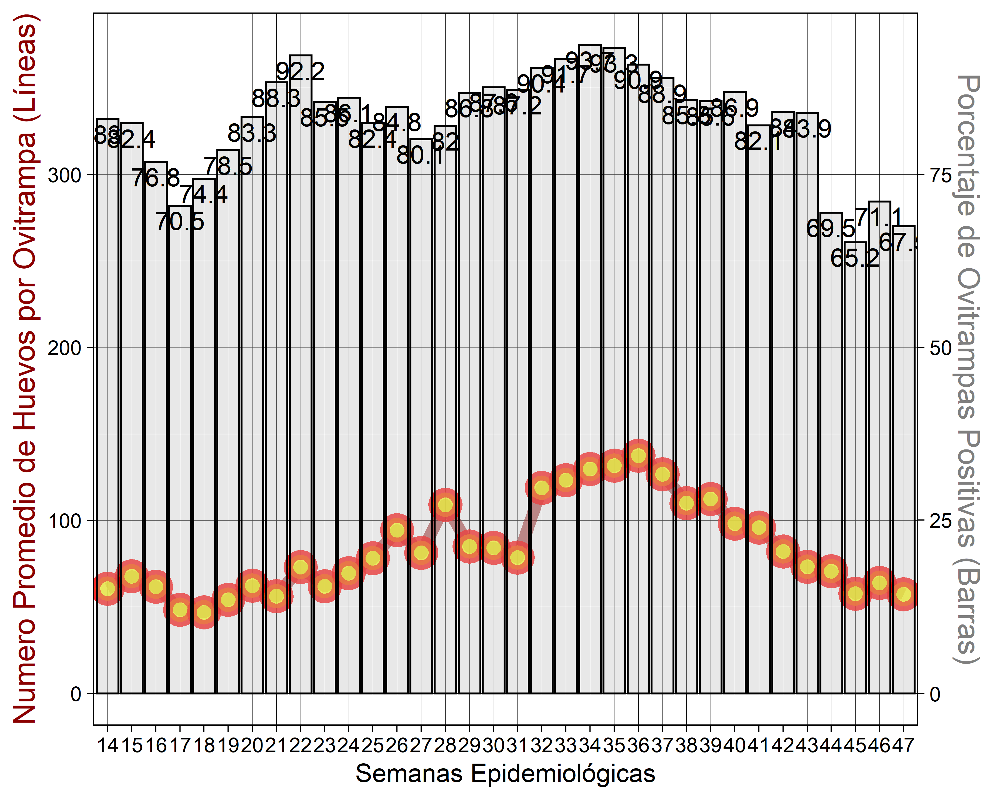


#### **<span style="color:#7d9029"> Manzanas Calientes del área urbana de Mérida en la semana 33</span>**
<div class="knitr-options" data-fig-width="576" data-fig-height="460"></div>


#### **<span style="color:#7d9029"> Predicción del Número de Huevos en el área urbana de Mérida en la semana 33</span>**
<div class="knitr-options" data-fig-width="576" data-fig-height="460"></div>


#### **<span style="color:#7d9029">Indicador de Ovitrampas en Valladolid</span>**
<div class="knitr-options" data-fig-width="576" data-fig-height="460"></div>


#### **<span style="color:#7d9029"> Manzanas Calientes de Valladolid en la semana 33</span>**
<div class="knitr-options" data-fig-width="576" data-fig-height="460"></div>


#### **<span style="color:#7d9029"> Predicción del Número de Huevos en el área urbana de Valladolid en la semana 33</span>**
<div class="knitr-options" data-fig-width="576" data-fig-height="460"></div>


#### **<span style="color:#7d9029">Indicador de Ovitrampas en Tizimín</span>**
<div class="knitr-options" data-fig-width="576" data-fig-height="460"></div>


#### **<span style="color:#7d9029"> Manzanas Calientes de Tizimín en la semana 33</span>**
<div class="knitr-options" data-fig-width="576" data-fig-height="460"></div>
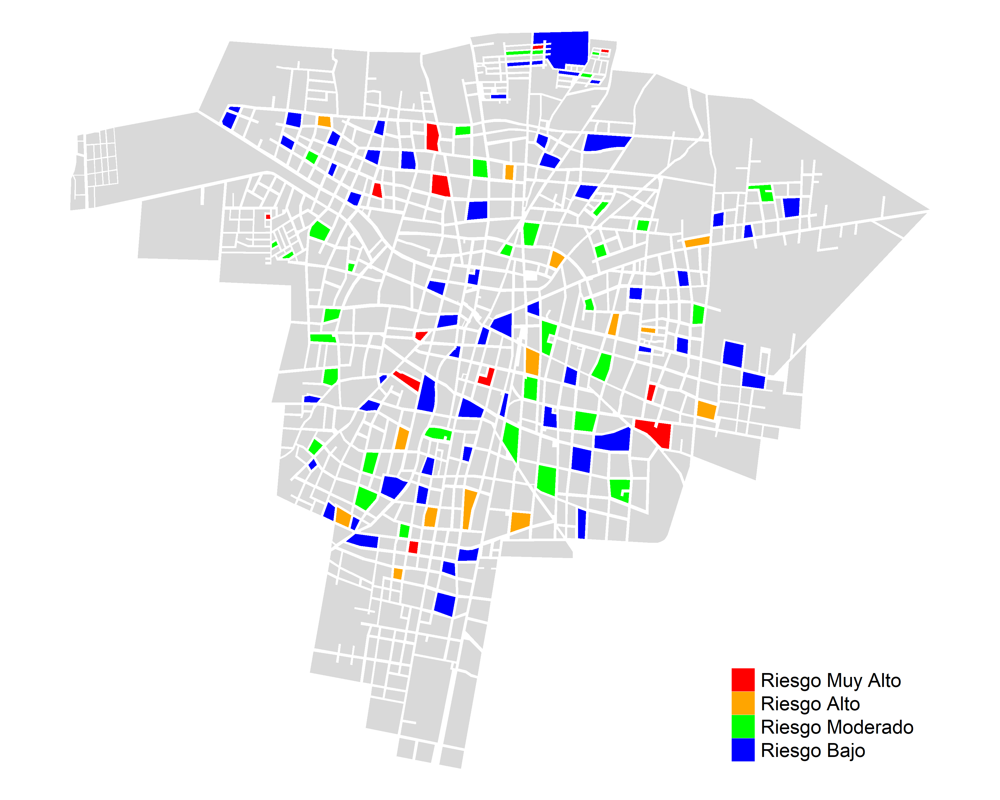


#### **<span style="color:#7d9029"> Predicción del Número de Huevos en el área urbana de Tizimín en la semana 33</span>**
<div class="knitr-options" data-fig-width="576" data-fig-height="460"></div>
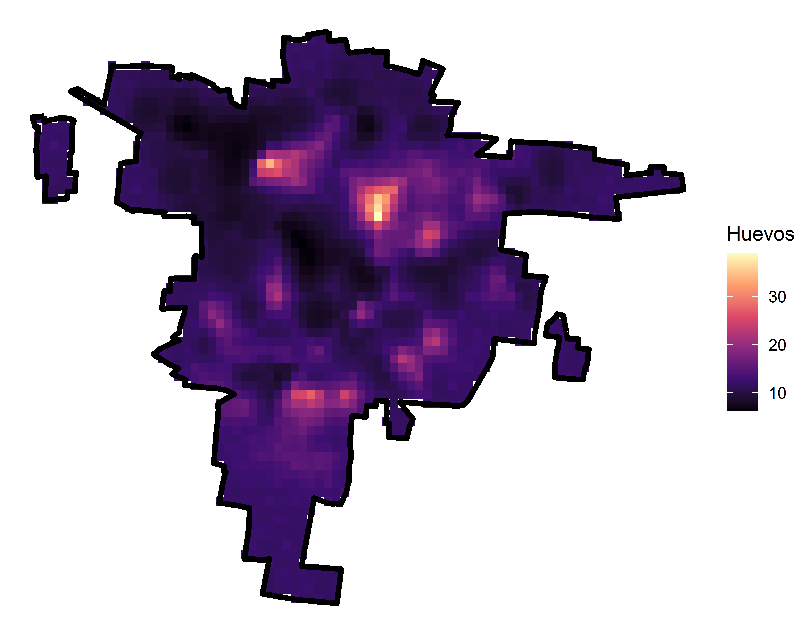

#### **<span style="color:#7d9029">Indicador de Ovitrampas en Piste</span>**
<div class="knitr-options" data-fig-width="576" data-fig-height="460"></div>
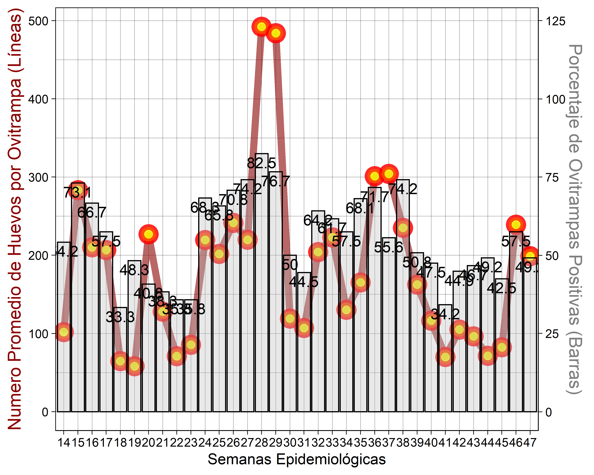

#### **<span style="color:#7d9029"> Predicción del Número de Huevos en el área urbana de Piste en la semana 33</span>**
<div class="knitr-options" data-fig-width="576" data-fig-height="460"></div>
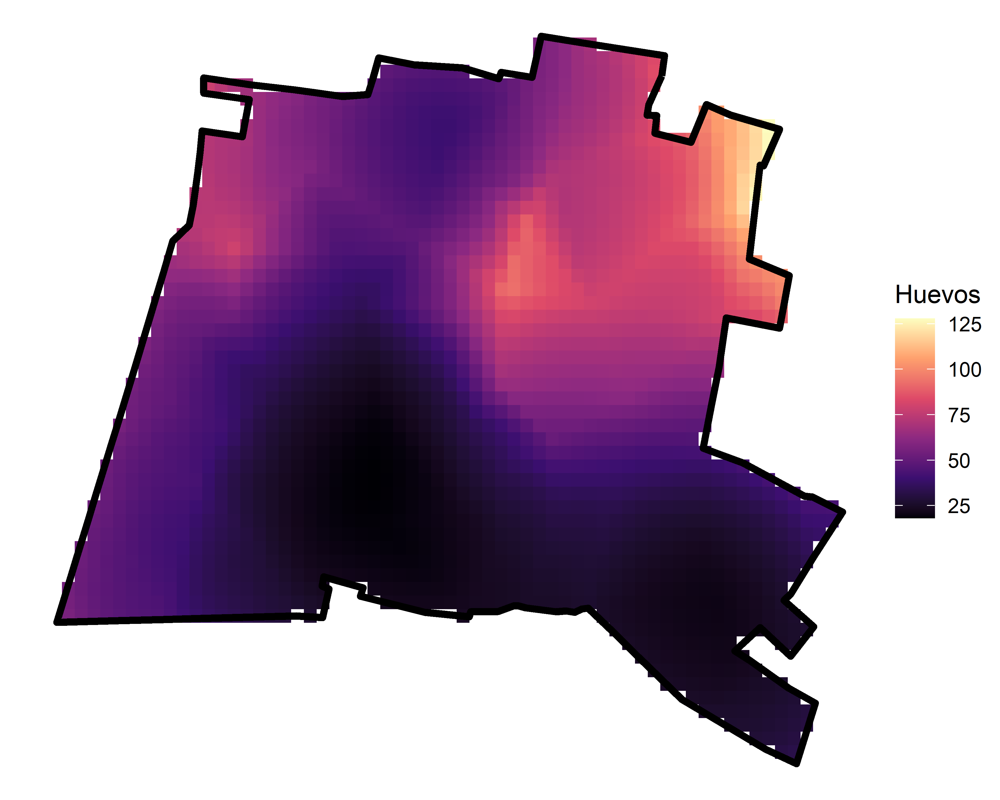

#### **<span style="color:#7d9029">Indicador de Ovitrampas en Ticul</span>**
<div class="knitr-options" data-fig-width="576" data-fig-height="460"></div>
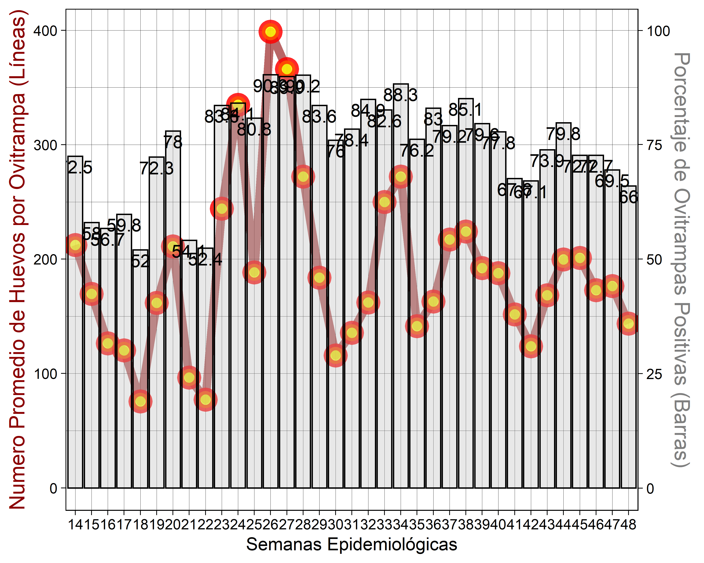

#### **<span style="color:#7d9029"> Manzanas Calientes de Ticul en la semana 33</span>**
<div class="knitr-options" data-fig-width="576" data-fig-height="460"></div>
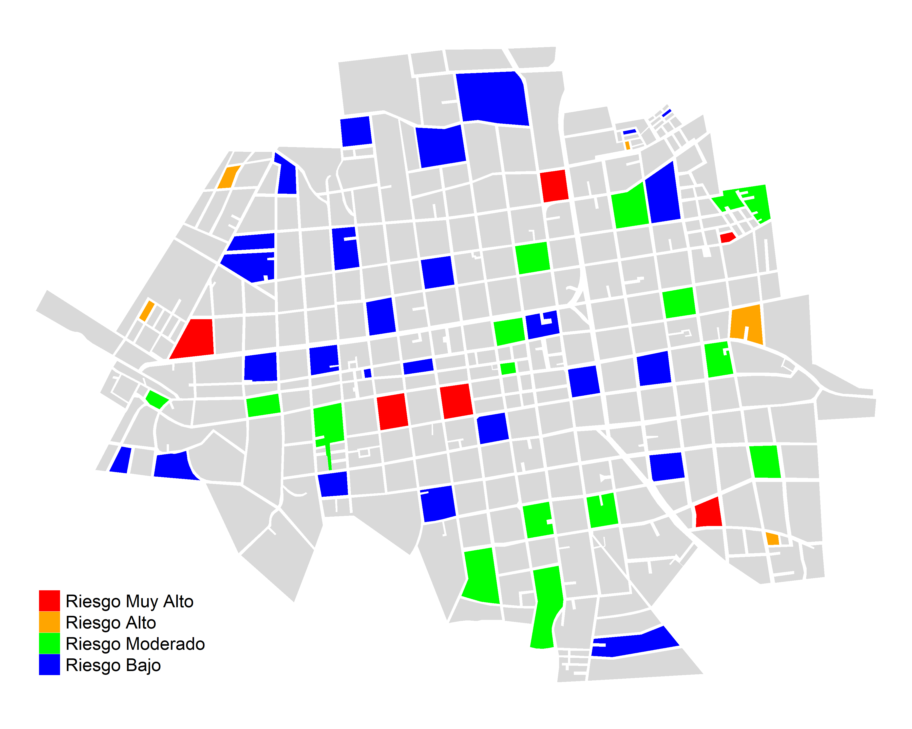

#### **<span style="color:#7d9029"> Predicción del Número de Huevos en el área urbana de Ticul en la semana 33</span>**
<div class="knitr-options" data-fig-width="576" data-fig-height="460"></div>


#### **<span style="color:#7d9029">Indicador de Ovitrampas en Peto</span>**
<div class="knitr-options" data-fig-width="576" data-fig-height="460"></div>


#### **<span style="color:#7d9029"> Manzanas Calientes de Peto en la semana 33</span>**
<div class="knitr-options" data-fig-width="576" data-fig-height="460"></div>


#### **<span style="color:#7d9029"> Predicción del Número de Huevos en el área urbana de Peto en la semana 33</span>**
<div class="knitr-options" data-fig-width="576" data-fig-height="460"></div>
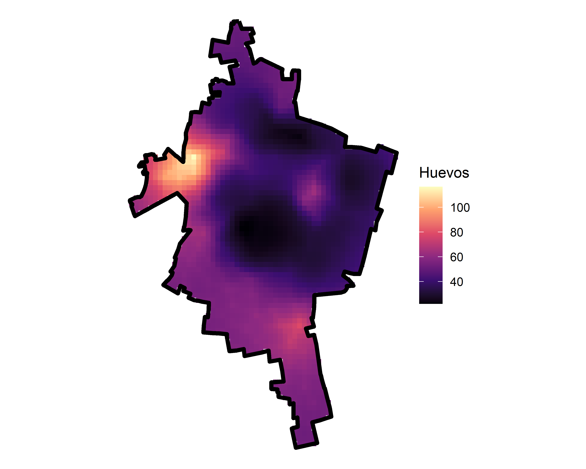

#### **<span style="color:#7d9029">Indicador de Ovitrampas en Tekax</span>**
<div class="knitr-options" data-fig-width="576" data-fig-height="460"></div>


#### **<span style="color:#7d9029"> Manzanas Calientes de Tekax en la semana 33</span>**
<div class="knitr-options" data-fig-width="576" data-fig-height="460"></div>


#### **<span style="color:#7d9029"> Predicción del Número de Huevos en el área urbana de Tekax en la semana 33</span>**
<div class="knitr-options" data-fig-width="576" data-fig-height="460"></div>
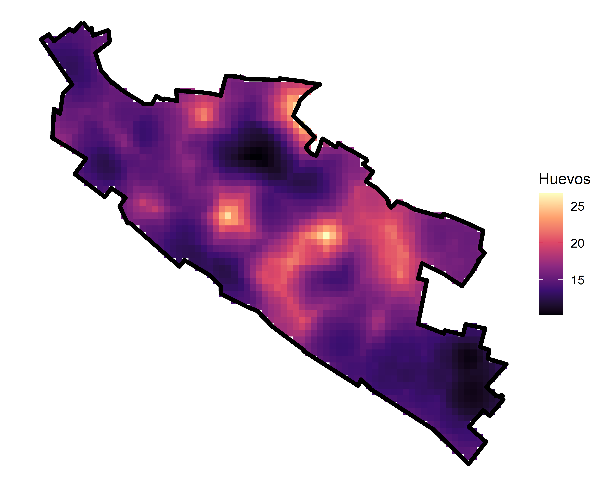

#### **<span style="color:#7d9029">Indicador de Ovitrampas en Oxkutzcab</span>**
<div class="knitr-options" data-fig-width="576" data-fig-height="460"></div>
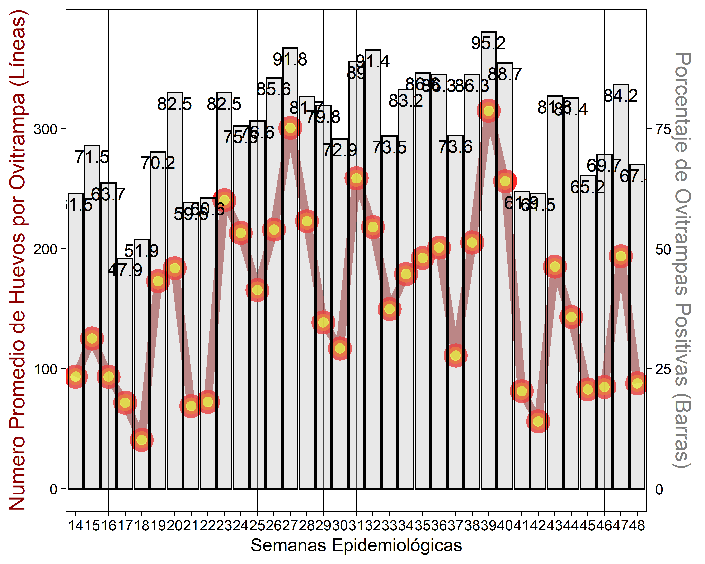

#### **<span style="color:#7d9029"> Manzanas Calientes de Oxkutzcab en la semana 33</span>**
<div class="knitr-options" data-fig-width="576" data-fig-height="460"></div>


#### **<span style="color:#7d9029"> Predicción del Número de Huevos en el área urbana de Oxkutzcab en la semana 33</span>**
<div class="knitr-options" data-fig-width="576" data-fig-height="460"></div>


</div>
</body>
</html>


**Acciones de Control**
=====================================  

Column {.tabset}
------------------------------------

### **<span style="color:#660033"> Control Larvario </span>**
<html>
<head>
<style>
.myDiv1 {
  border: 2px outset darkgreen;
  background-color: white;
  text-align: center;
}
</style>
</head>
<body>

<div class="myDiv1">
  <h2></h2>
  <p></p>

#### Avances de **Control Larvario** Por **Jurisdicción Sanitaria**
<div class="knitr-options" data-fig-width="576" data-fig-height="460"></div>

<table class="table table-condensed">
 <thead>
  <tr>
   <th style="text-align:center;"> Jurisdiccion </th>
   <th style="text-align:center;"> Casas Visitadas hasta la Semana </th>
   <th style="text-align:center;"> Casas Trabajadas hasta la Semana </th>
   <th style="text-align:center;"> Casas Visitadas en los dos últimos meses </th>
   <th style="text-align:center;"> Casas Trabajadas en los dos últimos meses </th>
   <th style="text-align:center;"> Casas Visitadas en la Semana </th>
   <th style="text-align:center;"> Casas Trabajadas en la Semana </th>
  </tr>
 </thead>
<tbody>
  <tr>
   <td style="text-align:center;"> <span style="color: black; font-weight: bold">Mérida    </span> </td>
   <td style="text-align:center;"> <span style="display: block; padding: 0 4px; border-radius: 4px; background-color: #71ca97">108632</span> </td>
   <td style="text-align:center;"> <span style="display: block; padding: 0 4px; border-radius: 4px; background-color: #ffa500">50535</span> </td>
   <td style="text-align:center;"> <span style="display: block; padding: 0 4px; border-radius: 4px; background-color: #71ca97">50791</span> </td>
   <td style="text-align:center;"> <span style="display: block; padding: 0 4px; border-radius: 4px; background-color: #ffa500">22013</span> </td>
   <td style="text-align:center;"> <span style="display: block; padding: 0 4px; border-radius: 4px; background-color: #71ca97">4647</span> </td>
   <td style="text-align:center;"> <span style="display: block; padding: 0 4px; border-radius: 4px; background-color: #ffa809">1666</span> </td>
  </tr>
  <tr>
   <td style="text-align:center;"> <span style="color: black; font-weight: bold">Ticul     </span> </td>
   <td style="text-align:center;"> <span style="display: block; padding: 0 4px; border-radius: 4px; background-color: #beead1">62421</span> </td>
   <td style="text-align:center;"> <span style="display: block; padding: 0 4px; border-radius: 4px; background-color: #ffc253">44345</span> </td>
   <td style="text-align:center;"> <span style="display: block; padding: 0 4px; border-radius: 4px; background-color: #beead1">26338</span> </td>
   <td style="text-align:center;"> <span style="display: block; padding: 0 4px; border-radius: 4px; background-color: #ffcb6d">17878</span> </td>
   <td style="text-align:center;"> <span style="display: block; padding: 0 4px; border-radius: 4px; background-color: #a6e0bf">2500</span> </td>
   <td style="text-align:center;"> <span style="display: block; padding: 0 4px; border-radius: 4px; background-color: #ffa500">1726</span> </td>
  </tr>
  <tr>
   <td style="text-align:center;"> <span style="color: black; font-weight: bold">Valladolid</span> </td>
   <td style="text-align:center;"> <span style="display: block; padding: 0 4px; border-radius: 4px; background-color: #def7e9">43828</span> </td>
   <td style="text-align:center;"> <span style="display: block; padding: 0 4px; border-radius: 4px; background-color: #ffffff">31533</span> </td>
   <td style="text-align:center;"> <span style="display: block; padding: 0 4px; border-radius: 4px; background-color: #def7e9">16413</span> </td>
   <td style="text-align:center;"> <span style="display: block; padding: 0 4px; border-radius: 4px; background-color: #ffffff">12377</span> </td>
   <td style="text-align:center;"> <span style="display: block; padding: 0 4px; border-radius: 4px; background-color: #def7e9">276</span> </td>
   <td style="text-align:center;"> <span style="display: block; padding: 0 4px; border-radius: 4px; background-color: #ffffff">148</span> </td>
  </tr>
</tbody>
</table>


####  **<span style="color:#7d9029">Avances de Control Larvario por Municipio de la Jurisdición 01 Mérida</span>**
<div class="knitr-options" data-fig-width="576" data-fig-height="460"></div>

<table class="table table-condensed">
 <thead>
  <tr>
   <th style="text-align:center;"> Municipio </th>
   <th style="text-align:center;"> Casas Visitadas hasta la Semana </th>
   <th style="text-align:center;"> Casas Trabajadas hasta la Semana </th>
   <th style="text-align:center;"> Casas Visitadas en los dos últimos meses </th>
   <th style="text-align:center;"> Casas Trabajadas en los dos últimos meses </th>
   <th style="text-align:center;"> Casas Visitadas en la Semana </th>
   <th style="text-align:center;"> Casas Trabajadas en la Semana </th>
  </tr>
 </thead>
<tbody>
  <tr>
   <td style="text-align:center;"> <span style="color: black; font-weight: bold">Mérida          </span> </td>
   <td style="text-align:center;"> <span style="display: block; padding: 0 4px; border-radius: 4px; background-color: #71ca97">54656</span> </td>
   <td style="text-align:center;"> <span style="display: block; padding: 0 4px; border-radius: 4px; background-color: #ffa500">26296</span> </td>
   <td style="text-align:center;"> <span style="display: block; padding: 0 4px; border-radius: 4px; background-color: #71ca97">16564</span> </td>
   <td style="text-align:center;"> <span style="display: block; padding: 0 4px; border-radius: 4px; background-color: #ffa500">6001</span> </td>
   <td style="text-align:center;"> <span style="display: block; padding: 0 4px; border-radius: 4px; background-color: #71ca97">3233</span> </td>
   <td style="text-align:center;"> <span style="display: block; padding: 0 4px; border-radius: 4px; background-color: #ffa500">1073</span> </td>
  </tr>
  <tr>
   <td style="text-align:center;"> <span style="color: black; font-weight: bold">Hunucmá         </span> </td>
   <td style="text-align:center;"> <span style="display: block; padding: 0 4px; border-radius: 4px; background-color: #d3f2e1">5031</span> </td>
   <td style="text-align:center;"> <span style="display: block; padding: 0 4px; border-radius: 4px; background-color: #fff7ea">2150</span> </td>
   <td style="text-align:center;"> <span style="display: block; padding: 0 4px; border-radius: 4px; background-color: #ccefdb">2717</span> </td>
   <td style="text-align:center;"> <span style="display: block; padding: 0 4px; border-radius: 4px; background-color: #ffe9c2">1427</span> </td>
   <td style="text-align:center;"> <span style="display: block; padding: 0 4px; border-radius: 4px; background-color: #def7e9">0</span> </td>
   <td style="text-align:center;"> <span style="display: block; padding: 0 4px; border-radius: 4px; background-color: #ffffff">0</span> </td>
  </tr>
  <tr>
   <td style="text-align:center;"> <span style="color: black; font-weight: bold">Motul           </span> </td>
   <td style="text-align:center;"> <span style="display: block; padding: 0 4px; border-radius: 4px; background-color: #d6f3e3">3991</span> </td>
   <td style="text-align:center;"> <span style="display: block; padding: 0 4px; border-radius: 4px; background-color: #fff8ed">1830</span> </td>
   <td style="text-align:center;"> <span style="display: block; padding: 0 4px; border-radius: 4px; background-color: #d1f1df">1952</span> </td>
   <td style="text-align:center;"> <span style="display: block; padding: 0 4px; border-radius: 4px; background-color: #ffefd3">1027</span> </td>
   <td style="text-align:center;"> <span style="display: block; padding: 0 4px; border-radius: 4px; background-color: #daf5e6">108</span> </td>
   <td style="text-align:center;"> <span style="display: block; padding: 0 4px; border-radius: 4px; background-color: #fff9ee">71</span> </td>
  </tr>
  <tr>
   <td style="text-align:center;"> <span style="color: black; font-weight: bold">Tekit           </span> </td>
   <td style="text-align:center;"> <span style="display: block; padding: 0 4px; border-radius: 4px; background-color: #d8f4e4">2945</span> </td>
   <td style="text-align:center;"> <span style="display: block; padding: 0 4px; border-radius: 4px; background-color: #fff9ef">1625</span> </td>
   <td style="text-align:center;"> <span style="display: block; padding: 0 4px; border-radius: 4px; background-color: #caeeda">2945</span> </td>
   <td style="text-align:center;"> <span style="display: block; padding: 0 4px; border-radius: 4px; background-color: #ffe6b9">1625</span> </td>
   <td style="text-align:center;"> <span style="display: block; padding: 0 4px; border-radius: 4px; background-color: #def7e9">0</span> </td>
   <td style="text-align:center;"> <span style="display: block; padding: 0 4px; border-radius: 4px; background-color: #ffffff">0</span> </td>
  </tr>
  <tr>
   <td style="text-align:center;"> <span style="color: black; font-weight: bold">Maxcanú         </span> </td>
   <td style="text-align:center;"> <span style="display: block; padding: 0 4px; border-radius: 4px; background-color: #d8f4e4">2686</span> </td>
   <td style="text-align:center;"> <span style="display: block; padding: 0 4px; border-radius: 4px; background-color: #fff9ef">1615</span> </td>
   <td style="text-align:center;"> <span style="display: block; padding: 0 4px; border-radius: 4px; background-color: #cdf0dc">2548</span> </td>
   <td style="text-align:center;"> <span style="display: block; padding: 0 4px; border-radius: 4px; background-color: #ffe7bd">1535</span> </td>
   <td style="text-align:center;"> <span style="display: block; padding: 0 4px; border-radius: 4px; background-color: #def7e9">0</span> </td>
   <td style="text-align:center;"> <span style="display: block; padding: 0 4px; border-radius: 4px; background-color: #ffffff">0</span> </td>
  </tr>
  <tr>
   <td style="text-align:center;"> <span style="color: black; font-weight: bold">Ixil            </span> </td>
   <td style="text-align:center;"> <span style="display: block; padding: 0 4px; border-radius: 4px; background-color: #d9f5e5">2133</span> </td>
   <td style="text-align:center;"> <span style="display: block; padding: 0 4px; border-radius: 4px; background-color: #fffaf1">1365</span> </td>
   <td style="text-align:center;"> <span style="display: block; padding: 0 4px; border-radius: 4px; background-color: #d1f1df">1904</span> </td>
   <td style="text-align:center;"> <span style="display: block; padding: 0 4px; border-radius: 4px; background-color: #ffeccb">1209</span> </td>
   <td style="text-align:center;"> <span style="display: block; padding: 0 4px; border-radius: 4px; background-color: #def7e9">0</span> </td>
   <td style="text-align:center;"> <span style="display: block; padding: 0 4px; border-radius: 4px; background-color: #ffffff">0</span> </td>
  </tr>
  <tr>
   <td style="text-align:center;"> <span style="color: black; font-weight: bold">Chocholá        </span> </td>
   <td style="text-align:center;"> <span style="display: block; padding: 0 4px; border-radius: 4px; background-color: #dbf5e6">1421</span> </td>
   <td style="text-align:center;"> <span style="display: block; padding: 0 4px; border-radius: 4px; background-color: #fffaf3">1208</span> </td>
   <td style="text-align:center;"> <span style="display: block; padding: 0 4px; border-radius: 4px; background-color: #d4f3e1">1421</span> </td>
   <td style="text-align:center;"> <span style="display: block; padding: 0 4px; border-radius: 4px; background-color: #ffeccb">1208</span> </td>
   <td style="text-align:center;"> <span style="display: block; padding: 0 4px; border-radius: 4px; background-color: #def7e9">0</span> </td>
   <td style="text-align:center;"> <span style="display: block; padding: 0 4px; border-radius: 4px; background-color: #ffffff">0</span> </td>
  </tr>
  <tr>
   <td style="text-align:center;"> <span style="color: black; font-weight: bold">Kanasín         </span> </td>
   <td style="text-align:center;"> <span style="display: block; padding: 0 4px; border-radius: 4px; background-color: #d8f4e4">2779</span> </td>
   <td style="text-align:center;"> <span style="display: block; padding: 0 4px; border-radius: 4px; background-color: #fffaf3">1170</span> </td>
   <td style="text-align:center;"> <span style="display: block; padding: 0 4px; border-radius: 4px; background-color: #d3f2e0">1626</span> </td>
   <td style="text-align:center;"> <span style="display: block; padding: 0 4px; border-radius: 4px; background-color: #fff6e5">590</span> </td>
   <td style="text-align:center;"> <span style="display: block; padding: 0 4px; border-radius: 4px; background-color: #cdf0dc">498</span> </td>
   <td style="text-align:center;"> <span style="display: block; padding: 0 4px; border-radius: 4px; background-color: #fff0d6">171</span> </td>
  </tr>
  <tr>
   <td style="text-align:center;"> <span style="color: black; font-weight: bold">Umán            </span> </td>
   <td style="text-align:center;"> <span style="display: block; padding: 0 4px; border-radius: 4px; background-color: #d7f4e4">3066</span> </td>
   <td style="text-align:center;"> <span style="display: block; padding: 0 4px; border-radius: 4px; background-color: #fffbf4">1087</span> </td>
   <td style="text-align:center;"> <span style="display: block; padding: 0 4px; border-radius: 4px; background-color: #caefda">2906</span> </td>
   <td style="text-align:center;"> <span style="display: block; padding: 0 4px; border-radius: 4px; background-color: #ffefd3">1030</span> </td>
   <td style="text-align:center;"> <span style="display: block; padding: 0 4px; border-radius: 4px; background-color: #d0f1df">389</span> </td>
   <td style="text-align:center;"> <span style="display: block; padding: 0 4px; border-radius: 4px; background-color: #ffefd3">184</span> </td>
  </tr>
  <tr>
   <td style="text-align:center;"> <span style="color: black; font-weight: bold">Dzilam González </span> </td>
   <td style="text-align:center;"> <span style="display: block; padding: 0 4px; border-radius: 4px; background-color: #d9f5e5">2374</span> </td>
   <td style="text-align:center;"> <span style="display: block; padding: 0 4px; border-radius: 4px; background-color: #fffbf5">932</span> </td>
   <td style="text-align:center;"> <span style="display: block; padding: 0 4px; border-radius: 4px; background-color: #d6f3e3">1176</span> </td>
   <td style="text-align:center;"> <span style="display: block; padding: 0 4px; border-radius: 4px; background-color: #fff7ea">483</span> </td>
   <td style="text-align:center;"> <span style="display: block; padding: 0 4px; border-radius: 4px; background-color: #def7e9">0</span> </td>
   <td style="text-align:center;"> <span style="display: block; padding: 0 4px; border-radius: 4px; background-color: #ffffff">0</span> </td>
  </tr>
  <tr>
   <td style="text-align:center;"> <span style="color: black; font-weight: bold">Temax           </span> </td>
   <td style="text-align:center;"> <span style="display: block; padding: 0 4px; border-radius: 4px; background-color: #d9f5e5">2374</span> </td>
   <td style="text-align:center;"> <span style="display: block; padding: 0 4px; border-radius: 4px; background-color: #fffcf6">862</span> </td>
   <td style="text-align:center;"> <span style="display: block; padding: 0 4px; border-radius: 4px; background-color: #dbf5e7">392</span> </td>
   <td style="text-align:center;"> <span style="display: block; padding: 0 4px; border-radius: 4px; background-color: #fffcf7">170</span> </td>
   <td style="text-align:center;"> <span style="display: block; padding: 0 4px; border-radius: 4px; background-color: #def7e9">0</span> </td>
   <td style="text-align:center;"> <span style="display: block; padding: 0 4px; border-radius: 4px; background-color: #ffffff">0</span> </td>
  </tr>
  <tr>
   <td style="text-align:center;"> <span style="color: black; font-weight: bold">Kantunil        </span> </td>
   <td style="text-align:center;"> <span style="display: block; padding: 0 4px; border-radius: 4px; background-color: #daf5e6">1866</span> </td>
   <td style="text-align:center;"> <span style="display: block; padding: 0 4px; border-radius: 4px; background-color: #fffcf7">794</span> </td>
   <td style="text-align:center;"> <span style="display: block; padding: 0 4px; border-radius: 4px; background-color: #d7f4e3">1029</span> </td>
   <td style="text-align:center;"> <span style="display: block; padding: 0 4px; border-radius: 4px; background-color: #fff8ed">403</span> </td>
   <td style="text-align:center;"> <span style="display: block; padding: 0 4px; border-radius: 4px; background-color: #def7e9">0</span> </td>
   <td style="text-align:center;"> <span style="display: block; padding: 0 4px; border-radius: 4px; background-color: #ffffff">0</span> </td>
  </tr>
  <tr>
   <td style="text-align:center;"> <span style="color: black; font-weight: bold">Yobaín          </span> </td>
   <td style="text-align:center;"> <span style="display: block; padding: 0 4px; border-radius: 4px; background-color: #dbf5e6">1380</span> </td>
   <td style="text-align:center;"> <span style="display: block; padding: 0 4px; border-radius: 4px; background-color: #fffcf7">781</span> </td>
   <td style="text-align:center;"> <span style="display: block; padding: 0 4px; border-radius: 4px; background-color: #daf5e6">592</span> </td>
   <td style="text-align:center;"> <span style="display: block; padding: 0 4px; border-radius: 4px; background-color: #fffaf1">314</span> </td>
   <td style="text-align:center;"> <span style="display: block; padding: 0 4px; border-radius: 4px; background-color: #def7e9">0</span> </td>
   <td style="text-align:center;"> <span style="display: block; padding: 0 4px; border-radius: 4px; background-color: #ffffff">0</span> </td>
  </tr>
  <tr>
   <td style="text-align:center;"> <span style="color: black; font-weight: bold">Tetiz           </span> </td>
   <td style="text-align:center;"> <span style="display: block; padding: 0 4px; border-radius: 4px; background-color: #dbf5e6">1461</span> </td>
   <td style="text-align:center;"> <span style="display: block; padding: 0 4px; border-radius: 4px; background-color: #fffcf7">772</span> </td>
   <td style="text-align:center;"> <span style="display: block; padding: 0 4px; border-radius: 4px; background-color: #ddf6e8">37</span> </td>
   <td style="text-align:center;"> <span style="display: block; padding: 0 4px; border-radius: 4px; background-color: #fffefd">34</span> </td>
   <td style="text-align:center;"> <span style="display: block; padding: 0 4px; border-radius: 4px; background-color: #def7e9">0</span> </td>
   <td style="text-align:center;"> <span style="display: block; padding: 0 4px; border-radius: 4px; background-color: #ffffff">0</span> </td>
  </tr>
  <tr>
   <td style="text-align:center;"> <span style="color: black; font-weight: bold">Hocabá          </span> </td>
   <td style="text-align:center;"> <span style="display: block; padding: 0 4px; border-radius: 4px; background-color: #dbf5e7">1234</span> </td>
   <td style="text-align:center;"> <span style="display: block; padding: 0 4px; border-radius: 4px; background-color: #fffcf8">708</span> </td>
   <td style="text-align:center;"> <span style="display: block; padding: 0 4px; border-radius: 4px; background-color: #d5f3e2">1234</span> </td>
   <td style="text-align:center;"> <span style="display: block; padding: 0 4px; border-radius: 4px; background-color: #fff4e0">708</span> </td>
   <td style="text-align:center;"> <span style="display: block; padding: 0 4px; border-radius: 4px; background-color: #def7e9">0</span> </td>
   <td style="text-align:center;"> <span style="display: block; padding: 0 4px; border-radius: 4px; background-color: #ffffff">0</span> </td>
  </tr>
  <tr>
   <td style="text-align:center;"> <span style="color: black; font-weight: bold">Sinanché        </span> </td>
   <td style="text-align:center;"> <span style="display: block; padding: 0 4px; border-radius: 4px; background-color: #dbf5e6">1441</span> </td>
   <td style="text-align:center;"> <span style="display: block; padding: 0 4px; border-radius: 4px; background-color: #fffcf8">620</span> </td>
   <td style="text-align:center;"> <span style="display: block; padding: 0 4px; border-radius: 4px; background-color: #d9f5e5">636</span> </td>
   <td style="text-align:center;"> <span style="display: block; padding: 0 4px; border-radius: 4px; background-color: #fffaf2">303</span> </td>
   <td style="text-align:center;"> <span style="display: block; padding: 0 4px; border-radius: 4px; background-color: #d7f4e4">190</span> </td>
   <td style="text-align:center;"> <span style="display: block; padding: 0 4px; border-radius: 4px; background-color: #fff8ec">77</span> </td>
  </tr>
  <tr>
   <td style="text-align:center;"> <span style="color: black; font-weight: bold">Celestún        </span> </td>
   <td style="text-align:center;"> <span style="display: block; padding: 0 4px; border-radius: 4px; background-color: #d9f5e5">2019</span> </td>
   <td style="text-align:center;"> <span style="display: block; padding: 0 4px; border-radius: 4px; background-color: #fffcf9">611</span> </td>
   <td style="text-align:center;"> <span style="display: block; padding: 0 4px; border-radius: 4px; background-color: #daf5e6">474</span> </td>
   <td style="text-align:center;"> <span style="display: block; padding: 0 4px; border-radius: 4px; background-color: #fffcf9">136</span> </td>
   <td style="text-align:center;"> <span style="display: block; padding: 0 4px; border-radius: 4px; background-color: #def7e9">0</span> </td>
   <td style="text-align:center;"> <span style="display: block; padding: 0 4px; border-radius: 4px; background-color: #ffffff">0</span> </td>
  </tr>
  <tr>
   <td style="text-align:center;"> <span style="color: black; font-weight: bold">Sanahcat        </span> </td>
   <td style="text-align:center;"> <span style="display: block; padding: 0 4px; border-radius: 4px; background-color: #dcf6e7">855</span> </td>
   <td style="text-align:center;"> <span style="display: block; padding: 0 4px; border-radius: 4px; background-color: #fffdf9">553</span> </td>
   <td style="text-align:center;"> <span style="display: block; padding: 0 4px; border-radius: 4px; background-color: #dbf5e6">440</span> </td>
   <td style="text-align:center;"> <span style="display: block; padding: 0 4px; border-radius: 4px; background-color: #fffaf3">278</span> </td>
   <td style="text-align:center;"> <span style="display: block; padding: 0 4px; border-radius: 4px; background-color: #def7e9">0</span> </td>
   <td style="text-align:center;"> <span style="display: block; padding: 0 4px; border-radius: 4px; background-color: #ffffff">0</span> </td>
  </tr>
  <tr>
   <td style="text-align:center;"> <span style="color: black; font-weight: bold">Kinchil         </span> </td>
   <td style="text-align:center;"> <span style="display: block; padding: 0 4px; border-radius: 4px; background-color: #dbf6e7">1099</span> </td>
   <td style="text-align:center;"> <span style="display: block; padding: 0 4px; border-radius: 4px; background-color: #fffdfa">478</span> </td>
   <td style="text-align:center;"> <span style="display: block; padding: 0 4px; border-radius: 4px; background-color: #d8f4e5">799</span> </td>
   <td style="text-align:center;"> <span style="display: block; padding: 0 4px; border-radius: 4px; background-color: #fff9f0">346</span> </td>
   <td style="text-align:center;"> <span style="display: block; padding: 0 4px; border-radius: 4px; background-color: #def7e9">0</span> </td>
   <td style="text-align:center;"> <span style="display: block; padding: 0 4px; border-radius: 4px; background-color: #ffffff">0</span> </td>
  </tr>
  <tr>
   <td style="text-align:center;"> <span style="color: black; font-weight: bold">Sotuta          </span> </td>
   <td style="text-align:center;"> <span style="display: block; padding: 0 4px; border-radius: 4px; background-color: #dbf5e6">1440</span> </td>
   <td style="text-align:center;"> <span style="display: block; padding: 0 4px; border-radius: 4px; background-color: #fffdfa">431</span> </td>
   <td style="text-align:center;"> <span style="display: block; padding: 0 4px; border-radius: 4px; background-color: #ddf6e8">66</span> </td>
   <td style="text-align:center;"> <span style="display: block; padding: 0 4px; border-radius: 4px; background-color: #fffefe">10</span> </td>
   <td style="text-align:center;"> <span style="display: block; padding: 0 4px; border-radius: 4px; background-color: #def7e9">0</span> </td>
   <td style="text-align:center;"> <span style="display: block; padding: 0 4px; border-radius: 4px; background-color: #ffffff">0</span> </td>
  </tr>
  <tr>
   <td style="text-align:center;"> <span style="color: black; font-weight: bold">Cansahcab       </span> </td>
   <td style="text-align:center;"> <span style="display: block; padding: 0 4px; border-radius: 4px; background-color: #dcf6e7">917</span> </td>
   <td style="text-align:center;"> <span style="display: block; padding: 0 4px; border-radius: 4px; background-color: #fffdfb">394</span> </td>
   <td style="text-align:center;"> <span style="display: block; padding: 0 4px; border-radius: 4px; background-color: #d7f4e4">917</span> </td>
   <td style="text-align:center;"> <span style="display: block; padding: 0 4px; border-radius: 4px; background-color: #fff9ee">394</span> </td>
   <td style="text-align:center;"> <span style="display: block; padding: 0 4px; border-radius: 4px; background-color: #def7e9">0</span> </td>
   <td style="text-align:center;"> <span style="display: block; padding: 0 4px; border-radius: 4px; background-color: #ffffff">0</span> </td>
  </tr>
  <tr>
   <td style="text-align:center;"> <span style="color: black; font-weight: bold">Yaxkukul        </span> </td>
   <td style="text-align:center;"> <span style="display: block; padding: 0 4px; border-radius: 4px; background-color: #dcf6e7">986</span> </td>
   <td style="text-align:center;"> <span style="display: block; padding: 0 4px; border-radius: 4px; background-color: #fffdfb">385</span> </td>
   <td style="text-align:center;"> <span style="display: block; padding: 0 4px; border-radius: 4px; background-color: #d7f4e4">986</span> </td>
   <td style="text-align:center;"> <span style="display: block; padding: 0 4px; border-radius: 4px; background-color: #fff9ee">385</span> </td>
   <td style="text-align:center;"> <span style="display: block; padding: 0 4px; border-radius: 4px; background-color: #def7e9">0</span> </td>
   <td style="text-align:center;"> <span style="display: block; padding: 0 4px; border-radius: 4px; background-color: #ffffff">0</span> </td>
  </tr>
  <tr>
   <td style="text-align:center;"> <span style="color: black; font-weight: bold">Sudzal          </span> </td>
   <td style="text-align:center;"> <span style="display: block; padding: 0 4px; border-radius: 4px; background-color: #dcf6e7">801</span> </td>
   <td style="text-align:center;"> <span style="display: block; padding: 0 4px; border-radius: 4px; background-color: #fffdfb">381</span> </td>
   <td style="text-align:center;"> <span style="display: block; padding: 0 4px; border-radius: 4px; background-color: #d9f5e5">705</span> </td>
   <td style="text-align:center;"> <span style="display: block; padding: 0 4px; border-radius: 4px; background-color: #fffaf1">323</span> </td>
   <td style="text-align:center;"> <span style="display: block; padding: 0 4px; border-radius: 4px; background-color: #def7e9">0</span> </td>
   <td style="text-align:center;"> <span style="display: block; padding: 0 4px; border-radius: 4px; background-color: #ffffff">0</span> </td>
  </tr>
  <tr>
   <td style="text-align:center;"> <span style="color: black; font-weight: bold">Xocchel         </span> </td>
   <td style="text-align:center;"> <span style="display: block; padding: 0 4px; border-radius: 4px; background-color: #dcf6e7">937</span> </td>
   <td style="text-align:center;"> <span style="display: block; padding: 0 4px; border-radius: 4px; background-color: #fffdfb">329</span> </td>
   <td style="text-align:center;"> <span style="display: block; padding: 0 4px; border-radius: 4px; background-color: #d9f5e5">660</span> </td>
   <td style="text-align:center;"> <span style="display: block; padding: 0 4px; border-radius: 4px; background-color: #fffbf4">239</span> </td>
   <td style="text-align:center;"> <span style="display: block; padding: 0 4px; border-radius: 4px; background-color: #def7e9">0</span> </td>
   <td style="text-align:center;"> <span style="display: block; padding: 0 4px; border-radius: 4px; background-color: #ffffff">0</span> </td>
  </tr>
  <tr>
   <td style="text-align:center;"> <span style="color: black; font-weight: bold">Tixkokob        </span> </td>
   <td style="text-align:center;"> <span style="display: block; padding: 0 4px; border-radius: 4px; background-color: #dcf6e8">601</span> </td>
   <td style="text-align:center;"> <span style="display: block; padding: 0 4px; border-radius: 4px; background-color: #fffdfb">327</span> </td>
   <td style="text-align:center;"> <span style="display: block; padding: 0 4px; border-radius: 4px; background-color: #dcf6e7">288</span> </td>
   <td style="text-align:center;"> <span style="display: block; padding: 0 4px; border-radius: 4px; background-color: #fffcf8">163</span> </td>
   <td style="text-align:center;"> <span style="display: block; padding: 0 4px; border-radius: 4px; background-color: #def7e9">0</span> </td>
   <td style="text-align:center;"> <span style="display: block; padding: 0 4px; border-radius: 4px; background-color: #ffffff">0</span> </td>
  </tr>
  <tr>
   <td style="text-align:center;"> <span style="color: black; font-weight: bold">Tepakán         </span> </td>
   <td style="text-align:center;"> <span style="display: block; padding: 0 4px; border-radius: 4px; background-color: #dcf6e7">678</span> </td>
   <td style="text-align:center;"> <span style="display: block; padding: 0 4px; border-radius: 4px; background-color: #fffdfb">325</span> </td>
   <td style="text-align:center;"> <span style="display: block; padding: 0 4px; border-radius: 4px; background-color: #daf5e5">607</span> </td>
   <td style="text-align:center;"> <span style="display: block; padding: 0 4px; border-radius: 4px; background-color: #fffaf3">271</span> </td>
   <td style="text-align:center;"> <span style="display: block; padding: 0 4px; border-radius: 4px; background-color: #def7e9">0</span> </td>
   <td style="text-align:center;"> <span style="display: block; padding: 0 4px; border-radius: 4px; background-color: #ffffff">0</span> </td>
  </tr>
  <tr>
   <td style="text-align:center;"> <span style="color: black; font-weight: bold">Teya            </span> </td>
   <td style="text-align:center;"> <span style="display: block; padding: 0 4px; border-radius: 4px; background-color: #ddf6e8">420</span> </td>
   <td style="text-align:center;"> <span style="display: block; padding: 0 4px; border-radius: 4px; background-color: #fffefc">281</span> </td>
   <td style="text-align:center;"> <span style="display: block; padding: 0 4px; border-radius: 4px; background-color: #def7e9">0</span> </td>
   <td style="text-align:center;"> <span style="display: block; padding: 0 4px; border-radius: 4px; background-color: #ffffff">0</span> </td>
   <td style="text-align:center;"> <span style="display: block; padding: 0 4px; border-radius: 4px; background-color: #def7e9">0</span> </td>
   <td style="text-align:center;"> <span style="display: block; padding: 0 4px; border-radius: 4px; background-color: #ffffff">0</span> </td>
  </tr>
  <tr>
   <td style="text-align:center;"> <span style="color: black; font-weight: bold">Kopomá          </span> </td>
   <td style="text-align:center;"> <span style="display: block; padding: 0 4px; border-radius: 4px; background-color: #dcf6e7">708</span> </td>
   <td style="text-align:center;"> <span style="display: block; padding: 0 4px; border-radius: 4px; background-color: #fffefc">267</span> </td>
   <td style="text-align:center;"> <span style="display: block; padding: 0 4px; border-radius: 4px; background-color: #dcf6e8">195</span> </td>
   <td style="text-align:center;"> <span style="display: block; padding: 0 4px; border-radius: 4px; background-color: #fffdfc">68</span> </td>
   <td style="text-align:center;"> <span style="display: block; padding: 0 4px; border-radius: 4px; background-color: #def7e9">0</span> </td>
   <td style="text-align:center;"> <span style="display: block; padding: 0 4px; border-radius: 4px; background-color: #ffffff">0</span> </td>
  </tr>
  <tr>
   <td style="text-align:center;"> <span style="color: black; font-weight: bold">Samahil         </span> </td>
   <td style="text-align:center;"> <span style="display: block; padding: 0 4px; border-radius: 4px; background-color: #ddf6e8">485</span> </td>
   <td style="text-align:center;"> <span style="display: block; padding: 0 4px; border-radius: 4px; background-color: #fffefc">259</span> </td>
   <td style="text-align:center;"> <span style="display: block; padding: 0 4px; border-radius: 4px; background-color: #daf5e6">485</span> </td>
   <td style="text-align:center;"> <span style="display: block; padding: 0 4px; border-radius: 4px; background-color: #fffbf3">259</span> </td>
   <td style="text-align:center;"> <span style="display: block; padding: 0 4px; border-radius: 4px; background-color: #def7e9">0</span> </td>
   <td style="text-align:center;"> <span style="display: block; padding: 0 4px; border-radius: 4px; background-color: #ffffff">0</span> </td>
  </tr>
  <tr>
   <td style="text-align:center;"> <span style="color: black; font-weight: bold">Tunkás          </span> </td>
   <td style="text-align:center;"> <span style="display: block; padding: 0 4px; border-radius: 4px; background-color: #ddf6e8">408</span> </td>
   <td style="text-align:center;"> <span style="display: block; padding: 0 4px; border-radius: 4px; background-color: #fffefc">245</span> </td>
   <td style="text-align:center;"> <span style="display: block; padding: 0 4px; border-radius: 4px; background-color: #dcf6e7">250</span> </td>
   <td style="text-align:center;"> <span style="display: block; padding: 0 4px; border-radius: 4px; background-color: #fffdf9">133</span> </td>
   <td style="text-align:center;"> <span style="display: block; padding: 0 4px; border-radius: 4px; background-color: #def7e9">0</span> </td>
   <td style="text-align:center;"> <span style="display: block; padding: 0 4px; border-radius: 4px; background-color: #ffffff">0</span> </td>
  </tr>
  <tr>
   <td style="text-align:center;"> <span style="color: black; font-weight: bold">Cuzamá          </span> </td>
   <td style="text-align:center;"> <span style="display: block; padding: 0 4px; border-radius: 4px; background-color: #dcf6e8">611</span> </td>
   <td style="text-align:center;"> <span style="display: block; padding: 0 4px; border-radius: 4px; background-color: #fffefc">237</span> </td>
   <td style="text-align:center;"> <span style="display: block; padding: 0 4px; border-radius: 4px; background-color: #d9f5e5">611</span> </td>
   <td style="text-align:center;"> <span style="display: block; padding: 0 4px; border-radius: 4px; background-color: #fffbf4">237</span> </td>
   <td style="text-align:center;"> <span style="display: block; padding: 0 4px; border-radius: 4px; background-color: #def7e9">0</span> </td>
   <td style="text-align:center;"> <span style="display: block; padding: 0 4px; border-radius: 4px; background-color: #ffffff">0</span> </td>
  </tr>
  <tr>
   <td style="text-align:center;"> <span style="color: black; font-weight: bold">Progreso        </span> </td>
   <td style="text-align:center;"> <span style="display: block; padding: 0 4px; border-radius: 4px; background-color: #d9f5e5">2103</span> </td>
   <td style="text-align:center;"> <span style="display: block; padding: 0 4px; border-radius: 4px; background-color: #fffefd">186</span> </td>
   <td style="text-align:center;"> <span style="display: block; padding: 0 4px; border-radius: 4px; background-color: #d1f1df">1923</span> </td>
   <td style="text-align:center;"> <span style="display: block; padding: 0 4px; border-radius: 4px; background-color: #fffdfa">98</span> </td>
   <td style="text-align:center;"> <span style="display: block; padding: 0 4px; border-radius: 4px; background-color: #def7e9">0</span> </td>
   <td style="text-align:center;"> <span style="display: block; padding: 0 4px; border-radius: 4px; background-color: #ffffff">0</span> </td>
  </tr>
  <tr>
   <td style="text-align:center;"> <span style="color: black; font-weight: bold">Acanceh         </span> </td>
   <td style="text-align:center;"> <span style="display: block; padding: 0 4px; border-radius: 4px; background-color: #ddf6e8">254</span> </td>
   <td style="text-align:center;"> <span style="display: block; padding: 0 4px; border-radius: 4px; background-color: #fffefd">143</span> </td>
   <td style="text-align:center;"> <span style="display: block; padding: 0 4px; border-radius: 4px; background-color: #def7e9">0</span> </td>
   <td style="text-align:center;"> <span style="display: block; padding: 0 4px; border-radius: 4px; background-color: #ffffff">0</span> </td>
   <td style="text-align:center;"> <span style="display: block; padding: 0 4px; border-radius: 4px; background-color: #def7e9">0</span> </td>
   <td style="text-align:center;"> <span style="display: block; padding: 0 4px; border-radius: 4px; background-color: #ffffff">0</span> </td>
  </tr>
  <tr>
   <td style="text-align:center;"> <span style="color: black; font-weight: bold">Ucú             </span> </td>
   <td style="text-align:center;"> <span style="display: block; padding: 0 4px; border-radius: 4px; background-color: #dcf6e7">731</span> </td>
   <td style="text-align:center;"> <span style="display: block; padding: 0 4px; border-radius: 4px; background-color: #fffefd">132</span> </td>
   <td style="text-align:center;"> <span style="display: block; padding: 0 4px; border-radius: 4px; background-color: #daf5e6">513</span> </td>
   <td style="text-align:center;"> <span style="display: block; padding: 0 4px; border-radius: 4px; background-color: #fffdfb">90</span> </td>
   <td style="text-align:center;"> <span style="display: block; padding: 0 4px; border-radius: 4px; background-color: #def7e9">0</span> </td>
   <td style="text-align:center;"> <span style="display: block; padding: 0 4px; border-radius: 4px; background-color: #ffffff">0</span> </td>
  </tr>
  <tr>
   <td style="text-align:center;"> <span style="color: black; font-weight: bold">Conkal          </span> </td>
   <td style="text-align:center;"> <span style="display: block; padding: 0 4px; border-radius: 4px; background-color: #ddf6e8">272</span> </td>
   <td style="text-align:center;"> <span style="display: block; padding: 0 4px; border-radius: 4px; background-color: #fffefd">122</span> </td>
   <td style="text-align:center;"> <span style="display: block; padding: 0 4px; border-radius: 4px; background-color: #dcf6e7">272</span> </td>
   <td style="text-align:center;"> <span style="display: block; padding: 0 4px; border-radius: 4px; background-color: #fffdf9">122</span> </td>
   <td style="text-align:center;"> <span style="display: block; padding: 0 4px; border-radius: 4px; background-color: #def7e9">0</span> </td>
   <td style="text-align:center;"> <span style="display: block; padding: 0 4px; border-radius: 4px; background-color: #ffffff">0</span> </td>
  </tr>
  <tr>
   <td style="text-align:center;"> <span style="color: black; font-weight: bold">Dzemul          </span> </td>
   <td style="text-align:center;"> <span style="display: block; padding: 0 4px; border-radius: 4px; background-color: #ddf6e8">216</span> </td>
   <td style="text-align:center;"> <span style="display: block; padding: 0 4px; border-radius: 4px; background-color: #fffefd">110</span> </td>
   <td style="text-align:center;"> <span style="display: block; padding: 0 4px; border-radius: 4px; background-color: #dcf6e7">216</span> </td>
   <td style="text-align:center;"> <span style="display: block; padding: 0 4px; border-radius: 4px; background-color: #fffdfa">110</span> </td>
   <td style="text-align:center;"> <span style="display: block; padding: 0 4px; border-radius: 4px; background-color: #def7e9">0</span> </td>
   <td style="text-align:center;"> <span style="display: block; padding: 0 4px; border-radius: 4px; background-color: #ffffff">0</span> </td>
  </tr>
  <tr>
   <td style="text-align:center;"> <span style="color: black; font-weight: bold">Baca            </span> </td>
   <td style="text-align:center;"> <span style="display: block; padding: 0 4px; border-radius: 4px; background-color: #ddf6e8">164</span> </td>
   <td style="text-align:center;"> <span style="display: block; padding: 0 4px; border-radius: 4px; background-color: #fffefd">105</span> </td>
   <td style="text-align:center;"> <span style="display: block; padding: 0 4px; border-radius: 4px; background-color: #def7e9">0</span> </td>
   <td style="text-align:center;"> <span style="display: block; padding: 0 4px; border-radius: 4px; background-color: #ffffff">0</span> </td>
   <td style="text-align:center;"> <span style="display: block; padding: 0 4px; border-radius: 4px; background-color: #def7e9">0</span> </td>
   <td style="text-align:center;"> <span style="display: block; padding: 0 4px; border-radius: 4px; background-color: #ffffff">0</span> </td>
  </tr>
  <tr>
   <td style="text-align:center;"> <span style="color: black; font-weight: bold">Dzidzantún      </span> </td>
   <td style="text-align:center;"> <span style="display: block; padding: 0 4px; border-radius: 4px; background-color: #ddf6e8">290</span> </td>
   <td style="text-align:center;"> <span style="display: block; padding: 0 4px; border-radius: 4px; background-color: #fffefe">103</span> </td>
   <td style="text-align:center;"> <span style="display: block; padding: 0 4px; border-radius: 4px; background-color: #dcf6e7">290</span> </td>
   <td style="text-align:center;"> <span style="display: block; padding: 0 4px; border-radius: 4px; background-color: #fffdfa">103</span> </td>
   <td style="text-align:center;"> <span style="display: block; padding: 0 4px; border-radius: 4px; background-color: #def7e9">0</span> </td>
   <td style="text-align:center;"> <span style="display: block; padding: 0 4px; border-radius: 4px; background-color: #ffffff">0</span> </td>
  </tr>
  <tr>
   <td style="text-align:center;"> <span style="color: black; font-weight: bold">Cacalchén       </span> </td>
   <td style="text-align:center;"> <span style="display: block; padding: 0 4px; border-radius: 4px; background-color: #ddf6e8">318</span> </td>
   <td style="text-align:center;"> <span style="display: block; padding: 0 4px; border-radius: 4px; background-color: #fffefe">92</span> </td>
   <td style="text-align:center;"> <span style="display: block; padding: 0 4px; border-radius: 4px; background-color: #def7e9">0</span> </td>
   <td style="text-align:center;"> <span style="display: block; padding: 0 4px; border-radius: 4px; background-color: #ffffff">0</span> </td>
   <td style="text-align:center;"> <span style="display: block; padding: 0 4px; border-radius: 4px; background-color: #def7e9">0</span> </td>
   <td style="text-align:center;"> <span style="display: block; padding: 0 4px; border-radius: 4px; background-color: #ffffff">0</span> </td>
  </tr>
  <tr>
   <td style="text-align:center;"> <span style="color: black; font-weight: bold">Muxupip         </span> </td>
   <td style="text-align:center;"> <span style="display: block; padding: 0 4px; border-radius: 4px; background-color: #ddf6e8">186</span> </td>
   <td style="text-align:center;"> <span style="display: block; padding: 0 4px; border-radius: 4px; background-color: #fffefe">91</span> </td>
   <td style="text-align:center;"> <span style="display: block; padding: 0 4px; border-radius: 4px; background-color: #dcf6e8">186</span> </td>
   <td style="text-align:center;"> <span style="display: block; padding: 0 4px; border-radius: 4px; background-color: #fffdfb">91</span> </td>
   <td style="text-align:center;"> <span style="display: block; padding: 0 4px; border-radius: 4px; background-color: #def7e9">0</span> </td>
   <td style="text-align:center;"> <span style="display: block; padding: 0 4px; border-radius: 4px; background-color: #ffffff">0</span> </td>
  </tr>
  <tr>
   <td style="text-align:center;"> <span style="color: black; font-weight: bold">Tixpéhual       </span> </td>
   <td style="text-align:center;"> <span style="display: block; padding: 0 4px; border-radius: 4px; background-color: #ddf6e8">229</span> </td>
   <td style="text-align:center;"> <span style="display: block; padding: 0 4px; border-radius: 4px; background-color: #fffefe">90</span> </td>
   <td style="text-align:center;"> <span style="display: block; padding: 0 4px; border-radius: 4px; background-color: #dcf6e7">229</span> </td>
   <td style="text-align:center;"> <span style="display: block; padding: 0 4px; border-radius: 4px; background-color: #fffdfb">90</span> </td>
   <td style="text-align:center;"> <span style="display: block; padding: 0 4px; border-radius: 4px; background-color: #d6f3e3">229</span> </td>
   <td style="text-align:center;"> <span style="display: block; padding: 0 4px; border-radius: 4px; background-color: #fff7e9">90</span> </td>
  </tr>
  <tr>
   <td style="text-align:center;"> <span style="color: black; font-weight: bold">Izamal          </span> </td>
   <td style="text-align:center;"> <span style="display: block; padding: 0 4px; border-radius: 4px; background-color: #ddf6e8">66</span> </td>
   <td style="text-align:center;"> <span style="display: block; padding: 0 4px; border-radius: 4px; background-color: #fffefe">43</span> </td>
   <td style="text-align:center;"> <span style="display: block; padding: 0 4px; border-radius: 4px; background-color: #def7e9">0</span> </td>
   <td style="text-align:center;"> <span style="display: block; padding: 0 4px; border-radius: 4px; background-color: #ffffff">0</span> </td>
   <td style="text-align:center;"> <span style="display: block; padding: 0 4px; border-radius: 4px; background-color: #def7e9">0</span> </td>
   <td style="text-align:center;"> <span style="display: block; padding: 0 4px; border-radius: 4px; background-color: #ffffff">0</span> </td>
  </tr>
  <tr>
   <td style="text-align:center;"> <span style="color: black; font-weight: bold">Abalá           </span> </td>
   <td style="text-align:center;"> <span style="display: block; padding: 0 4px; border-radius: 4px; background-color: #def7e9">0</span> </td>
   <td style="text-align:center;"> <span style="display: block; padding: 0 4px; border-radius: 4px; background-color: #ffffff">0</span> </td>
   <td style="text-align:center;"> <span style="display: block; padding: 0 4px; border-radius: 4px; background-color: #def7e9">0</span> </td>
   <td style="text-align:center;"> <span style="display: block; padding: 0 4px; border-radius: 4px; background-color: #ffffff">0</span> </td>
   <td style="text-align:center;"> <span style="display: block; padding: 0 4px; border-radius: 4px; background-color: #def7e9">0</span> </td>
   <td style="text-align:center;"> <span style="display: block; padding: 0 4px; border-radius: 4px; background-color: #ffffff">0</span> </td>
  </tr>
  <tr>
   <td style="text-align:center;"> <span style="color: black; font-weight: bold">Bokobá          </span> </td>
   <td style="text-align:center;"> <span style="display: block; padding: 0 4px; border-radius: 4px; background-color: #def7e9">0</span> </td>
   <td style="text-align:center;"> <span style="display: block; padding: 0 4px; border-radius: 4px; background-color: #ffffff">0</span> </td>
   <td style="text-align:center;"> <span style="display: block; padding: 0 4px; border-radius: 4px; background-color: #def7e9">0</span> </td>
   <td style="text-align:center;"> <span style="display: block; padding: 0 4px; border-radius: 4px; background-color: #ffffff">0</span> </td>
   <td style="text-align:center;"> <span style="display: block; padding: 0 4px; border-radius: 4px; background-color: #def7e9">0</span> </td>
   <td style="text-align:center;"> <span style="display: block; padding: 0 4px; border-radius: 4px; background-color: #ffffff">0</span> </td>
  </tr>
  <tr>
   <td style="text-align:center;"> <span style="color: black; font-weight: bold">Dzoncauich      </span> </td>
   <td style="text-align:center;"> <span style="display: block; padding: 0 4px; border-radius: 4px; background-color: #def7e9">0</span> </td>
   <td style="text-align:center;"> <span style="display: block; padding: 0 4px; border-radius: 4px; background-color: #ffffff">0</span> </td>
   <td style="text-align:center;"> <span style="display: block; padding: 0 4px; border-radius: 4px; background-color: #def7e9">0</span> </td>
   <td style="text-align:center;"> <span style="display: block; padding: 0 4px; border-radius: 4px; background-color: #ffffff">0</span> </td>
   <td style="text-align:center;"> <span style="display: block; padding: 0 4px; border-radius: 4px; background-color: #def7e9">0</span> </td>
   <td style="text-align:center;"> <span style="display: block; padding: 0 4px; border-radius: 4px; background-color: #ffffff">0</span> </td>
  </tr>
  <tr>
   <td style="text-align:center;"> <span style="color: black; font-weight: bold">Halachó         </span> </td>
   <td style="text-align:center;"> <span style="display: block; padding: 0 4px; border-radius: 4px; background-color: #def7e9">0</span> </td>
   <td style="text-align:center;"> <span style="display: block; padding: 0 4px; border-radius: 4px; background-color: #ffffff">0</span> </td>
   <td style="text-align:center;"> <span style="display: block; padding: 0 4px; border-radius: 4px; background-color: #def7e9">0</span> </td>
   <td style="text-align:center;"> <span style="display: block; padding: 0 4px; border-radius: 4px; background-color: #ffffff">0</span> </td>
   <td style="text-align:center;"> <span style="display: block; padding: 0 4px; border-radius: 4px; background-color: #def7e9">0</span> </td>
   <td style="text-align:center;"> <span style="display: block; padding: 0 4px; border-radius: 4px; background-color: #ffffff">0</span> </td>
  </tr>
  <tr>
   <td style="text-align:center;"> <span style="color: black; font-weight: bold">Tahmek          </span> </td>
   <td style="text-align:center;"> <span style="display: block; padding: 0 4px; border-radius: 4px; background-color: #def7e9">0</span> </td>
   <td style="text-align:center;"> <span style="display: block; padding: 0 4px; border-radius: 4px; background-color: #ffffff">0</span> </td>
   <td style="text-align:center;"> <span style="display: block; padding: 0 4px; border-radius: 4px; background-color: #def7e9">0</span> </td>
   <td style="text-align:center;"> <span style="display: block; padding: 0 4px; border-radius: 4px; background-color: #ffffff">0</span> </td>
   <td style="text-align:center;"> <span style="display: block; padding: 0 4px; border-radius: 4px; background-color: #def7e9">0</span> </td>
   <td style="text-align:center;"> <span style="display: block; padding: 0 4px; border-radius: 4px; background-color: #ffffff">0</span> </td>
  </tr>
  <tr>
   <td style="text-align:center;"> <span style="color: black; font-weight: bold">Tekal de Venegas</span> </td>
   <td style="text-align:center;"> <span style="display: block; padding: 0 4px; border-radius: 4px; background-color: #def7e9">0</span> </td>
   <td style="text-align:center;"> <span style="display: block; padding: 0 4px; border-radius: 4px; background-color: #ffffff">0</span> </td>
   <td style="text-align:center;"> <span style="display: block; padding: 0 4px; border-radius: 4px; background-color: #def7e9">0</span> </td>
   <td style="text-align:center;"> <span style="display: block; padding: 0 4px; border-radius: 4px; background-color: #ffffff">0</span> </td>
   <td style="text-align:center;"> <span style="display: block; padding: 0 4px; border-radius: 4px; background-color: #def7e9">0</span> </td>
   <td style="text-align:center;"> <span style="display: block; padding: 0 4px; border-radius: 4px; background-color: #ffffff">0</span> </td>
  </tr>
  <tr>
   <td style="text-align:center;"> <span style="color: black; font-weight: bold">Tekantó         </span> </td>
   <td style="text-align:center;"> <span style="display: block; padding: 0 4px; border-radius: 4px; background-color: #def7e9">0</span> </td>
   <td style="text-align:center;"> <span style="display: block; padding: 0 4px; border-radius: 4px; background-color: #ffffff">0</span> </td>
   <td style="text-align:center;"> <span style="display: block; padding: 0 4px; border-radius: 4px; background-color: #def7e9">0</span> </td>
   <td style="text-align:center;"> <span style="display: block; padding: 0 4px; border-radius: 4px; background-color: #ffffff">0</span> </td>
   <td style="text-align:center;"> <span style="display: block; padding: 0 4px; border-radius: 4px; background-color: #def7e9">0</span> </td>
   <td style="text-align:center;"> <span style="display: block; padding: 0 4px; border-radius: 4px; background-color: #ffffff">0</span> </td>
  </tr>
</tbody>
</table>


####  **<span style="color:#7d9029">Avances de Control Larvario por Municipio de la Jurisdición 02 Valladolid</span>**
<div class="knitr-options" data-fig-width="576" data-fig-height="460"></div>

<table class="table table-condensed">
 <thead>
  <tr>
   <th style="text-align:center;"> Municipio </th>
   <th style="text-align:center;"> Casas Visitadas hasta la Semana </th>
   <th style="text-align:center;"> Casas Trabajadas hasta la Semana </th>
   <th style="text-align:center;"> Casas Visitadas en los dos últimos meses </th>
   <th style="text-align:center;"> Casas Trabajadas en los dos últimos meses </th>
   <th style="text-align:center;"> Casas Visitadas en la Semana </th>
   <th style="text-align:center;"> Casas Trabajadas en la Semana </th>
  </tr>
 </thead>
<tbody>
  <tr>
   <td style="text-align:center;"> <span style="color: black; font-weight: bold">Valladolid   </span> </td>
   <td style="text-align:center;"> <span style="display: block; padding: 0 4px; border-radius: 4px; background-color: #71ca97">17273</span> </td>
   <td style="text-align:center;"> <span style="display: block; padding: 0 4px; border-radius: 4px; background-color: #ffa500">13044</span> </td>
   <td style="text-align:center;"> <span style="display: block; padding: 0 4px; border-radius: 4px; background-color: #71ca97">6657</span> </td>
   <td style="text-align:center;"> <span style="display: block; padding: 0 4px; border-radius: 4px; background-color: #ffa500">5058</span> </td>
   <td style="text-align:center;"> <span style="display: block; padding: 0 4px; border-radius: 4px; background-color: #def7e9">0</span> </td>
   <td style="text-align:center;"> <span style="display: block; padding: 0 4px; border-radius: 4px; background-color: #ffffff">0</span> </td>
  </tr>
  <tr>
   <td style="text-align:center;"> <span style="color: black; font-weight: bold">Tizimín      </span> </td>
   <td style="text-align:center;"> <span style="display: block; padding: 0 4px; border-radius: 4px; background-color: #93d8b0">11843</span> </td>
   <td style="text-align:center;"> <span style="display: block; padding: 0 4px; border-radius: 4px; background-color: #ffce76">6980</span> </td>
   <td style="text-align:center;"> <span style="display: block; padding: 0 4px; border-radius: 4px; background-color: #7dcfa0">5874</span> </td>
   <td style="text-align:center;"> <span style="display: block; padding: 0 4px; border-radius: 4px; background-color: #ffb837">3967</span> </td>
   <td style="text-align:center;"> <span style="display: block; padding: 0 4px; border-radius: 4px; background-color: #71ca97">157</span> </td>
   <td style="text-align:center;"> <span style="display: block; padding: 0 4px; border-radius: 4px; background-color: #ffb020">69</span> </td>
  </tr>
  <tr>
   <td style="text-align:center;"> <span style="color: black; font-weight: bold">Sucilá       </span> </td>
   <td style="text-align:center;"> <span style="display: block; padding: 0 4px; border-radius: 4px; background-color: #bbe8cf">5467</span> </td>
   <td style="text-align:center;"> <span style="display: block; padding: 0 4px; border-radius: 4px; background-color: #ffdb99">5207</span> </td>
   <td style="text-align:center;"> <span style="display: block; padding: 0 4px; border-radius: 4px; background-color: #b7e7cc">2329</span> </td>
   <td style="text-align:center;"> <span style="display: block; padding: 0 4px; border-radius: 4px; background-color: #ffd68c">2281</span> </td>
   <td style="text-align:center;"> <span style="display: block; padding: 0 4px; border-radius: 4px; background-color: #def7e9">0</span> </td>
   <td style="text-align:center;"> <span style="display: block; padding: 0 4px; border-radius: 4px; background-color: #ffffff">0</span> </td>
  </tr>
  <tr>
   <td style="text-align:center;"> <span style="color: black; font-weight: bold">Tinum        </span> </td>
   <td style="text-align:center;"> <span style="display: block; padding: 0 4px; border-radius: 4px; background-color: #caeeda">3119</span> </td>
   <td style="text-align:center;"> <span style="display: block; padding: 0 4px; border-radius: 4px; background-color: #fff4e0">1605</span> </td>
   <td style="text-align:center;"> <span style="display: block; padding: 0 4px; border-radius: 4px; background-color: #def7e9">0</span> </td>
   <td style="text-align:center;"> <span style="display: block; padding: 0 4px; border-radius: 4px; background-color: #ffffff">0</span> </td>
   <td style="text-align:center;"> <span style="display: block; padding: 0 4px; border-radius: 4px; background-color: #def7e9">0</span> </td>
   <td style="text-align:center;"> <span style="display: block; padding: 0 4px; border-radius: 4px; background-color: #ffffff">0</span> </td>
  </tr>
  <tr>
   <td style="text-align:center;"> <span style="color: black; font-weight: bold">Cenotillo    </span> </td>
   <td style="text-align:center;"> <span style="display: block; padding: 0 4px; border-radius: 4px; background-color: #d5f3e2">1400</span> </td>
   <td style="text-align:center;"> <span style="display: block; padding: 0 4px; border-radius: 4px; background-color: #fff6e7">1240</span> </td>
   <td style="text-align:center;"> <span style="display: block; padding: 0 4px; border-radius: 4px; background-color: #def7e9">0</span> </td>
   <td style="text-align:center;"> <span style="display: block; padding: 0 4px; border-radius: 4px; background-color: #ffffff">0</span> </td>
   <td style="text-align:center;"> <span style="display: block; padding: 0 4px; border-radius: 4px; background-color: #def7e9">0</span> </td>
   <td style="text-align:center;"> <span style="display: block; padding: 0 4px; border-radius: 4px; background-color: #ffffff">0</span> </td>
  </tr>
  <tr>
   <td style="text-align:center;"> <span style="color: black; font-weight: bold">San Felipe   </span> </td>
   <td style="text-align:center;"> <span style="display: block; padding: 0 4px; border-radius: 4px; background-color: #d3f2e0">1759</span> </td>
   <td style="text-align:center;"> <span style="display: block; padding: 0 4px; border-radius: 4px; background-color: #fff7e8">1186</span> </td>
   <td style="text-align:center;"> <span style="display: block; padding: 0 4px; border-radius: 4px; background-color: #cff0de">888</span> </td>
   <td style="text-align:center;"> <span style="display: block; padding: 0 4px; border-radius: 4px; background-color: #fff4e2">565</span> </td>
   <td style="text-align:center;"> <span style="display: block; padding: 0 4px; border-radius: 4px; background-color: #8bd4aa">119</span> </td>
   <td style="text-align:center;"> <span style="display: block; padding: 0 4px; border-radius: 4px; background-color: #ffa500">79</span> </td>
  </tr>
  <tr>
   <td style="text-align:center;"> <span style="color: black; font-weight: bold">Chichimilá   </span> </td>
   <td style="text-align:center;"> <span style="display: block; padding: 0 4px; border-radius: 4px; background-color: #d5f3e2">1430</span> </td>
   <td style="text-align:center;"> <span style="display: block; padding: 0 4px; border-radius: 4px; background-color: #fff9ee">895</span> </td>
   <td style="text-align:center;"> <span style="display: block; padding: 0 4px; border-radius: 4px; background-color: #d8f4e4">343</span> </td>
   <td style="text-align:center;"> <span style="display: block; padding: 0 4px; border-radius: 4px; background-color: #fffbf3">222</span> </td>
   <td style="text-align:center;"> <span style="display: block; padding: 0 4px; border-radius: 4px; background-color: #def7e9">0</span> </td>
   <td style="text-align:center;"> <span style="display: block; padding: 0 4px; border-radius: 4px; background-color: #ffffff">0</span> </td>
  </tr>
  <tr>
   <td style="text-align:center;"> <span style="color: black; font-weight: bold">Panabá       </span> </td>
   <td style="text-align:center;"> <span style="display: block; padding: 0 4px; border-radius: 4px; background-color: #dbf5e7">439</span> </td>
   <td style="text-align:center;"> <span style="display: block; padding: 0 4px; border-radius: 4px; background-color: #fffcf7">413</span> </td>
   <td style="text-align:center;"> <span style="display: block; padding: 0 4px; border-radius: 4px; background-color: #def7e9">0</span> </td>
   <td style="text-align:center;"> <span style="display: block; padding: 0 4px; border-radius: 4px; background-color: #ffffff">0</span> </td>
   <td style="text-align:center;"> <span style="display: block; padding: 0 4px; border-radius: 4px; background-color: #def7e9">0</span> </td>
   <td style="text-align:center;"> <span style="display: block; padding: 0 4px; border-radius: 4px; background-color: #ffffff">0</span> </td>
  </tr>
  <tr>
   <td style="text-align:center;"> <span style="color: black; font-weight: bold">Chemax       </span> </td>
   <td style="text-align:center;"> <span style="display: block; padding: 0 4px; border-radius: 4px; background-color: #dbf6e7">414</span> </td>
   <td style="text-align:center;"> <span style="display: block; padding: 0 4px; border-radius: 4px; background-color: #fffcf8">348</span> </td>
   <td style="text-align:center;"> <span style="display: block; padding: 0 4px; border-radius: 4px; background-color: #dcf6e8">72</span> </td>
   <td style="text-align:center;"> <span style="display: block; padding: 0 4px; border-radius: 4px; background-color: #fffdfb">68</span> </td>
   <td style="text-align:center;"> <span style="display: block; padding: 0 4px; border-radius: 4px; background-color: #def7e9">0</span> </td>
   <td style="text-align:center;"> <span style="display: block; padding: 0 4px; border-radius: 4px; background-color: #ffffff">0</span> </td>
  </tr>
  <tr>
   <td style="text-align:center;"> <span style="color: black; font-weight: bold">Cuncunul     </span> </td>
   <td style="text-align:center;"> <span style="display: block; padding: 0 4px; border-radius: 4px; background-color: #dcf6e8">241</span> </td>
   <td style="text-align:center;"> <span style="display: block; padding: 0 4px; border-radius: 4px; background-color: #fffdfb">226</span> </td>
   <td style="text-align:center;"> <span style="display: block; padding: 0 4px; border-radius: 4px; background-color: #def7e9">0</span> </td>
   <td style="text-align:center;"> <span style="display: block; padding: 0 4px; border-radius: 4px; background-color: #ffffff">0</span> </td>
   <td style="text-align:center;"> <span style="display: block; padding: 0 4px; border-radius: 4px; background-color: #def7e9">0</span> </td>
   <td style="text-align:center;"> <span style="display: block; padding: 0 4px; border-radius: 4px; background-color: #ffffff">0</span> </td>
  </tr>
  <tr>
   <td style="text-align:center;"> <span style="color: black; font-weight: bold">Tixcacalcupul</span> </td>
   <td style="text-align:center;"> <span style="display: block; padding: 0 4px; border-radius: 4px; background-color: #ddf6e8">90</span> </td>
   <td style="text-align:center;"> <span style="display: block; padding: 0 4px; border-radius: 4px; background-color: #fffefd">89</span> </td>
   <td style="text-align:center;"> <span style="display: block; padding: 0 4px; border-radius: 4px; background-color: #def7e9">0</span> </td>
   <td style="text-align:center;"> <span style="display: block; padding: 0 4px; border-radius: 4px; background-color: #ffffff">0</span> </td>
   <td style="text-align:center;"> <span style="display: block; padding: 0 4px; border-radius: 4px; background-color: #def7e9">0</span> </td>
   <td style="text-align:center;"> <span style="display: block; padding: 0 4px; border-radius: 4px; background-color: #ffffff">0</span> </td>
  </tr>
  <tr>
   <td style="text-align:center;"> <span style="color: black; font-weight: bold">Buctzotz     </span> </td>
   <td style="text-align:center;"> <span style="display: block; padding: 0 4px; border-radius: 4px; background-color: #ddf6e8">101</span> </td>
   <td style="text-align:center;"> <span style="display: block; padding: 0 4px; border-radius: 4px; background-color: #fffefe">86</span> </td>
   <td style="text-align:center;"> <span style="display: block; padding: 0 4px; border-radius: 4px; background-color: #dcf6e7">101</span> </td>
   <td style="text-align:center;"> <span style="display: block; padding: 0 4px; border-radius: 4px; background-color: #fffdfa">86</span> </td>
   <td style="text-align:center;"> <span style="display: block; padding: 0 4px; border-radius: 4px; background-color: #def7e9">0</span> </td>
   <td style="text-align:center;"> <span style="display: block; padding: 0 4px; border-radius: 4px; background-color: #ffffff">0</span> </td>
  </tr>
  <tr>
   <td style="text-align:center;"> <span style="color: black; font-weight: bold">Temozón      </span> </td>
   <td style="text-align:center;"> <span style="display: block; padding: 0 4px; border-radius: 4px; background-color: #ddf6e8">78</span> </td>
   <td style="text-align:center;"> <span style="display: block; padding: 0 4px; border-radius: 4px; background-color: #fffefe">66</span> </td>
   <td style="text-align:center;"> <span style="display: block; padding: 0 4px; border-radius: 4px; background-color: #dcf6e8">78</span> </td>
   <td style="text-align:center;"> <span style="display: block; padding: 0 4px; border-radius: 4px; background-color: #fffdfb">66</span> </td>
   <td style="text-align:center;"> <span style="display: block; padding: 0 4px; border-radius: 4px; background-color: #def7e9">0</span> </td>
   <td style="text-align:center;"> <span style="display: block; padding: 0 4px; border-radius: 4px; background-color: #ffffff">0</span> </td>
  </tr>
  <tr>
   <td style="text-align:center;"> <span style="color: black; font-weight: bold">Uayma        </span> </td>
   <td style="text-align:center;"> <span style="display: block; padding: 0 4px; border-radius: 4px; background-color: #ddf6e8">71</span> </td>
   <td style="text-align:center;"> <span style="display: block; padding: 0 4px; border-radius: 4px; background-color: #fffefe">64</span> </td>
   <td style="text-align:center;"> <span style="display: block; padding: 0 4px; border-radius: 4px; background-color: #dcf6e8">71</span> </td>
   <td style="text-align:center;"> <span style="display: block; padding: 0 4px; border-radius: 4px; background-color: #fffdfb">64</span> </td>
   <td style="text-align:center;"> <span style="display: block; padding: 0 4px; border-radius: 4px; background-color: #def7e9">0</span> </td>
   <td style="text-align:center;"> <span style="display: block; padding: 0 4px; border-radius: 4px; background-color: #ffffff">0</span> </td>
  </tr>
  <tr>
   <td style="text-align:center;"> <span style="color: black; font-weight: bold">Chankom      </span> </td>
   <td style="text-align:center;"> <span style="display: block; padding: 0 4px; border-radius: 4px; background-color: #def7e9">50</span> </td>
   <td style="text-align:center;"> <span style="display: block; padding: 0 4px; border-radius: 4px; background-color: #fffefe">48</span> </td>
   <td style="text-align:center;"> <span style="display: block; padding: 0 4px; border-radius: 4px; background-color: #def7e9">0</span> </td>
   <td style="text-align:center;"> <span style="display: block; padding: 0 4px; border-radius: 4px; background-color: #ffffff">0</span> </td>
   <td style="text-align:center;"> <span style="display: block; padding: 0 4px; border-radius: 4px; background-color: #def7e9">0</span> </td>
   <td style="text-align:center;"> <span style="display: block; padding: 0 4px; border-radius: 4px; background-color: #ffffff">0</span> </td>
  </tr>
  <tr>
   <td style="text-align:center;"> <span style="color: black; font-weight: bold">Tekom        </span> </td>
   <td style="text-align:center;"> <span style="display: block; padding: 0 4px; border-radius: 4px; background-color: #ddf6e8">53</span> </td>
   <td style="text-align:center;"> <span style="display: block; padding: 0 4px; border-radius: 4px; background-color: #ffffff">36</span> </td>
   <td style="text-align:center;"> <span style="display: block; padding: 0 4px; border-radius: 4px; background-color: #def7e9">0</span> </td>
   <td style="text-align:center;"> <span style="display: block; padding: 0 4px; border-radius: 4px; background-color: #ffffff">0</span> </td>
   <td style="text-align:center;"> <span style="display: block; padding: 0 4px; border-radius: 4px; background-color: #def7e9">0</span> </td>
   <td style="text-align:center;"> <span style="display: block; padding: 0 4px; border-radius: 4px; background-color: #ffffff">0</span> </td>
  </tr>
</tbody>
</table>


####  **<span style="color:#7d9029">Avances de Control Larvario por Municipio de la Jurisdición 03 Ticul</span>**
<div class="knitr-options" data-fig-width="576" data-fig-height="460"></div>

<table class="table table-condensed">
 <thead>
  <tr>
   <th style="text-align:center;"> Municipio </th>
   <th style="text-align:center;"> Casas Visitadas hasta la Semana </th>
   <th style="text-align:center;"> Casas Trabajadas hasta la Semana </th>
   <th style="text-align:center;"> Casas Visitadas en los dos últimos meses </th>
   <th style="text-align:center;"> Casas Trabajadas en los dos últimos meses </th>
   <th style="text-align:center;"> Casas Visitadas en la Semana </th>
   <th style="text-align:center;"> Casas Trabajadas en la Semana </th>
  </tr>
 </thead>
<tbody>
  <tr>
   <td style="text-align:center;"> <span style="color: black; font-weight: bold">Peto       </span> </td>
   <td style="text-align:center;"> <span style="display: block; padding: 0 4px; border-radius: 4px; background-color: #71ca97">18853</span> </td>
   <td style="text-align:center;"> <span style="display: block; padding: 0 4px; border-radius: 4px; background-color: #ffa500">13609</span> </td>
   <td style="text-align:center;"> <span style="display: block; padding: 0 4px; border-radius: 4px; background-color: #77cc9b">8499</span> </td>
   <td style="text-align:center;"> <span style="display: block; padding: 0 4px; border-radius: 4px; background-color: #ffa500">6267</span> </td>
   <td style="text-align:center;"> <span style="display: block; padding: 0 4px; border-radius: 4px; background-color: #73ca98">930</span> </td>
   <td style="text-align:center;"> <span style="display: block; padding: 0 4px; border-radius: 4px; background-color: #ffa500">666</span> </td>
  </tr>
  <tr>
   <td style="text-align:center;"> <span style="color: black; font-weight: bold">Oxkutzcab  </span> </td>
   <td style="text-align:center;"> <span style="display: block; padding: 0 4px; border-radius: 4px; background-color: #76cc9b">17845</span> </td>
   <td style="text-align:center;"> <span style="display: block; padding: 0 4px; border-radius: 4px; background-color: #ffb836">10742</span> </td>
   <td style="text-align:center;"> <span style="display: block; padding: 0 4px; border-radius: 4px; background-color: #71ca97">9024</span> </td>
   <td style="text-align:center;"> <span style="display: block; padding: 0 4px; border-radius: 4px; background-color: #ffb939">4863</span> </td>
   <td style="text-align:center;"> <span style="display: block; padding: 0 4px; border-radius: 4px; background-color: #71ca97">951</span> </td>
   <td style="text-align:center;"> <span style="display: block; padding: 0 4px; border-radius: 4px; background-color: #ffb227">564</span> </td>
  </tr>
  <tr>
   <td style="text-align:center;"> <span style="color: black; font-weight: bold">Tekax      </span> </td>
   <td style="text-align:center;"> <span style="display: block; padding: 0 4px; border-radius: 4px; background-color: #91d7af">13215</span> </td>
   <td style="text-align:center;"> <span style="display: block; padding: 0 4px; border-radius: 4px; background-color: #ffbb40">10181</span> </td>
   <td style="text-align:center;"> <span style="display: block; padding: 0 4px; border-radius: 4px; background-color: #9cdcb7">5405</span> </td>
   <td style="text-align:center;"> <span style="display: block; padding: 0 4px; border-radius: 4px; background-color: #ffc254">4189</span> </td>
   <td style="text-align:center;"> <span style="display: block; padding: 0 4px; border-radius: 4px; background-color: #97d9b3">619</span> </td>
   <td style="text-align:center;"> <span style="display: block; padding: 0 4px; border-radius: 4px; background-color: #ffbb41">496</span> </td>
  </tr>
  <tr>
   <td style="text-align:center;"> <span style="color: black; font-weight: bold">Ticul      </span> </td>
   <td style="text-align:center;"> <span style="display: block; padding: 0 4px; border-radius: 4px; background-color: #9fddb9">10907</span> </td>
   <td style="text-align:center;"> <span style="display: block; padding: 0 4px; border-radius: 4px; background-color: #ffc65e">8582</span> </td>
   <td style="text-align:center;"> <span style="display: block; padding: 0 4px; border-radius: 4px; background-color: #c4ecd5">2094</span> </td>
   <td style="text-align:center;"> <span style="display: block; padding: 0 4px; border-radius: 4px; background-color: #ffe8bf">1564</span> </td>
   <td style="text-align:center;"> <span style="display: block; padding: 0 4px; border-radius: 4px; background-color: #def7e9">0</span> </td>
   <td style="text-align:center;"> <span style="display: block; padding: 0 4px; border-radius: 4px; background-color: #ffffff">0</span> </td>
  </tr>
  <tr>
   <td style="text-align:center;"> <span style="color: black; font-weight: bold">Chacsinkín </span> </td>
   <td style="text-align:center;"> <span style="display: block; padding: 0 4px; border-radius: 4px; background-color: #daf5e6">638</span> </td>
   <td style="text-align:center;"> <span style="display: block; padding: 0 4px; border-radius: 4px; background-color: #fffbf6">538</span> </td>
   <td style="text-align:center;"> <span style="display: block; padding: 0 4px; border-radius: 4px; background-color: #d6f3e3">638</span> </td>
   <td style="text-align:center;"> <span style="display: block; padding: 0 4px; border-radius: 4px; background-color: #fff7e9">538</span> </td>
   <td style="text-align:center;"> <span style="display: block; padding: 0 4px; border-radius: 4px; background-color: #def7e9">0</span> </td>
   <td style="text-align:center;"> <span style="display: block; padding: 0 4px; border-radius: 4px; background-color: #ffffff">0</span> </td>
  </tr>
  <tr>
   <td style="text-align:center;"> <span style="color: black; font-weight: bold">Tzucacab   </span> </td>
   <td style="text-align:center;"> <span style="display: block; padding: 0 4px; border-radius: 4px; background-color: #dbf5e7">521</span> </td>
   <td style="text-align:center;"> <span style="display: block; padding: 0 4px; border-radius: 4px; background-color: #fffdfa">336</span> </td>
   <td style="text-align:center;"> <span style="display: block; padding: 0 4px; border-radius: 4px; background-color: #d7f4e4">521</span> </td>
   <td style="text-align:center;"> <span style="display: block; padding: 0 4px; border-radius: 4px; background-color: #fffaf1">336</span> </td>
   <td style="text-align:center;"> <span style="display: block; padding: 0 4px; border-radius: 4px; background-color: #def7e9">0</span> </td>
   <td style="text-align:center;"> <span style="display: block; padding: 0 4px; border-radius: 4px; background-color: #ffffff">0</span> </td>
  </tr>
  <tr>
   <td style="text-align:center;"> <span style="color: black; font-weight: bold">Tahdziú    </span> </td>
   <td style="text-align:center;"> <span style="display: block; padding: 0 4px; border-radius: 4px; background-color: #ddf6e8">188</span> </td>
   <td style="text-align:center;"> <span style="display: block; padding: 0 4px; border-radius: 4px; background-color: #fffefd">153</span> </td>
   <td style="text-align:center;"> <span style="display: block; padding: 0 4px; border-radius: 4px; background-color: #def7e9">0</span> </td>
   <td style="text-align:center;"> <span style="display: block; padding: 0 4px; border-radius: 4px; background-color: #ffffff">0</span> </td>
   <td style="text-align:center;"> <span style="display: block; padding: 0 4px; border-radius: 4px; background-color: #def7e9">0</span> </td>
   <td style="text-align:center;"> <span style="display: block; padding: 0 4px; border-radius: 4px; background-color: #ffffff">0</span> </td>
  </tr>
  <tr>
   <td style="text-align:center;"> <span style="color: black; font-weight: bold">Santa Elena</span> </td>
   <td style="text-align:center;"> <span style="display: block; padding: 0 4px; border-radius: 4px; background-color: #ddf6e8">157</span> </td>
   <td style="text-align:center;"> <span style="display: block; padding: 0 4px; border-radius: 4px; background-color: #fffefe">121</span> </td>
   <td style="text-align:center;"> <span style="display: block; padding: 0 4px; border-radius: 4px; background-color: #dcf6e7">157</span> </td>
   <td style="text-align:center;"> <span style="display: block; padding: 0 4px; border-radius: 4px; background-color: #fffdfa">121</span> </td>
   <td style="text-align:center;"> <span style="display: block; padding: 0 4px; border-radius: 4px; background-color: #def7e9">0</span> </td>
   <td style="text-align:center;"> <span style="display: block; padding: 0 4px; border-radius: 4px; background-color: #ffffff">0</span> </td>
  </tr>
  <tr>
   <td style="text-align:center;"> <span style="color: black; font-weight: bold">Dzán       </span> </td>
   <td style="text-align:center;"> <span style="display: block; padding: 0 4px; border-radius: 4px; background-color: #def7e9">97</span> </td>
   <td style="text-align:center;"> <span style="display: block; padding: 0 4px; border-radius: 4px; background-color: #ffffff">83</span> </td>
   <td style="text-align:center;"> <span style="display: block; padding: 0 4px; border-radius: 4px; background-color: #def7e9">0</span> </td>
   <td style="text-align:center;"> <span style="display: block; padding: 0 4px; border-radius: 4px; background-color: #ffffff">0</span> </td>
   <td style="text-align:center;"> <span style="display: block; padding: 0 4px; border-radius: 4px; background-color: #def7e9">0</span> </td>
   <td style="text-align:center;"> <span style="display: block; padding: 0 4px; border-radius: 4px; background-color: #ffffff">0</span> </td>
  </tr>
</tbody>
</table>


</div>
</body>
</html>
